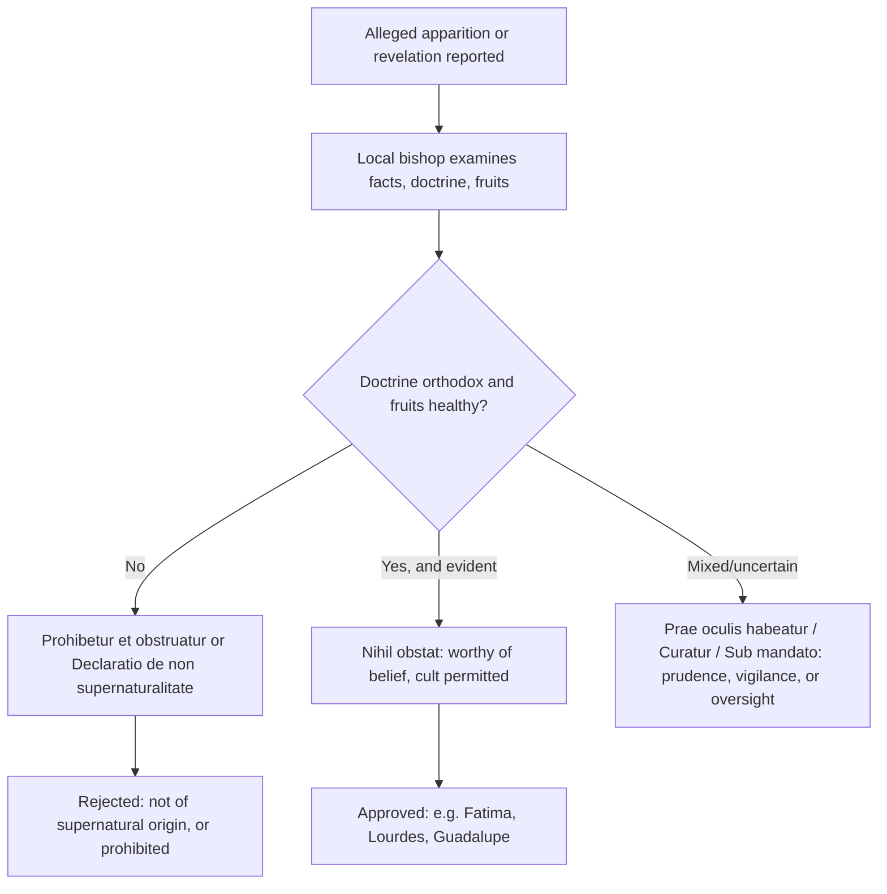

# A Catholic Guide to Discernment — Evaluating _The Book of Truth_

> This guide is written for a Catholic who has encountered _The Book of Truth_ (Maria Divine Mercy) — in print, online, or through a friend — and wants to know how to evaluate it correctly. It applies the Church's own criteria for private revelation and then shows how _The Book of Truth_ measures against them.

---

## 1. The Starting Principle: Private Revelation Is Never Necessary for Salvation

Before examining any particular claim, the foundational truth must be clear:

> "No new public revelation is to be expected before the glorious manifestation of our Lord Jesus Christ." (CCC 66, citing _Dei Verbum_ 4)

The revelation of God in Christ is **complete and definitive**. The Catechism goes on:

> "Throughout the ages, there have been so-called 'private' revelations, some of which have been recognized by the authority of the Church. They do not belong, however, to the deposit of faith. It is not their role to improve or complete Christ's definitive Revelation, but to help [the faithful] live more fully by it in a certain period of history. … **Christian faith cannot accept 'revelations' that claim to surpass or correct the Revelation of which Christ is the fulfilment.**" (CCC 67)

Three consequences follow immediately:

1. **No Catholic is obliged to believe any private revelation** — not Fatima, not Lourdes, not _The Book of Truth_ (CCC 67).
2. **A private revelation can never correct or supersede the Church's doctrine** or Scripture. If a claimed revelation contradicts Catholic faith or morals, the claim is false by definition.
3. **The faith is nourished by public Revelation, the sacraments, and the Church's teaching** — not by end-times messages. "Faith is a response to the Word of God, not to revelations."

> **Therefore:** A message that claims to be the definitive "unsealing" of Revelation, or that turns the reader's attention away from the Church's visible authority, has already failed a first, decisive test.

---

## 2. The Church's Criteria for Authenticity

When the Church examines an alleged apparition or revelation, she looks for the following (CDF _Norms_ of 1978; reorganized by the DDF _Norms_ of 17 May 2024):

1. **The truth of the alleged facts** — are the events as described, and is the report trustworthy?
2. **Doctrinal orthodoxy** — does the content agree with Catholic faith and morals, with public Revelation, and with the Church's teaching?
3. **The moral and spiritual integrity of the recipients** — their honesty, humility, obedience to Church authority, and freedom from manipulation or gain.
4. **The healthiness of the devotion and its fruits** — does it produce genuine conversion, charity, Eucharistic piety, obedience, peace, and unity with the Church; or fear, division, and novelty?
5. **Any specifically supernatural character** — is there evidence beyond purely natural explanation?

The process, and its possible conclusions, can be pictured simply:

_The Book of Truth_ falls in the **rejected** category by the judgment of multiple local ordinaries (see [church-assessment-and-warnings.md](church-assessment-and-warnings.md)).

---

## 3. Applying the Criteria to _The Book of Truth_

| Criterion                       | Assessment                                                                                                                                                                                                                                                                                                                         |
| ------------------------------- | ---------------------------------------------------------------------------------------------------------------------------------------------------------------------------------------------------------------------------------------------------------------------------------------------------------------------------------- |
| **Doctrinal orthodoxy**         | **Fails.** The core message teaches a literal earthly millennium, which the Church rejects as millenarianism (CCC 676). The Archdiocese of Dublin found "many of the texts … in contradiction with Catholic theology." The messages also set the reader against the papacy and against the teaching of the Second Vatican Council. |
| **Truth of the alleged facts**  | **Fails.** The recipient is anonymous and has refused to present herself to Church authority for examination (Bishop Coleridge). The central "fulfilled" prediction — the ousting of Benedict XVI — contradicts the Pope's own statement that he resigned freely.                                                                  |
| **Integrity of the recipient**  | **Unverifiable, and problematic.** Anonymity, a hidden identity while directing a global movement, and commercial sale of the books are all contrary to the ordinary pattern of authentic visionaries, who have submitted to Church authority and accepted criticism.                                                              |
| **Healthiness of the devotion** | **Fails.** Bishops found the messages "provoke fear rather than the peace of the Spirit" (Brisbane) and "bring confusion and propagate erroneous, false and distorted teachings" (CBCP). Adherents risk schism by treating the Pope as a false prophet.                                                                            |
| **Supernatural character**      | **Not established**, and contradicted by unfulfilled date-specific predictions.                                                                                                                                                                                                                                                    |

---

## 4. Warning Signs — A Checklist

The following are general red flags in evaluating any claimed revelation. _The Book of Truth_ exhibits many of them.

- [x] **Anonymity** — the seer hides her identity, making examination impossible.
- [x] **Refusal to submit to the local bishop** — the Church's normal first step is never taken.
- [x] **Date-setting** — specific timelines for the end times and for "the Warning."
- [x] **A claim to supersede or definitively "unseal" Scripture** — "the 7th Messenger" who opens the seals of Revelation.
- [x] **Attacks on the Church's legitimate authority** — the Pope as "false prophet," the visible Church as a "shell."
- [x] **Contradiction of defined doctrine** — a literal 1,000-year earthly reign (CCC 676).
- [x] **Novel devotional system** — "Crusade Prayers," the "Seal of the Living God," and new formulas presented as necessary.
- [x] **Fear-based urgency** — messages designed to provoke anxiety rather than the peace of the Spirit.
- [x] **Retroactive reinterpretation** — treating ordinary events (e.g., a papal resignation) as "fulfilled prophecy."
- [x] **Financial and promotional apparatus** — books, cards, and merchandise sold alongside the messages.
- [x] **Unfulfilled predictions** — the tribulation ending around 2016, the immediate "false prophet," the New World Religion.

---

## 5. What to Do

**If you have been reading it:**

1. **Do not be afraid.** Coercive fear is itself a sign that the message is not from the Spirit of Christ. The peace of Christ is your guide.
2. **Return to what is certain.** The Mass, the sacraments, Sacred Scripture, the Rosary, the Catechism, and the Church's teaching on the Last Things (see [eschatology/doctrinal-foundations.md](../eschatology/doctrinal-foundations.md)).
3. **Stop promoting it.** Do not circulate the messages, and do not use them in a Church group (per the Archdiocese of Dublin).
4. **Speak with a priest** if the material has unsettled your faith or led you to distrust the Pope or the Church.

**If a friend or family member is involved:**

1. **Be charitable and patient.** People are drawn to such messages out of genuine love for God and a desire for holiness. Do not attack the person.
2. **Focus on the positive** — invite them back to the Mass, the Rosary, and confession rather than beginning with argument about the messages.
3. **Share the bishops' statements** calmly, especially the Archdiocese of Dublin's (the territory of the alleged recipient) and, if you are in the Philippines, the CBCP warning.
4. **Distinguish authentic devotion from counterfeit.** If the person is devoted to Divine Mercy, note that the authentic devotion needs no supplement; the CBCP warning arose at the request of Divine Mercy devotees themselves. See [liturgy/chaplet-divine-mercy.md](../liturgy/chaplet-divine-mercy.md).
5. **Pray for them**, and for the person who wrote the messages, "that she may find the grace to repudiate them" (as the _National Catholic Register_ analysis put it).

---

## 6. Two Final Distinctions

**Unapproved vs. prohibited.** Most private revelations are simply _unapproved_ — neither accepted nor condemned, and free to be ignored. _The Book of Truth_ is in a more serious position: local ordinaries have **prohibited** it in their jurisdictions and judged it harmful to faith. Non-approval is not the worst case; a negative judgment is.

**Authentic private revelation vs. private revelation that is binding.** Even the approved apparitions (Guadalupe, Lourdes, Fatima) never bind the faith. They are aids to living the Gospel. If a claimed revelation is not even approved — and is, in fact, judged contrary to doctrine — the Catholic is free, and in some places obliged, to set it aside.

---

## 7. See Also

- [README.md](README.md) — directory overview and status.
- [the-book-of-truth.md](the-book-of-truth.md) — the content and claims of the corpus.
- [church-assessment-and-warnings.md](church-assessment-and-warnings.md) — the ecclesial record.
- [../miracles/README.md](../miracles/README.md) — the theology of approved apparitions and miracles.
- [../gifts-holy-spirit/discernment-of-spirits.md](../gifts-holy-spirit/discernment-of-spirits.md) — the charism of discernment.
- [../eschatology/doctrinal-foundations.md](../eschatology/doctrinal-foundations.md) — the Church's doctrine on the Last Things.

---

## Sources

- **Catechism of the Catholic Church** 66–67, 675–677.
- **Vatican II**, _Dei Verbum_ 2–4.
- **Congregation for the Doctrine of the Faith**, _Norms regarding the manner of proceeding in the discernment of presumed apparitions or revelations_ (1978; published 2012).
- **Dicastery for the Doctrine of the Faith**, _Norms for Proceeding in the Discernment of Alleged Supernatural Phenomena_ (17 May 2024).
- **Archdiocese of Dublin** (16 April 2014); **Diocese of Portland** (27 August 2013, quoting Bishop John Coleridge of Brisbane); **CBCP News** (2019). Full citations in [church-assessment-and-warnings.md](church-assessment-and-warnings.md).
- _National Catholic Register_, Jimmy Akin, "9 Things You Need to Know About 'Maria Divine Mercy'" (3 March 2013).
