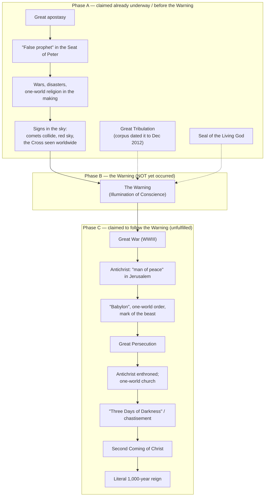

# The Book of Truth — The Claimed Sequence of End-Times Events

> ⚠️ **Not approved by the Church.** This document reports, **as claims**, the order of end-times events that the _Book of Truth_ corpus (Maria Divine Mercy) asserts will unfold before and after the Second Coming of Christ. It does **not** propose these claims for belief. Several bishops and dioceses have prohibited the corpus or judged it contrary to Catholic faith. For the Church's judgment, see [church-assessment-and-warnings.md](church-assessment-and-warnings.md); for how to evaluate such claims, see [catholic-discernment-guide.md](catholic-discernment-guide.md); for the Church's actual doctrine on the Last Things, see [../eschatology/doctrinal-foundations.md](../eschatology/doctrinal-foundations.md).

---

## 1. Purpose and Method

The corpus claims to "unseal" the prophecies of Daniel and the Book of Revelation and to set out, in advance, the order of the final events. This page gathers that claimed order so that a reader can see plainly (a) what the corpus actually asserts, and (b) how it compares with Catholic doctrine.

Four cautions govern everything below:

1. **These are reported claims, not facts.** Where the corpus is quoted, the wording is quoted as its promoters have published it. The whole scheme rests on alleged private revelations that the Church has never approved and that several local ordinaries have forbidden.
2. **Nothing "after the Warning" has occurred — because the Warning itself has never occurred.** The Warning (the corpus's "Illumination of Conscience") is the **hinge** of the entire scheme. The corpus's own promoters compiled their sequence under the title "**After the Warning**," and more than a decade later the event has not taken place. Every event the corpus places after the Warning is therefore, on the corpus's own terms, still **unfulfilled**. This document reports those events as future claims, not as history.
3. **The corpus does not put everything after the Warning.** The messages also claim that several events are **already underway now, before the Warning** — a "great apostasy," the "false prophet" occupying the See of Peter, and a "Great Tribulation" the corpus expressly dated to begin in **December 2012**. The sequence therefore has to be read in **two phases around the Warning**, not as one straight line (see §2–§3).
4. **The corpus borrows heavily from elsewhere.** Its sequence is a composite of approved Catholic prophecy (especially Fátima), unapproved revelations (especially Garabandal, whose "Warning → Great Miracle → Chastisement" pattern the corpus explicitly invokes), the popular "Three Days of Darkness" devotion, and premillennial ideas of Protestant origin. Where an element comes from another source, that is noted.

> **Terminology.** The corpus's own term is **"the Warning."** It identifies "the Warning" with an **"Illumination of Conscience"** — a single, worldwide, momentary event in which each soul is shown its own sins. That identification is the corpus's claim, not a defined Catholic doctrine (see §4).

---

## 2. The Claimed Sequence at a Glance — Two Phases Around the Warning

Because the Warning has not occurred, the corpus's timeline is best shown in three parts: **Phase A**, events the corpus claims are already underway or that precede the Warning; **Phase B**, the Warning itself — the still-future hinge; and **Phase C**, the events the corpus places after the Warning, none of which has happened. (The corpus is not consistent even about this split: it dates the Great Tribulation to December 2012, before the Warning, yet its promoters also place much tribulation material _after_ the Warning. The phases below follow the corpus's ordinary presentation.)

### Phase A — Claimed to be already underway, or to precede the Warning

| #   | Claimed event                                                 | The corpus's own description                                                                                                                                                                                                                      | Catholic assessment (short)                                                                            |
| --- | ------------------------------------------------------------- | ------------------------------------------------------------------------------------------------------------------------------------------------------------------------------------------------------------------------------------------------- | ------------------------------------------------------------------------------------------------------ |
| A1  | **The "great apostasy"**                                      | The falling away of belief and the glorifying of sin; the corpus calls this "the first sign" that the Second Coming is near.                                                                                                                      | The Church does expect a "final trial" and a great apostasy (CCC 675); the corpus's dating is its own. |
| A2  | **The "false prophet" in the Seat of Peter**                  | The pope elected after Benedict XVI is said to be a "false prophet" who heads "the shell of the Catholic Church on earth."                                                                                                                        | Gravely erroneous; sets the reader on the road to **schism** (CIC 751; 1364 §1).                       |
| A3  | **The Great Tribulation**                                     | A three-and-a-half-year tribulation the corpus expressly dated to begin in **December 2012** — i.e. _before_ the Warning.                                                                                                                         | Scripture speaks of "great tribulation," but Christ forbids date-setting (Mark 13:32).                 |
| A4  | **Wars, disasters, and the one-world religion in the making** | Escalating wars, natural disasters, and the groundwork of a merged world religion, government, and currency.                                                                                                                                      | Private-revelation claim, mixed with premillennial schemas.                                            |
| A5  | **The "Seal of the Living God"**                              | A protective "seal" (a prayer card / "Crusade Prayer," borrowed from Revelation 7:2–3) distributed in advance for protection.                                                                                                                     | Novel devotional system presented as necessary — a warning sign.                                       |
| A6  | **Signs in the heavens and the Cross**                        | "Two comets will collide," the sky turns red, and the "Sign of My Cross" is seen "all over the world, by everyone" — the immediate precursor (see [signs-in-the-heavens-and-the-cross.md](../eschatology/signs-in-the-heavens-and-the-cross.md)). | Private-revelation claim; no such event tied to a Warning occurred as urged (2011).                    |

### Phase B — The Warning (Illumination of Conscience): the still-unfulfilled hinge

| #   | Claimed event                                | The corpus's own description                                                                                                                                                                                                                                      | Catholic assessment (short)                                                                                                                        |
| --- | -------------------------------------------- | ----------------------------------------------------------------------------------------------------------------------------------------------------------------------------------------------------------------------------------------------------------------- | -------------------------------------------------------------------------------------------------------------------------------------------------- |
| B1  | **The Warning (Illumination of Conscience)** | A single worldwide event, experienced by "all … over seven years of age," in which each soul sees its own sins; brief (about a quarter of an hour); "billions will convert"; some die of shock. The corpus tied its timing to Benedict XVI's departure from Rome. | Not a defined article of faith; a private-revelation motif (cf. CCC 66–67). **It has not occurred**, so everything in Phase C remains unfulfilled. |

### Phase C — Claimed to follow the Warning (all unfulfilled)

| #   | Claimed event                                                 | The corpus's own description                                                                                                                                          | Catholic assessment (short)                                                                                                                                                                                                                                                                                                                                             |
| --- | ------------------------------------------------------------- | --------------------------------------------------------------------------------------------------------------------------------------------------------------------- | ----------------------------------------------------------------------------------------------------------------------------------------------------------------------------------------------------------------------------------------------------------------------------------------------------------------------------------------------------------------------- |
| C1  | **The Great War ("WWIII")**                                   | Lesser wars escalate into a great war in the Middle East, drawing in the U.S., Russia, Europe, and China; nuclear weapons are used.                                   | Private-revelation claim.                                                                                                                                                                                                                                                                                                                                               |
| C2  | **The antichrist as "man of peace"**                          | He suddenly appears on the world stage in Jerusalem and brokers a peace treaty, then links the world's banks into "Babylon."                                          | The figure of an Antichrist is Catholic (CCC 675–676); the corpus's scenario is its own.                                                                                                                                                                                                                                                                                |
| C3  | **"Babylon," the one-world order, and the mark of the beast** | A merged world religion, government, and currency; a "mark" (666 hidden in a microchip, likened to a vaccination) controlling money, food, and dwelling.              | Private-revelation claim.                                                                                                                                                                                                                                                                                                                                               |
| C4  | **The Great Persecution**                                     | Christians and Jews are persecuted; the "True Church" is "thrown out of Rome"; bishops and priests are excommunicated or martyred; Mass is offered in secret refuges. | The Church does teach a final trial (CCC 675); the corpus's detail is its own.                                                                                                                                                                                                                                                                                          |
| C5  | **The enthronement of the antichrist**                        | The "false prophet" is seen at death's door and appears to rise; the antichrist is enthroned in a one-world church; the tabernacles are emptied of the Eucharist.     | Contradicts the Church's indefectibility (Matthew 16:18–19; CCC 869).                                                                                                                                                                                                                                                                                                   |
| C6  | **"Three Days of Darkness" / chastisement**                   | A period of darkness on the earth; followers are told to "prepare your homes with blessed candles and a supply of water and food."                                    | A popular **devotion**, not doctrine (see [../eschatology/three-days-of-darkness.md](../eschatology/three-days-of-darkness.md)).                                                                                                                                                                                                                                        |
| C7  | **The Second Coming of Christ**                               | The antichrist counterfeits an "ascension"; then Christ is seen descending on the clouds; the antichrist and his followers are cast into the lake of fire.            | The Second Coming is **dogma** (CCC 668, 1041–1043).                                                                                                                                                                                                                                                                                                                    |
| C8  | **The 1,000-year earthly reign**                              | A literal 1,000-year "Era of Peace" on earth after the Second Coming, in which St. Peter rules (first from heaven, then on earth).                                    | **Millenarianism — rejected** (CCC 675–677, esp. CCC 676). "New Paradise" is not a second claimed event: the corpus applies that one phrase both to this era (25 June 2011) and to the eternal "world without end" (17 April 2014); its one near-distinction is treated in §3.4. Where the corpus is silent, Catholic doctrine supplies the true order (CCC 1038–1050). |

**Figure 1.** The corpus's claimed sequence as its own promoters frame it — a phase of events said to be underway, the still-future **Warning** (Phase B), and everything the corpus places **after** the Warning (Phase C). Nothing in Phase C has occurred, because the Warning has not.

---

## 3. The Claimed Events in Detail

The subsections below are grouped by the phase in which the corpus places each event.

### 3.1 Phase A — Claimed to be already underway, or to precede the Warning

#### 3.1.1 The "great apostasy"

The corpus treats a worldwide falling-away from the faith — the "great apostasy," in which sin is glorified — as the first sign that the Second Coming is near (message of 28 September 2013).

- **Catholic note:** The Catechism does teach that, before the Lord's return, the Church must pass through a final trial that will shake the faith of many, and it speaks of a "supreme religious deception" (CCC 675–676). So the _category_ of a great apostasy is genuinely Catholic. What is _not_ Catholic is the corpus's attempt to pinpoint its timing and to read the present moment as its fulfilment.

#### 3.1.2 The "false prophet" in the Seat of Peter

The corpus claims that the pope elected after Benedict XVI is a "false prophet" who "will now take over the Seat in Rome" and who heads "the shell of the Catholic Church on earth"; it also applies the famous line "Peter the Roman" (from the non-magisterial "Prophecy of St. Malachy") not to a future pope but to the **historical St. Peter**, ruling from heaven.

- **Catholic note — a grave matter.** A validly elected Roman Pontiff cannot be a "false prophet" or an antipope, and the Church on earth is not a "shell" but the Body of Christ, indefectibly guided by the Holy Spirit (Matthew 16:18–19; CCC 869). To treat the Pope as a false prophet and the visible hierarchy as a counterfeit is precisely to enter the terrain of **schism** — "the refusal of submission to the Supreme Pontiff or of communion with the members of the Church subject to him" (CIC 751) — a delict carrying _latae sententiae_ excommunication (CIC 1364 §1). See [church-assessment-and-warnings.md](church-assessment-and-warnings.md).

#### 3.1.3 The Great Tribulation (dated to December 2012)

The corpus claims a "Great Tribulation" of three and a half years and **dated it**: "the three and a half years remaining in the Tribulation period commences in December 2012" (a claim quoted in the _National Catholic Register_ analysis). Read literally, that would have ended the tribulation around mid-2016 — and, either way, it places the tribulation **before** the Warning.

- **Catholic note:** Sacred Scripture does speak of a "great tribulation" (Matthew 24:21; Revelation 7:14), and the Church expects a final trial before the Lord's return (CCC 675). But Christ explicitly forbids date-setting: "Of that day or hour, no one knows, neither the angels in heaven, nor the Son, but only the Father" (Mark 13:32; cf. Matthew 24:36; Acts 1:7). Any scheme that assigns a calendar to the tribulation has already failed a decisive test.

#### 3.1.4 The "Seal of the Living God"

The corpus prescribes a protective "Seal of the Living God," drawn from the sealing of the elect in Revelation 7:2–3. In its most common form it is a prayer card bearing a "Crusade Prayer," which adherents are told to display on the door of the home; a "Medal of Salvation" serves a similar purpose.

- **Catholic note:** The imagery is biblical, but the corpus redirects it into a **novel devotional system**, presented as necessary for protection in the coming trial. That is a recognized warning sign in the discernment of spirits (see the checklist in [catholic-discernment-guide.md](catholic-discernment-guide.md)). The Church's own protection is the sacramental life — Baptism, the Eucharist, Penance, the sacramentals — not a proprietary card.

#### 3.1.5 Signs in the heavens and the Cross — the immediate precursor

The corpus claims that the Warning will be announced by visible signs in the heavens. A message of 5 June 2011 — titled by its promoters "Two comets will collide, My cross will appear in a red sky" — is the clearest expression:

> "They will see great signs in the skies, before The Warning takes place. Stars will clash with such impact that man will confuse the spectacle they see in the sky as being catastrophic. As these comets infuse, a great red sky will result and the Sign of My Cross will be seen all over the world, by everyone."

A companion message of 8 June 2011, "Prepare your family to witness My Cross in the Sky," repeats that "when they see My Cross in the sky they will be prepared," and that this sign precedes the "Illumination of Conscience."

- **Corpus claim:** the Cross in the sky is the "Divine Sign" announcing that the Warning (the Illumination) has begun, and it will be visible to everyone on earth at once.
- **Catholic note:** The "sign of the Son of Man in heaven" belongs to the **actual Second Coming** (Matthew 24:30), not to a separate, earlier "illumination." The corpus's added detail — that "stars will clash," i.e., comets will collide, as the immediate trigger — is attached to no doctrine and, on its own dating, did not occur as a Warning-sign.

- **In full:** This motif — its biblical and patristic roots, its other private-revelation witnesses by canonical status, and its correct discernment — is treated in [../eschatology/signs-in-the-heavens-and-the-cross.md](../eschatology/signs-in-the-heavens-and-the-cross.md).

### 3.2 Phase B — The Warning (Illumination of Conscience)

This is the corpus's central event, the origin of the movement's name, and the hinge of its whole timeline. **It has not occurred.**

- **Corpus claim — scope:** a single, worldwide, mystical event "experienced by all … over seven years of age, everywhere throughout the world" (message of 28 January 2011).
- **Corpus claim — content:** each soul sees its own life and sins — its "past lives are played out before their eyes" — and is made to feel, briefly, "what it feels like when the Light of God disappears," the desolation of the soul in mortal sin.
- **Corpus claim — purpose:** it is a great act of **Divine Mercy** meant to convert: "billions of people will convert during The Warning," and it is called "one of the greatest events in the history of mankind."
- **Corpus claim — duration:** brief; the promoters describe it as lasting about "a quarter of an hour."
- **Corpus claim — consequences:** many who are unprepared will, it is said, die of shock.
- **Corpus claim — timing:** tied to the papacy — "This great Illumination of Conscience will take place after My Holy Vicar [Benedict XVI] has left Rome" (message of 20 February 2013).

- **Catholic note:** There is **no defined Catholic doctrine** of a worldwide "illumination of conscience" or "Warning" before the Second Coming. It is a recurring motif of private revelation and popular Catholic literature (see [../eschatology/alar-end-times-interview.md](../eschatology/alar-end-times-interview.md)), and it may be **piously** entertained as a private claim, but the Church does not require belief in it and has not authenticated it. The corpus's specific date claims did not come to pass as stated, and the event itself remains unfulfilled (§6). A full treatment of the Warning in this corpus and across other private revelations is given in [../eschatology/the-warning.md](../eschatology/the-warning.md).

### 3.3 Phase C — Claimed to follow the Warning

Nothing in this phase has occurred, because the Warning has not. These are the events the corpus's own promoters gathered under the heading "After the Warning."

#### 3.3.1 The Great War, "Babylon," and the mark of the beast

- **Corpus claim:** lesser wars escalate into a Great War (WWIII) in the Middle East, drawing in "the four big empires" — the U.S., Russia, Europe, and China; nuclear weapons are used; Israel suffers a genocide. When all seems hopeless, the **antichrist** appears as a "man of peace" in Jerusalem and brokers a peace treaty, then links the world's banks into a new financial power the corpus calls "**Babylon**." Together with the false prophet he builds a one-world religion, government, and currency, and introduces a "**mark of the beast**" — 666 hidden in a microchip, taken "like a vaccination" — controlling money, food, and dwelling.
- **Catholic note:** The Antichrist and a final deception are genuinely Catholic categories (CCC 675–676; 2 Thessalonians 2). The corpus's particular scenario — a named "Babylon" as the European Union, a vaccination-microchip mark, and so on — is its own private claim, mixed with premillennial schemas, and requires no assent.

#### 3.3.2 The Great Persecution, the antichrist enthroned, and the one-world religion

- **Corpus claim:** Christians and Jews are persecuted; the "True Church" is "thrown out of Rome" and endures years of desolation; the "false prophet" is seen at death's door and appears to rise; sacrilege and a merged world religion follow; priests who refuse the new order are excommunicated or martyred, and the faithful worship in secret refuges with "daily Mass and the Holy Eucharist." The antichrist is welcomed into the "false Catholic Church," and the sign that he is about to be enthroned is that the tabernacles are replaced by wooden versions and the Eucharist is no longer present.
- **Catholic note:** Christ's promise that the gates of hell will not prevail against His Church (Matthew 16:18) means the Church cannot defect or be replaced by a counterfeit "shell"; she may be persecuted and reduced, but she cannot fail (CCC 869). The corpus's claim that the Eucharist will be removed from the Church and the Pope replaced by a false prophet is incompatible with the faith. The "final trial" the Catechism foresees (CCC 675) is a trial of faith, not a proof that the Church has become apostate.

#### 3.3.3 The "Three Days of Darkness" and the chastisement

- **Corpus claim:** the corpus attaches to the period before the Second Coming a time of darkness and chastisement. Its practical instruction is telling: after the Warning, followers are told to "prepare your homes with blessed candles and a supply of water and food to last for a couple of weeks" (message of 29 September 2011, "Aftermath of The Warning"). Promoters have assembled the corpus's statements under the title "Maria Divine Mercy on the Three Days of Darkness," presenting a period of darkness as the event "immediately before the Day of the Second Coming."
- **Catholic note:** The "Three Days of Darkness" is a **popular devotion**, not a defined doctrine. It rests on private revelations of differing — and often unverified — canonical status: the later "Secret" associated with **La Salette** (the speculative interpretation of which the Holy Office restricted in 1915), **Blessed Anna Maria Taigi**, **Marie-Julie Jahenny**, and **Servant of God Luisa Piccarreta**. See the repository's full treatment at [../eschatology/three-days-of-darkness.md](../eschatology/three-days-of-darkness.md). The "blessed candles, stay indoors, keep food and water" instruction belongs to that wider devotional tradition, and the corpus's version is one more instance of it — not evidence of authenticity. The proper Catholic response to any such prediction is the sacramental life, not stockpiling.

#### 3.3.4 The Second Coming of Christ

- **Corpus claim:** after the persecution and the darkness, the antichrist counterfeits an "ascension"; then Christ is seen descending on the clouds "just as He promised," and the antichrist and his followers are cast into the lake of fire. The corpus repeatedly asserted that this "Second Coming" was near — "The time for My Second Coming is almost upon the world" (5 January 2012) and "This generation will witness My glorious return" (18 February 2012).
- **Catholic note:** The Second Coming is **dogma** — "Christ … will come again in glory to judge the living and the dead" (CCC 668; cf. CCC 1041–1043). What is _not_ Catholic is the claim to have fixed its nearness or its "generation." The corpus thereby does what Christ warned against.

#### 3.3.5 The 1,000-year earthly reign (the "Era of Peace")

- **Corpus claim:** after the Second Coming, Christ reigns for a **literal 1,000 years** on earth — the "Era of Peace," which the corpus says was "spoken of at Fátima." The messages insist the number is literal: "Know that the 1,000 years referred to in the Book of Revelation means just that." Satan, it says, is "banished from earth for 1,000 years," distinct from the end of the world; and "Peter the Roman" rules the Church, first from heaven and then on earth.
- **Catholic note — the central doctrinal error.** This is **millenarianism** (chiliasm): the expectation of a worldly, earthly messianic kingdom before the final judgment. The Church has explicitly rejected it: "The Church has rejected even modified forms of this falsification of the kingdom to come under the name of millenarianism" (CCC 676; cf. CCC 675–677; the 1979 CDF letter _Some Aspects of Christian Eschatology_ likewise holds millenarianism "cannot be taught safely"). This error alone is sufficient to disqualify the corpus as authentic Catholic private revelation. The Church's true eschatology — the Second Coming, the resurrection of the body, the Last Judgment, and the new heavens and new earth, **with no interim earthly millennium** — is set out in [../eschatology/doctrinal-foundations.md](../eschatology/doctrinal-foundations.md). Fátima did speak of a period of peace, but the Church has never interpreted it as a literal thousand-year earthly reign after the Parousia in the way the corpus does.

### 3.4 After the Millennium — "The New Paradise" Is Not a Second Claimed Event

The corpus has no distinct event after the 1,000 years. "The New Paradise" is its own phrase for the renewed earth, and it applies that one phrase inconsistently:

- **25 June 2011** — the New Paradise _is_ the 1,000-year era: "This New Paradise on Earth is now being planned for all of My children. It will last 1,000 years on Earth and no one must be excluded."
- **12 October 2012** — the one message that comes near a distinction: it describes the New Paradise (its "different levels," its "12 nations," with governments "ruled by My saints and apostles"), then has the final state follow separately — "Satan will be released, along with his demons, for a short period. Then all evil will be destroyed. My Mercy will, finally, be presented to the world, in the New Heavens and the New Earth combined."
- **17 April 2014** — reverses that, making the New Paradise _the eternal state_: "the old Earth and the Heavens will disappear and a New World will arise. My New Paradise will become the World without end – as foretold."

So "the New Paradise" is one loose idea applied to both the millennium and the world to come — not a stage that follows the 1,000-year reign. On the corpus's own terms nothing follows the 1,000 years except the final resurrection, the destruction of evil, and the renewal of creation; and where the corpus is silent on these, Catholic doctrine supplies the true order (CCC 1038–1050).

---

## 4. How Catholic Doctrine Actually Orders the Last Things

To see the difference between the corpus's sequence and the faith, set the two side by side. Note especially that the Church gives **no "before the Warning / after the Warning" structure**, because there is no defined "Warning" at all:

| Element                                                    | Catholic status                            | Source                               |
| ---------------------------------------------------------- | ------------------------------------------ | ------------------------------------ |
| The final trial of the Church / the Antichrist's deception | **Dogma** (in substance)                   | CCC 675–676                          |
| The Second Coming of Christ in glory                       | **Dogma**                                  | CCC 668, 1041–1043                   |
| The resurrection of the dead, just and unjust              | **Dogma**                                  | CCC 988–1004, 1038                   |
| The Last Judgment                                          | **Dogma**                                  | CCC 1038–1041                        |
| The new heavens and the new earth                          | **Dogma**                                  | CCC 1042–1050                        |
| A worldwide "illumination of conscience" / "Warning"       | **Not taught**; a private-revelation motif | CCC 66–67 (no new public revelation) |
| A literal 1,000-year earthly reign before the judgment     | **Rejected as error** (millenarianism)     | CCC 676                              |
| Any specific date for these events                         | **Forbidden**                              | Matthew 24:36; Mark 13:32            |

The point is not that the corpus merely _adds detail_ to the Church's teaching. It does two things the faith forbids: it **contradicts dogma** (a literal earthly millennium), and it **binds consciences to a calendar** in defiance of Christ's own words.

---

## 5. Distinguishing This Sequence from Other Prophecies

The corpus's sequence overlaps with other private revelations, and the differences matter:

**Garabandal (1961–1965; no declaration of supernatural origin; a negative 1967 judgment).** Garabandal speaks of a **Warning**, then a **Great Miracle**, then a **Chastisement**. The corpus explicitly invokes it — "The prophecies given at Garabandal will now become a reality" (31 May 2011) — but then redefines the "miracle" as **its own messages**: "The miracles I speak of are firstly, My communications through you … through these Messages" (31 March 2012). That is a classic example of a movement absorbing another's prophecy and re-anchoring it to itself.

**The "Three Days of Darkness" tradition.** La Salette's restricted "Secret," Blessed Anna Maria Taigi, Marie-Julie Jahenny, and Servant of God Luisa Piccarreta. See [../eschatology/three-days-of-darkness.md](../eschatology/three-days-of-darkness.md).

**Fátima (approved, 1917).** Fátima supplies the "Era of Peace," a period of peace following the triumph of the Immaculate Heart; the corpus re-reads that as a **literal 1,000-year reign** — a step Fátima itself does not take and the Church does not endorse.

---

## 6. Why the Claimed Sequence Fails Discernment

Even if one sets doctrine aside, the corpus's claimed timeline collapses under its own predictions:

- **The hinge event never came.** The Warning — the pivot on which the whole sequence depends — has not occurred, more than a decade after the corpus's own deadlines. Everything the corpus places after it is therefore unfulfilled by the corpus's own logic.
- **Date-setting and failed dates.** "A few months" for the Warning (2011); the Great Tribulation beginning December 2012; its end around 2016; the immediate installation of the false prophet. None occurred as stated. Scripture's test is exacting: "If the word does not come to pass … the prophet has spoken it presumptuously" (Deuteronomy 18:21–22).
- **The "predicted" resignation of Benedict XVI.** The messages said the Pope would be "ousted" by a Vatican plot; Benedict XVI stated that he resigned **"with full freedom"** for reasons of age and strength. To accept the corpus's version, one must set aside the Pope's own testimony.
- **Internal incoherence.** The Warning is at once "imminent" and contingent on Benedict's departure; the Tribulation is dated to 2012 yet also placed after the Warning; ordinary events are retroactively claimed as fulfilled prophecy — a pattern common to failed prophetic movements.
- **Contradiction of dogma.** The literal earthly millennium (CCC 676), and the claim that the Church can become a false "shell."
- **A parallel magisterium.** Novel prayers, a "seal," and messages presented as necessary, with the Church's own judgment declared "not important."
- **Fear-based spirituality.** The tone is one of retribution and dread, not the peace of the Spirit — a recognized negative fruit.

---

## 7. The Proper Catholic Response

1. **Do not be afraid.** Coercive fear is itself a sign that a message is not from the Spirit of Christ (2 Timothy 1:7).
2. **Do not treat the sequence as prophecy, and never date-set.** "Of that day or hour, no one knows" (Mark 13:32).
3. **Return to what is certain** — the Mass, the sacraments, Sacred Scripture, the Rosary, and the Catechism, including its true teaching on the Last Things at [../eschatology/doctrinal-foundations.md](../eschatology/doctrinal-foundations.md).
4. **Test everything** (1 Thessalonians 5:21): the Church's criteria are applied to this corpus in [catholic-discernment-guide.md](catholic-discernment-guide.md), and the bishops' judgments are recorded in [church-assessment-and-warnings.md](church-assessment-and-warnings.md).
5. **Remember the rule of faith:** even an approved private revelation never adds to the deposit of faith (CCC 66–67). A message that claims to "unseal" Revelation and to reorganize the Church's future around itself has already failed the first test.

---

## 8. See Also

- [README.md](README.md) — directory overview and the corpus's unapproved status.
- [the-book-of-truth.md](the-book-of-truth.md) — the corpus's content, claims, and unfulfilled predictions.
- [church-assessment-and-warnings.md](church-assessment-and-warnings.md) — the ecclesial record (Brisbane 2013; Portland 2013; Dublin 2014; CBCP 2019).
- [catholic-discernment-guide.md](catholic-discernment-guide.md) — how to evaluate unapproved private revelation.
- [../eschatology/doctrinal-foundations.md](../eschatology/doctrinal-foundations.md) — the Church's true doctrine on the Last Things.
- [../eschatology/three-days-of-darkness.md](../eschatology/three-days-of-darkness.md) — the "Three Days of Darkness" devotional tradition evaluated.
- [../eschatology/signs-in-the-heavens-and-the-cross.md](../eschatology/signs-in-the-heavens-and-the-cross.md) — the "signs in the heavens / Cross in the sky" motif (row A6) evaluated.
- [../eschatology/alar-end-times-interview.md](../eschatology/alar-end-times-interview.md) — the "Warning"/Illumination of Conscience in current popular Catholic discussion.
- [../miracles/README.md](../miracles/README.md) — the discernment of authentic private revelation.
- [../gifts-holy-spirit/discernment-of-spirits.md](../gifts-holy-spirit/discernment-of-spirits.md) — the charism of discernment.
- [resources.md](resources.md) — where the corpus's primary text circulates, with citation caveats (a pointer list, for study only).

---

## Sources

- **Edition and quoted messages.** The message texts quoted in this page are as republished by the promoters in the Mary Refuge of Souls per-message pages and in the compiled _All Messages 1 thru 1328_ (4 March 2015 edition); [resources.md](resources.md) lists the full set of sources. Pages consulted 2 October 2026. For §3.3.5 and §3.4: "The time has come now for Me to reclaim My Glorious Kingdom – New Paradise on Earth will last 1,000 years" (25 June 2011); "There will be different levels in the New Paradise of 12 nations" (12 October 2012); "My New Paradise will become the World without end – as foretold" (17 April 2014).
- _National Catholic Register_, Jimmy Akin, "9 Things You Need to Know About 'Maria Divine Mercy'" (3 March 2013), quoting the messages as published on _thewarningsecondcoming.com_ (the "Warning," the tribulation dated to December 2012, the false prophet, the literal 1,000 years, "Peter the Roman").
- New Advent, Dr. Mark Miravalle, "A closer look at the false prophecies of Maria Divine Mercy" (30 March 2013) — the theological evaluation, including millenarianism and the failed "Warning" date.
- The corpus's own messages as republished by its promoters, chiefly "Two comets will collide, My cross will appear in a red sky" (5 June 2011); "Prepare your family to witness My Cross in the Sky" (8 June 2011); "Prepare for The Warning, the Illumination of Conscience" (28 January 2011); "Aftermath of The Warning" (29 September 2011); and the messages of 3 March 2011, 5 January 2012, 18 February 2012, 31 March 2012, and 20 February 2013. Quoted here only in short excerpts, as the corpus's claims.
- Promoter compilation, "After the Warning — Sequence of Prophesied Events Leading Up to the Reign of the Antichrist (Book of Truth — Maria Divine Mercy)," _Mary Refuge of Souls_ / _The Warning of God_ (2016) — the source for the corpus's own post-Warning ordering (the Great War, the antichrist, "Babylon," the mark of the beast, the enthroned antichrist, and the Second Coming).
- **Catechism of the Catholic Church** 66–67, 668, 675–677, 988–1004, 1038–1050.
- **Vatican II**, _Dei Verbum_ 4; **Congregation for the Doctrine of the Faith**, _Some Aspects of Christian Eschatology_ (1979) and _The Message of Fátima_ (2000).
- **Code of Canon Law** (CIC) 751, 1364 §1.
