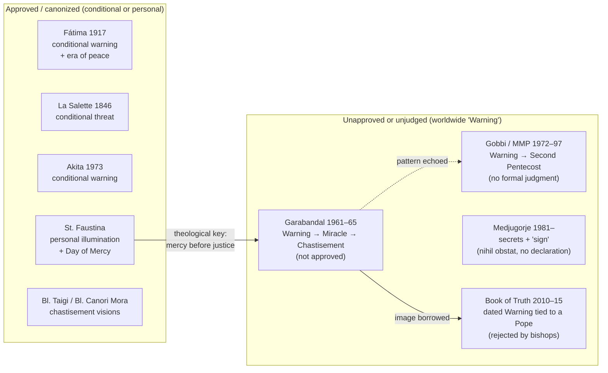

# The Warning (Illumination of Conscience): The Book of Truth and the Wider Tradition

> ⚠️ **Not approved by the Church.** This document reports, **as claims**, what the _Book of Truth_ corpus (Maria Divine Mercy) and other alleged private revelations say about a coming worldwide "**Warning**" or "**Illumination of Conscience**." It does **not** propose any of it for belief. The corpus has **no ecclesiastical approval**, and several bishops and dioceses have prohibited it or judged it contrary to Catholic faith; see [church-assessment-and-warnings.md](church-assessment-and-warnings.md). For the Church's actual doctrine on the Last Things, see [../eschatology/doctrinal-foundations.md](../eschatology/doctrinal-foundations.md); for how to weigh such claims, see [catholic-discernment-guide.md](catholic-discernment-guide.md) and the [2024 Dicastery norms](../eschatology/doctrinal-foundations.md#6-the-2024-dicastery-norms).

> **A note on registers.** Throughout this page, three things are kept strictly separate: **(a) quoted corpus text** (as the corpus's promoters publish it), **(b) other private revelations** (each labelled with its own canonical status), and **(c) Catholic doctrine** (cited to the Catechism, Scripture, councils, and papal documents). A private-revelation claim — even an approved one — never becomes Church teaching.

---

## Contents

1. [Terminology and What the Church Has (and Has Not) Defined](#1-terminology-and-what-the-church-has-and-has-not-defined)
2. [The Warning in the _Book of Truth_ Corpus](#2-the-warning-in-the-book-of-truth-corpus)
3. [The Warning in Other Private Revelations](#3-the-warning-in-other-private-revelations)
4. [Comparison at a Glance](#4-comparison-at-a-glance)
5. [What the Church Actually Teaches](#5-what-the-church-actually-teaches)
6. [Discernment: Reading "the Warning" Rightly](#6-discernment-reading-the-warning-rightly)
7. [Pastoral Guidance](#7-pastoral-guidance)
8. [See Also](#8-see-also)
9. [Sources](#sources)

---

## 1. Terminology and What the Church Has (and Has Not) Defined

### 1.1 The three names for one motif

Several phrases circulate for the same popular idea. They are not synonyms in origin, but they are commonly used interchangeably:

| Term                                 | Usual meaning                                                                                                               |
| ------------------------------------ | --------------------------------------------------------------------------------------------------------------------------- |
| **"The Warning"**                    | The _Book of Truth_ corpus's own name for the event, and the most common popular shorthand.                                 |
| **"The Illumination of Conscience"** | The descriptive name: a momentary, worldwide interior experience in which each soul is shown its own sins as God sees them. |
| **"The Little Judgment"**            | A devotional phrase used by some mystics' promoters to describe the same idea — a foretaste of the particular judgment.     |

Related but distinct motifs are often bundled in: the **"great apostasy,"** the **"Great Miracle"** and **"Great Sign"** of Garabandal, the **"Second Pentecost,"** the **"Three Days of Darkness,"** and the **"Era of Peace" / Triumph of the Immaculate Heart.** Each has its own provenance and its own canonical status, and they should not be treated as one package (see [end-times-event-sequence.md](end-times-event-sequence.md) and [../eschatology/three-days-of-darkness.md](../eschatology/three-days-of-darkness.md)).

### 1.2 What the Church has, and has not, defined

- **Defined (dogma):** Christ will come again in glory to judge the living and the dead ([CCC 668, 1041–1043](https://www.magisterium.com/docs/0583c069-d4bf-42dd-97de-c19f0b80150f)); every person is judged at death (the **particular judgment**) and all will be judged publicly at the **general (Last) Judgment** ([CCC 1021–1022, 1038–1041](https://www.magisterium.com/docs/0583c069-d4bf-42dd-97de-c19f0b80150f)); at that judgment "the truth about each man's relationship with God" will be made manifest ([CCC 678–679](https://www.magisterium.com/docs/0583c069-d4bf-42dd-97de-c19f0b80150f)); before the Lord's return the Church must pass through a **final trial** ([CCC 675–676](https://www.magisterium.com/docs/0583c069-d4bf-42dd-97de-c19f0b80150f)); and **no one may date** the end ([CCC 1040](https://www.magisterium.com/docs/0583c069-d4bf-42dd-97de-c19f0b80150f); [Matthew 24:36](https://www.drbo.org/x/d?b=drb&c=mt&g=24&p=36); [Mark 13:32](https://www.drbo.org/x/d?b=drb&c=mk&g=13&p=32); [Acts 1:7](https://www.drbo.org/x/d?b=drb&c=act&g=1&p=7)).
- **Not defined:** There is **no defined Catholic doctrine** of a worldwide, momentary "illumination of conscience" taking place before the Second Coming. It is a **private-revelation motif** and a popular devotional theme. It may be piously entertained as a private claim, but it is not an article of faith, it binds no conscience, and the Church has never authenticated any particular version of it. Public Revelation "is complete in Christ," and "no new public revelation is to be expected" before His glorious return ([CCC 65–67](https://www.magisterium.com/docs/0583c069-d4bf-42dd-97de-c19f0b80150f); _Dei Verbum_ 4).

### 1.3 Why the distinction matters

The Scriptural texts most often invoked for an "illumination" — [1 Corinthians 4:5](https://www.drbo.org/x/d?b=drb&c=1co&g=4&p=5) ("the Lord … will bring to light the hidden things of darkness and will make manifest the counsels of the hearts"), [Romans 2:15–16](https://www.drbo.org/x/d?b=drb&c=rm&g=2&p=15), [Luke 12:2–3](https://www.drbo.org/x/d?b=drb&c=lk&g=12&p=2), and [Matthew 25:31–46](https://www.drbo.org/x/d?b=drb&c=mt&g=25&p=31) — speak of the **divine judgment** in which hidden things are made manifest. They do **not** specify that this disclosure occurs in a separate, worldwide event before the Parousia, nor do they give it a date, a duration, or a mechanism. That is exactly the gap the private-revelation tradition fills with its own claims.

---

## 2. The Warning in the _Book of Truth_ Corpus

### 2.1 The corpus's central claim

"The Warning" is the **hinge of the entire _Book of Truth_ scheme** and the origin of the movement's better-known name, "The Warning Second Coming." The corpus claims it is a single, worldwide act of Divine Mercy in which God makes His presence known and shows each person his or her own soul and sins, so that "billions … will convert." The corpus's own promoters compiled their end-times sequence under the title "**After the Warning**" — evidence that, on the corpus's own terms, the Warning is the pivot on which everything else depends (see [end-times-event-sequence.md](end-times-event-sequence.md#2-the-claimed-sequence-at-a-glance--two-phases-around-the-warning)).

### 2.2 What the corpus says the Warning is

Reported below as the corpus's claims (message dates as published by its promoters; see [resources.md](resources.md) for where the text circulates and its citation caveats):

| Aspect           | The corpus's claim                                                                                                                                                                                          |
| ---------------- | ----------------------------------------------------------------------------------------------------------------------------------------------------------------------------------------------------------- |
| **Nature**       | A supernatural "Illumination of Conscience" — a direct act of God, not a natural event; described as "one of the greatest events in the history of mankind."                                                |
| **Scope**        | Worldwide and simultaneous: "experienced by all … over seven years of age, everywhere throughout the world" (message of **28 January 2011**, "Prepare for The Warning, the Illumination of Conscience").    |
| **Content**      | Each soul sees its own life and sins — its "past lives are played out before their eyes" — and briefly feels "what it feels like when the Light of God disappears," the desolation of a soul in mortal sin. |
| **Duration**     | Brief; the promoters describe it as lasting about "**a quarter of an hour**."                                                                                                                               |
| **Purpose**      | An act of **Divine Mercy** to convert the world before the chastisements that follow: "billions of people will convert during The Warning."                                                                 |
| **Consequences** | The converted return to the sacraments; those who cannot bear the sight of their sins are said to **die of shock**.                                                                                         |
| **Timing**       | Tied to the papacy: "This great Illumination of Conscience will take place after My Holy Vicar [Benedict XVI] has left Rome" (message of **20 February 2013**).                                             |

### 2.3 The claimed precursor signs

The corpus says the Warning will be announced by visible signs in the heavens. Two messages of 2011 are the clearest — as titled and republished by the promoters:

- **5 June 2011 — "Two comets will collide, My cross will appear in a red sky":** "They will see great signs in the skies, before The Warning takes place. Stars will clash … a great red sky will result and the Sign of My Cross will be seen all over the world, by everyone."
- **8 June 2011 — "Prepare your family to witness My Cross in the Sky":** the Cross in the sky is presented as the "Divine Sign" marking that the Illumination has begun; "when they see My Cross in the sky they will be prepared."

The same "Cross in the sky / two comets collide" motif appears in the earlier, unapproved **Garabandal** tradition (§3.2.1) — an example of the corpus absorbing an existing devotional image and re-anchoring it to its own timeline.

### 2.4 What the corpus says follows the Warning

Everything after the Warning is, on the corpus's own terms, still **unfulfilled**, because the Warning itself has not occurred. The corpus's post-Warning sequence includes the Great War (WWIII), the antichrist appearing as a "man of peace," "Babylon" and the mark of the beast, the Great Persecution, the "Three Days of Darkness," the Second Coming, and a literal 1,000-year earthly reign. The last of these is the corpus's **central doctrinal error** (millenarianism; [CCC 676](https://www.magisterium.com/docs/0583c069-d4bf-42dd-97de-c19f0b80150f)). The full ordering, with its doctrinal assessment, is set out in [end-times-event-sequence.md](end-times-event-sequence.md).

A practical detail shows the corpus's pastoral texture. In "**Aftermath of The Warning**" (**29 September 2011**), followers are told to "prepare your homes with blessed candles and a supply of water and food to last for a couple of weeks" — an instruction that belongs to the wider "Three Days of Darkness" devotional tradition rather than to anything the Church teaches ([../eschatology/three-days-of-darkness.md](../eschatology/three-days-of-darkness.md)).

### 2.5 The Warning and the corpus's devotional system

The corpus does not present the Warning as a bare prediction. Around it it builds a **parallel devotional system**, presented as necessary for the coming trial:

- The **"Seal of the Living God"** — a prayer card (a "Crusade Prayer") drawn from the sealing of the elect in [Revelation 7:2–3](https://www.drbo.org/x/d?b=drb&c=rv&g=7&p=2), to be displayed in the home for protection.
- The **"Medal of Salvation"** and a scapular, sold through the promoters' store.
- Roughly **170 new "Crusade Prayers"** and several litanies, which borrow the language of approved devotions (the Rosary, the Chaplet of Divine Mercy, the Sacred Heart) while redirecting allegiance toward the corpus.

> **Catholic note.** Novel devotional systems presented as _necessary_ for protection — and sold — are a recognized warning sign in the discernment of spirits (see the checklist in [catholic-discernment-guide.md](catholic-discernment-guide.md)). The Church's own protection is the sacramental life — Baptism, Confirmation, the Eucharist, Penance, and the sacramentals — not a proprietary card or medal. The corpus's own prayers are documented, for study, via [resources.md](resources.md); they are **not** endorsed here.

### 2.6 Catholic assessment of the corpus's Warning

- **It is unapproved private revelation.** No ecclesiastical approval has ever been granted. The Archdiocese of Dublin (16 April 2014) found "no ecclesiastical approval" and stated that "many of the texts are in contradiction with Catholic theology"; the Diocese of Portland (27 August 2013) prohibited dissemination; the Archdiocese of Brisbane (2013) called the material "patently fraudulent" and its eschatology "bogus millenarianism." See [church-assessment-and-warnings.md](church-assessment-and-warnings.md).
- **Its timing claims failed.** The Warning was tied to Benedict XVI's departure from Rome. Benedict XVI stated that he resigned "**with full freedom**" for reasons of age and strength; the corpus's account instead has him "ousted" by a Vatican plot. The Warning has not occurred more than a decade after the corpus's own deadlines — the hinge event on which the whole scheme depends.
- **It date-sets, which Christ forbids** ([Mark 13:32](https://www.drbo.org/x/d?b=drb&c=mk&g=13&p=32); [CCC 1040](https://www.magisterium.com/docs/0583c069-d4bf-42dd-97de-c19f0b80150f)). Scripture's test of prophecy is exacting: "If the word does not come to pass … the prophet has spoken it presumptuously" ([Deuteronomy 18:21–22](https://www.drbo.org/x/d?b=drb&c=dt&g=18&p=21)).
- **It contradicts dogma elsewhere in the same system** — a literal earthly millennium ([CCC 676](https://www.magisterium.com/docs/0583c069-d4bf-42dd-97de-c19f0b80150f)); the claim that the successor of Peter is a "false prophet" and the Church a "shell" (against the Church's indefectibility, [Matthew 16:18–19](https://www.drbo.org/x/d?b=drb&c=mt&g=16&p=18); [CCC 869](https://www.magisterium.com/docs/0583c069-d4bf-42dd-97de-c19f0b80150f)); and the claim that the Eucharist will be removed from the Church.
- **It risks schism.** To treat a validly elected Pope as a false prophet and the visible hierarchy as a counterfeit is to enter the terrain of schism — "the refusal of submission to the Supreme Pontiff or of communion with the members of the Church subject to him" (CIC 751), a delict carrying _latae sententiae_ excommunication (CIC 1364 §1).

**The distinction that saves the baby from the bathwater:** the _category_ of a divine warning to conscience is not absurd; the Church does teach a coming final trial and a judgment that reveals hearts. What disqualifies the _Book of Truth_ is not the general idea but the **specific package** — the date-setting, the failed hinge, the papal claims, the millenarianism, and the parallel devotional system built on top.

---

## 3. The Warning in Other Private Revelations

The "illumination of conscience" motif is **older than the _Book of Truth_ by at least two centuries**, and it appears across revelations of very different canonical status. Canonical status is the first thing to note about each: an **approved** apparition, a **beatified** or **canonized** mystic's private writings, and an **unapproved** claimed apparition are not on the same footing.

### 3.1 Canonized and beatified mystics

These are holy figures whose sanctity the Church has recognized. Their canonization or beatification is a judgment on their **holiness**, not a certification of every eschatological detail later attributed to them in popular literature.

#### 3.1.1 St. Faustina Kowalska (1905–1938; canonized 2000)

The Church's premier instance of an actual _illumination of conscience_ — experienced by one soul, not yet the world. In **_Diary_ 36**, St. Faustina records being "summoned to the judgment seat of God" and seeing "the condition of my own soul as God sees it," adding: "I could not clearly see all that was displeasing to God. I did not know that even the smallest transgressions will have to be accounted for." Fr. Chris Alar uses this passage as the type of what the mystics describe as happening to every soul in the great Warning (see [../eschatology/alar-end-times-interview.md](../eschatology/alar-end-times-interview.md#3-the-warning-illumination-of-conscience)).

St. Faustina also supplies the **theological key** to the motif: the divine warning is an act of **mercy preceding justice**. "Before the Day of Justice, I am sending the Day of Mercy" (_Diary_ 1588); the whole Divine Mercy devotion is the Church's approved form of that "Day of Mercy." Her _Diary_ 83 also describes a future darkness with the Cross in the sky — the passage that links her to the "Three Days of Darkness" tradition. See [../liturgy/divine-mercy-feast-and-novena.md](../liturgy/divine-mercy-feast-and-novena.md) and [../liturgy/hour-of-great-mercy.md](../liturgy/hour-of-great-mercy.md).

#### 3.1.2 Blessed Anna Maria Taigi (1769–1837; beatified 1920)

An Italian wife, mother of seven, and Trinitarian tertiary, known for mystical visions, prophecy, and bilocation. Popular literature attributes to her predictions of a coming chastisement and of a period of darkness in which only blessed candles would give light. The Church's beatification recognizes her **holiness**; it does **not** certify any specific prophecy attributed to her. See [../eschatology/three-days-of-darkness.md](../eschatology/three-days-of-darkness.md#22-blessed-anna-maria-taigi-17691837--beatified-specific-prophecies-not-approved).

#### 3.1.3 Blessed Elisabetta Canori Mora (1774–1825; beatified 1994)

A Roman wife and Trinitarian tertiary who offered her sufferings for the conversion of her unfaithful husband, for the Church, and for Rome. Her writings, which received ecclesiastical approval in her cause, describe visions of a coming chastisement and of the gathering of the faithful. As with Bl. Anna Maria Taigi, the beatification is not a certification of her specific eschatological details.

#### 3.1.4 St. Mary of Jesus Crucified (Mariam Baouardy, 1846–1878; canonized 2015)

A Greek-Melkite Discalced Carmelite mystic and stigmatist, canonized by Pope Francis on 17 May 2015 and named patroness of peace in the Middle East. Popular accounts of the "Three Days of Darkness" cite her for the claim that only "a fourth of humanity" would survive. This specific detail is **devotional attribution**, not magisterial teaching.

### 3.2 Marian apparitions

#### 3.2.1 Garabandal (1961–1965) — the classic "Warning → Miracle → Chastisement"

Garabandal is the single most important **non–_Book of Truth_** source for the "Warning" motif, and the corpus plainly borrowed from it. Four girls in San Sebastián de Garabandal, Spain, reported apparitions of St. Michael and of the Blessed Virgin between 18 June 1961 and 1965.

**Canonical status — no approval.** In 1967 the Bishop of Santander declared that the events could not be established as supernatural (_non constat de supernaturalitate_), and clerical involvement was prohibited. Garabandal has never been approved; it has also never been formally condemned. It remains unapproved. See [../miracles/marian-apparitions/ongoing-investigations/garabandal.md](../miracles/marian-apparitions/ongoing-investigations/garabandal.md).

**The claimed Warning.** As reported by the seers and their promoters (e.g., Conchita González and Jacinta González), the Warning is described as:

- a **direct work of God**, not a natural event, visible to the **entire world**;
- a **God-given illumination of conscience** for every individual at the same time — "the state of our soul as it stands before God," including the good left undone and the sins committed;
- **interior and external at once** — some accounts say it begins as an event in the sky (in later devotional retellings, "like the collision of two comets") and then passes into the soul;
- **brief** ("a very little time" that seems long), and **like a particular judgment while still living** — a purification and an opportunity for conversion, not the end of the world;
- **mercy and justice together**: some may die "from the impression," but its purpose is that people convert;
- followed, **within about a year**, by the **Great Miracle** (at Garabandal, on a Thursday at 8:30 p.m., on the feast of a martyred saint of the Eucharist, known in advance to Conchita, to be announced eight days ahead), and then, **if the world does not respond**, by the **Chastisement**.

**Catholic note.** Garabandal's Warning shares the "two comets / Cross in the sky" image that the _Book of Truth_ later re-used. But Garabandal attaches it to a **conditional** schema — "the future is not irrevocably set" — whereas the corpus folds it into a dated, self-anchored sequence. The **2024 Dicastery norms** apply here as elsewhere: an unapproved claim cannot be treated as more certain than the Gospel ([../eschatology/doctrinal-foundations.md](../eschatology/doctrinal-foundations.md#6-the-2024-dicastery-norms)).

#### 3.2.2 Medjugorje (1981– ) — the "secrets" and the promised "sign"

Since 24 June 1981, six young people in Medjugorje, Bosnia-Herzegovina, have reported daily apparitions of the "Queen of Peace," together with a series of **"secrets"** concerning the future of the world and the Church, to be revealed at appointed times. Popular accounts within the Medjugorje literature speak of a coming **"Warning"** and of a permanent **"great sign"** to be left on the hill — both unfulfilled and unverified.

**Canonical status — cautious permission, no supernatural declaration.** On **19 September 2024**, the Dicastery for the Doctrine of the Faith issued the note _"The Queen of Peace"_ and granted a **_nihil obstat_**: the faithful may adhere to the devotion prudently and pilgrimages may be organized — **without any declaration that the events are of supernatural origin**. Medjugorje is **neither approved nor rejected** and remains under pastoral vigilance. See [../miracles/marian-apparitions/ongoing-investigations/medjugorje.md](../miracles/marian-apparitions/ongoing-investigations/medjugorje.md).

**Catholic note.** Because the Church has expressly declined to judge the events supernatural, the "secrets" — including any "Warning" among them — must not be presented as prophecy, still less as something Catholics are bound to expect.

#### 3.2.3 Fátima (1917) — approved, and conditional

The most authoritative Marian apparition of the modern era; the events were declared worthy of belief in 1930. Fátima's message is one of **penance, the Rosary, and reparation for sin**, with **conditional** threats ("If what I say is not done, …") and a promise that "in the end, my Immaculate Heart will triumph." The **third part of the Secret** (published in 2000) depicts a vision of the Church's persecution, and the CDF's 2000 interpretation (_The Message of Fátima_) reads it in the light of the 20th-century persecutions without turning it into a calendar of the end. See [../miracles/marian-apparitions/approved/fatima.md](../miracles/marian-apparitions/approved/fatima.md).

**Catholic note.** Fátima is **approved**, but it does **not** define a "Warning." It supplies the **"Era of Peace"** — a period of peace following the triumph of the Immaculate Heart — which the _Book of Truth_ re-reads as a **literal 1,000-year earthly reign**: a step Fátima does not take and the Church does not endorse ([CCC 676](https://www.magisterium.com/docs/0583c069-d4bf-42dd-97de-c19f0b80150f)).

#### 3.2.4 La Salette (1846) — approved apparition, restricted "Secret"

The Blessed Virgin reportedly appeared in tears to Mélanie Calvat and Maximin Giraud at La Salette-Fallavaux, France. Bishop Philibert de Bruillard of Grenoble declared the apparition worthy of belief on 16 November 1851. The message is **reconciliation**: Mary's grief over blasphemy, the neglect of Sunday, and the disregard of Lent, with threats of chastisement and promises of mercy if people amend. Later "Secret" speculations — including some that fed the "Three Days of Darkness" devotion — were **restricted by the Holy Office on 21 December 1915**; that decree did **not** touch the La Salette devotion itself. See [../miracles/marian-apparitions/approved/la-salette.md](../miracles/marian-apparitions/approved/la-salette.md).

#### 3.2.5 Akita (1973) — approved, and conditional

Sister Agnes Sasagawa's reported locutions were approved by Bishop John Shojiro Ito of Niigata in 1984, and Cardinal Ratzinger (as Prefect of the CDF) confirmed that Ito's judgment could be followed. The message is a **conditional warning**: "If men do not repent, the Father will inflict a terrible punishment on all humanity," mitigated by prayer, penance, and especially the Rosary, and accompanied by the promise that "the only weapons" are the Rosary and "the sign left by my Son." Like Fátima, Akita **warns** but does not define a "Warning." See [../miracles/marian-apparitions/approved/akita.md](../miracles/marian-apparitions/approved/akita.md).

### 3.3 Mystics, movements, and modern popularization

#### 3.3.1 Fr. Stefano Gobbi and the Marian Movement of Priests

The most developed **non-Garabandal** treatment of "the Warning" outside the _Book of Truth_. Fr. Stefano Gobbi (1930–2011), an Italian priest, reported interior locutions attributed to the Virgin Mary from 8 May 1972 (at Fátima) until 1997; the messages were published as _To the Priests, Our Lady's Beloved Sons_ and became the movement's handbook. Among them, "**the Warning**" is presented as a great **illumination of conscience**, an act of mercy that will touch all humanity, leading into a **"Second Pentecost"** and the Triumph of the Immaculate Heart.

**Canonical status — nuanced.**

- The **movement** has genuine ecclesial standing: it was recognized by the Pontifical Council for the Laity and erected as an international association of the faithful of pontifical right (1993), with papal blessings for some of its branches.
- The **messages themselves** enjoy no similar judgment. A **local imprimatur** was granted for the book in 1996; but in **October 1994** the Vatican nunciature in the United States reportedly conveyed that officials of the Congregation for the Doctrine of the Faith regarded the locutions as Fr. Gobbi's own meditations rather than messages from Our Lady, and asked him so to describe them — which he declined to do. **No formal CDF position has ever been published.**
- In **2024** the diocesan inquiry into Fr. Gobbi's cause was opened (in the Diocese of Como), giving him the title **Servant of God**. This is a judgment about his cause, not about the locutions.

**Catholic note.** An imprimatur on a book and the erection of a movement are **not** a declaration that the interior locutions are supernatural. Catholics may take the movement's devotional goods (consecration to the Immaculate Heart, the Rosary, Eucharistic adoration) without treating the messages as prophecy.

#### 3.3.2 Marie-Julie Jahenny (1850–1941)

A French stigmatist and "Breton mystic" whose alleged visions supply many of the details in the "Three Days of Darkness" literature (blessed candles of wax, demons roaming, a great warning). The Church has made **no formal declaration** on the supernatural character of her revelations. Her claims are to be received with the prudence the 2024 norms require ([../eschatology/three-days-of-darkness.md](../eschatology/three-days-of-darkness.md#23-marie-julie-jahenny-18501941--no-formal-ecclesiastical-approval)).

#### 3.3.3 Servant of God Luisa Piccarreta (1865–1947)

An Italian mystic, author of 36 volumes known as the _Book of Heaven_, whose cause was opened in 1994 (Diocese of Trani). Her writings contain detailed eschatological passages about a coming chastisement and a warning, but the Church has **not** approved them as supernatural revelation, and some of her theological positions were contested in her lifetime. Her cause is open; that is not an endorsement of her specific prophecies ([../eschatology/three-days-of-darkness.md](../eschatology/three-days-of-darkness.md#24-servant-of-god-luisa-piccarreta-18651947--cause-open-specific-prophecies-not-approved)).

#### 3.3.4 The modern popularization

Much of today's talk of "the Warning" flows through popular devotional media rather than through any single apparition. The most influential recent examples:

- **Fr. Chris Alar, MIC**, in his end-times catechesis, presents the Warning as one step in a sequence drawn "from the saints and mystics," while explicitly cautioning: "This is not dogmatic. The Church does not teach this is something you have to believe" (see [../eschatology/alar-end-times-interview.md](../eschatology/alar-end-times-interview.md#2-the-order-of-end-time-events-according-to-the-saints)).
- **Christine Watkins, _The Warning: Testimonies and Prophecies of the Illumination of Conscience_ (2018)** — a popular compilation of quotations from mystics on the theme. It is a **devotional anthology**, not an ecclesial act; its own framing is the compiler's, and its selections and readings should be checked against the original sources.

**Catholic note.** That a motif appears in many mystics does not make it **doctrine**. Concurrence among private revelations is a _prudential_ consideration, not a proof; and where a compiler's framing goes beyond what a given mystic actually wrote, the compiler's framing is the compiler's.

---

## 4. Comparison at a Glance

| Source                                        | Canonical status                                             | Core of the claimed "Warning"                                                                                             | Notable differences from the _Book of Truth_                                                        |
| --------------------------------------------- | ------------------------------------------------------------ | ------------------------------------------------------------------------------------------------------------------------- | --------------------------------------------------------------------------------------------------- |
| **_Book of Truth_** (Maria Divine Mercy)      | **Unapproved**; bishops prohibited or rejected it            | Worldwide, ~15 minutes, all over age 7, sins shown, billions convert, some die of shock; tied to Benedict XVI's departure | The only source that **dates** it, ties it to a Pope, and builds a **new prayer/seal system** on it |
| **Garabandal** (1961–1965)                    | **Unapproved** (_non constat_ 1967)                          | Worldwide illumination of conscience; then Great Miracle (~1 year later); then conditional chastisement                   | **Conditional**; no date; includes a Miracle and a permanent sign                                   |
| **Medjugorje** (1981– )                       | **_Nihil obstat_ 2024**; no supernatural declaration         | "Secrets," and a coming "Warning" and "great sign" (unverified)                                                           | Sought only by popular attribution; the Church has judged nothing                                   |
| **Fátima** (1917)                             | **Approved** (1930)                                          | Penance, Rosary, reparation; **conditional** chastisement; era of peace                                                   | No "Warning" event; a period of peace, not a millennium                                             |
| **La Salette** (1846)                         | **Approved** (1851); "Secret" **restricted 1915**            | Mary's tears; conditional chastisement; call to reconciliation                                                            | No illumination event; the "Secret" speculation is restrained                                       |
| **Akita** (1973)                              | **Approved** (1984)                                          | Conditional warning of a great punishment; Rosary as remedy                                                               | No "Warning" event as such                                                                          |
| **St. Faustina** (_Diary_, d. 1938)           | **Canonized** mystic; diary approved                         | Her own personal illumination (36); "Day of Mercy before the Day of Justice" (1588)                                       | An **individual** experience and a **devotional** key, not a world event                            |
| **Bl. Anna Maria Taigi** (d. 1837)            | **Beatified**; specific prophecies not approved              | Chastisement / darkness, attributed in popular literature                                                                 | Holiness recognized; prophecies unverified                                                          |
| **Bl. Elisabetta Canori Mora** (d. 1825)      | **Beatified**; specific prophecies not approved              | Visions of chastisement and gathering of the faithful                                                                     | Holiness recognized; prophecies unverified                                                          |
| **St. Mary of Jesus Crucified** (d. 1878)     | **Canonized**; specific details not approved                 | "A fourth of humanity" survives (popular attribution)                                                                     | Devotional attribution, not teaching                                                                |
| **Fr. Gobbi / MMP** (1972–1997)               | Movement recognized; **locutions without a formal judgment** | "The Warning" as illumination of conscience → "Second Pentecost"                                                          | No date-set; the CDF reportedly asked him to call them his own meditations                          |
| **Marie-Julie Jahenny** (d. 1941)             | **No declaration**                                           | A "great warning" bound up with the Three Days of Darkness                                                                | Unverified                                                                                          |
| **Servant of God Luisa Piccarreta** (d. 1947) | Cause **open**; no approval of writings                      | Chastisement and warning within her _Book of Heaven_                                                                      | Cause open ≠ approval of prophecies                                                                 |

**Figure 1.** The "Warning" motif across traditions. Only the left-hand column rests on approved or canonized ground, and even there the "Warning" is either **conditional** (Fátima, La Salette, Akita) or **personal and devotional** (St. Faustina) — never a dated worldwide event binding on faith. The dated, worldwide, system-building version is a feature of the **unapproved** column.

---

## 5. What the Church Actually Teaches

Set the Church's teaching beside the devotional motif:

| Element                                                         | Catholic status                            | Source                                                                                                                                            |
| --------------------------------------------------------------- | ------------------------------------------ | ------------------------------------------------------------------------------------------------------------------------------------------------- |
| A final trial of the Church before the Lord's return            | **Dogma (in substance)**                   | [CCC 675–676](https://www.magisterium.com/docs/0583c069-d4bf-42dd-97de-c19f0b80150f)                                                              |
| The general (Last) Judgment, revealing hidden things            | **Dogma**                                  | [CCC 1038–1041](https://www.magisterium.com/docs/0583c069-d4bf-42dd-97de-c19f0b80150f); [1 Cor 4:5](https://www.drbo.org/x/d?b=drb&c=1co&g=4&p=5) |
| The particular judgment at death                                | **Dogma**                                  | [CCC 1021–1022](https://www.magisterium.com/docs/0583c069-d4bf-42dd-97de-c19f0b80150f)                                                            |
| The Second Coming of Christ in glory                            | **Dogma**                                  | [CCC 668, 1041–1043](https://www.magisterium.com/docs/0583c069-d4bf-42dd-97de-c19f0b80150f)                                                       |
| A worldwide, momentary "illumination of conscience" / "Warning" | **Not taught**; a private-revelation motif | [CCC 65–67](https://www.magisterium.com/docs/0583c069-d4bf-42dd-97de-c19f0b80150f)                                                                |
| A literal 1,000-year earthly reign before the judgment          | **Rejected as error** (millenarianism)     | [CCC 676](https://www.magisterium.com/docs/0583c069-d4bf-42dd-97de-c19f0b80150f)                                                                  |
| Any specific date for these events                              | **Forbidden**                              | [Mark 13:32](https://www.drbo.org/x/d?b=drb&c=mk&g=13&p=32); [CCC 1040](https://www.magisterium.com/docs/0583c069-d4bf-42dd-97de-c19f0b80150f)    |

Three consequences follow:

1. **The Scriptural data is open, not closed.** That hidden things will be revealed is certain; _when and how_ — at death, at the Last Judgment, or in some prior illumination — is not specified. A private revelation may legitimately propose a reading; it may not bind anyone to it.
2. **A true private revelation can never be more certain than the Gospel.** The **2024 Dicastery norms** warn explicitly against the tendency of past declarations to make the faithful "think they had to believe in these phenomena, which sometimes were valued more than the Gospel itself" ([../eschatology/doctrinal-foundations.md](../eschatology/doctrinal-foundations.md#6-the-2024-dicastery-norms)).
3. **Fear is not the Spirit's signature.** "God did not give us a spirit of timidity but a spirit of power and love and self-control" ([2 Timothy 1:7](https://www.drbo.org/x/d?b=drb&c=2tm&g=1&p=7)). Even the harshest approved warnings (Fátima, Akita) are framed as **conditional** and aimed at conversion, not at producing dread.

---

## 6. Discernment: Reading "the Warning" Rightly

### 6.1 Warning signs in the claims themselves

Applying the criteria in [catholic-discernment-guide.md](catholic-discernment-guide.md) and the [2024 Dicastery norms](../eschatology/doctrinal-foundations.md#6-the-2024-dicastery-norms):

- **Date-setting or deadline-setting** — e.g. the _Book of Truth_'s tie to Benedict XVI's departure, or its December 2012 tribulation date.
- **Official teaching or dogma contradicted elsewhere in the same system** — a literal millennium; a Pope as "false prophet"; the Eucharist removed from the Church.
- **A message that re-anchors another's prophecy to itself** — the corpus invoking Garabandal (31 May 2011) and then redefining its "Great Miracle" as its own messages (31 March 2012).
- **A parallel devotional system presented as necessary** — a proprietary "Seal," "Medal," or new prayers required for protection.
- **Fear as the dominant tone**, with dread of missing a date or a secret.
- **Failed predictions retroactively reinterpreted as fulfilled.**
- **Secrecy about the core claim** ("I cannot say what it is"), which makes the claim unfalsifiable.

### 6.2 Signs of a sound approach

- **It stays subordinate to Scripture and the Catechism.** Approved private revelation "does not add to or correct the deposit of faith" ([CCC 66–67](https://www.magisterium.com/docs/0583c069-d4bf-42dd-97de-c19f0b80150f)).
- **It distinguishes registers.** The reader can say plainly: _this is what the source claims; this is what the Church defines; this is my own opinion._
- **It leaves freedom intact.** No one is bound to believe a private revelation, however widely circulated.
- **It points to the sacraments.** Approved messages end in Confession, the Eucharist, the Rosary, and works of mercy — not in stockpiles, seals, or a movement's membership.

### 6.3 The one test that settles the dated versions

Christ Himself supplies it: "But of that day or hour, no one knows, neither the angels in heaven, nor the Son, but only the Father" ([Mark 13:32](https://www.drbo.org/x/d?b=drb&c=mk&g=13&p=32); cf. [Matthew 24:36](https://www.drbo.org/x/d?b=drb&c=mt&g=24&p=36); [Acts 1:7](https://www.drbo.org/x/d?b=drb&c=act&g=1&p=7)). Any scheme that assigns a calendar to the Warning, the tribulation, or the Second Coming has already failed a decisive test — regardless of how many mystics are quoted in its favour.

---

## 7. Pastoral Guidance

1. **Do not be afraid.** Coercive fear is itself a sign that a message is not from the Spirit of Christ ([2 Timothy 1:7](https://www.drbo.org/x/d?b=drb&c=2tm&g=1&p=7)).
2. **Do not treat "the Warning" as prophecy, and never date-set.** You may hold it as a pious opinion if you wish; you may not impose it on others, and no one may impose it on you.
3. **Return to what is certain** — the Mass, the sacraments (Confession, the Eucharist, Confirmation), Sacred Scripture, the Rosary, and the Catechism, including its true teaching on the Last Things ([../eschatology/doctrinal-foundations.md](../eschatology/doctrinal-foundations.md)).
4. **Test everything** ([1 Thessalonians 5:21](https://www.drbo.org/x/d?b=drb&c=1ts&g=5&p=21)). A practical preparation for any serious trial is _spiritual_, not material: a well-made confession, a state of grace, sacramental strength.
5. **If a family member or friend is drawn into a dated "Warning" movement**, engage with charity: affirm what is true (God does call us to conversion and will judge the living and the dead), gently separate claim from doctrine, and steer toward the sacraments and the Church's own approved devotions.
6. **Remember the rule of faith.** Even an approved private revelation never adds to the deposit of faith ([CCC 66–67](https://www.magisterium.com/docs/0583c069-d4bf-42dd-97de-c19f0b80150f)). A message that claims to "unseal" Revelation and to re-organize the Church's future around itself has already failed the first test.

---

## 8. See Also

- [README.md](README.md) — directory overview and the corpus's unapproved status.
- [the-book-of-truth.md](the-book-of-truth.md) — comprehensive study of the corpus, including the Warning among its principal claims and its unfulfilled predictions.
- [end-times-event-sequence.md](end-times-event-sequence.md) — the corpus's claimed order of end-times events in three phases around the still-future Warning.
- [church-assessment-and-warnings.md](church-assessment-and-warnings.md) — the ecclesial record (Brisbane 2013; Portland 2013; Dublin 2014; CBCP 2019).
- [catholic-discernment-guide.md](catholic-discernment-guide.md) — the Church's criteria and a warning-signs checklist.
- [resources.md](resources.md) — where the corpus's primary text circulates, with citation caveats (a pointer list, for study only).
- [../eschatology/doctrinal-foundations.md](../eschatology/doctrinal-foundations.md) — the Church's actual doctrine on the Last Things, including the 2024 Dicastery norms.
- [../eschatology/alar-end-times-interview.md](../eschatology/alar-end-times-interview.md) — Fr. Chris Alar's catechesis on the Warning and the order of end-time events according to the saints.
- [../eschatology/three-days-of-darkness.md](../eschatology/three-days-of-darkness.md) — Blessed Anna Maria Taigi, Marie-Julie Jahenny, Luisa Piccarreta, and the 1915 Holy Office decree.
- [../miracles/marian-apparitions/ongoing-investigations/garabandal.md](../miracles/marian-apparitions/ongoing-investigations/garabandal.md) — the classic Warning → Miracle → Chastisement schema, unapproved.
- [../miracles/marian-apparitions/ongoing-investigations/medjugorje.md](../miracles/marian-apparitions/ongoing-investigations/medjugorje.md) — the 2024 _nihil obstat_ and the unverified "secrets."
- [../miracles/marian-apparitions/approved/fatima.md](../miracles/marian-apparitions/approved/fatima.md), [../miracles/marian-apparitions/approved/la-salette.md](../miracles/marian-apparitions/approved/la-salette.md), and [../miracles/marian-apparitions/approved/akita.md](../miracles/marian-apparitions/approved/akita.md) — the approved, conditional warnings.
- [../miracles/README.md](../miracles/README.md) — the theology and discernment of authentic private revelation.
- [../gifts-holy-spirit/discernment-of-spirits.md](../gifts-holy-spirit/discernment-of-spirits.md) — the charism of discernment.

---

## Sources

- **The corpus's own messages, as republished by its promoters** (quoted here only in short excerpts, as the corpus's claims; see [resources.md](resources.md) for editions and caveats): "Prepare for The Warning, the Illumination of Conscience" (28 January 2011); "Aftermath of The Warning" (29 September 2011); "Two comets will collide, My cross will appear in a red sky" (5 June 2011); "Prepare your family to witness My Cross in the Sky" (8 June 2011); and the message tying the Warning to Benedict XVI's departure (20 February 2013). Pages consulted 2 October 2026.
- **The corpus study and prior pages in this directory:** [the-book-of-truth.md](the-book-of-truth.md) (Warning among the principal claims; "billions … will convert"; the tie to Benedict XVI), [end-times-event-sequence.md](end-times-event-sequence.md) (the three-phase ordering and the doctrinal assessment), and [church-assessment-and-warnings.md](church-assessment-and-warnings.md) (Brisbane 2013; Portland 2013; Dublin 2014; CBCP 2019).
- _National Catholic Register_, Jimmy Akin, "9 Things You Need to Know About 'Maria Divine Mercy'" (3 March 2013); New Advent, Dr. Mark Miravalle, "A closer look at the false prophecies of Maria Divine Mercy" (30 March 2013) — the tribulation dated to December 2012; the "false prophet"; "Peter the Roman"; the literal 1,000 years.
- **Garabandal:** San Sebastián de Garabandal messages (18 October 1961; 18 June 1965) as transcribed in F. Sanchez-Ventura y Pascual, _The Apparitions of Garabandal_ (1966); devotional accounts of the alleged Warning, Miracle, permanent sign, and chastisement at the [Holy Family School of Faith](https://schooloffaith.com/rosary-archive/garabandal) and the [Servants of the Pierced Hearts of Jesus and Mary](https://www.piercedhearts.org/treasures/shrines/garabandal.htm) — reported material without ecclesiastical approval. See [../miracles/marian-apparitions/ongoing-investigations/garabandal.md](../miracles/marian-apparitions/ongoing-investigations/garabandal.md).
- **Medjugorje:** Dicastery for the Doctrine of the Faith, _"The Queen of Peace": Note About the Spiritual Experience Connected with Medjugorje_ (19 September 2024), granting a _nihil obstat_ without a declaration of supernatural origin.
- **Fr. Stefano Gobbi / Marian Movement of Priests:** the movement's own published material and press accounts — the interior locutions (1972–1997) collected as _To the Priests, Our Lady's Beloved Sons_; the 1993 pontifical erection of the movement; the 1996 local imprimatur; and the October 1994 nunciature communication reported in the English-language secondary literature. Presented here as **reported**, since no formal Holy See judgment on the locutions has been published.
- **St. Faustina Kowalska**, _Diary: Divine Mercy in My Soul_, §§ 36, 83, 1588.
- **Fr. Chris Alar, MIC**, end-times interview (as synthesized in [../eschatology/alar-end-times-interview.md](../eschatology/alar-end-times-interview.md)); **Christine Watkins**, _The Warning: Testimonies and Prophecies of the Illumination of Conscience_ (2018) — popular devotional treatments, not ecclesial sources.
- **Catechism of the Catholic Church** 65–67, 668, 675–679, 869, 1021–1022, 1038–1050; **Vatican II**, _Dei Verbum_ 4; **Congregation for the Doctrine of the Faith**, _Some Aspects of Christian Eschatology_ (1979) and _The Message of Fátima_ (2000); **Dicastery for the Doctrine of the Faith**, _Norms for Proceeding in the Discernment of Alleged Supernatural Phenomena_ (17 May 2024); **Code of Canon Law** (CIC) 751, 1364 §1.
- **Sacred Scripture** (Douay-Rheims): Deuteronomy 18:21–22; Matthew 16:18–19; Matthew 24:36; Matthew 25:31–46; Mark 13:32; Luke 12:2–3; Acts 1:7; Romans 2:15–16; 1 Corinthians 4:5; 2 Timothy 1:7; 1 Thessalonians 5:21; Revelation 7:2–3.
- **Canonical status of the mystics cited:** St. Faustina Kowalska (canonized 30 April 2000); Bl. Anna Maria Taigi (beatified 30 May 1920); Bl. Elisabetta Canori Mora (beatified 24 April 1994); St. Mary of Jesus Crucified, Mariam Baouardy (canonized 17 May 2015) — per the Dicastery for the Causes of Saints.
