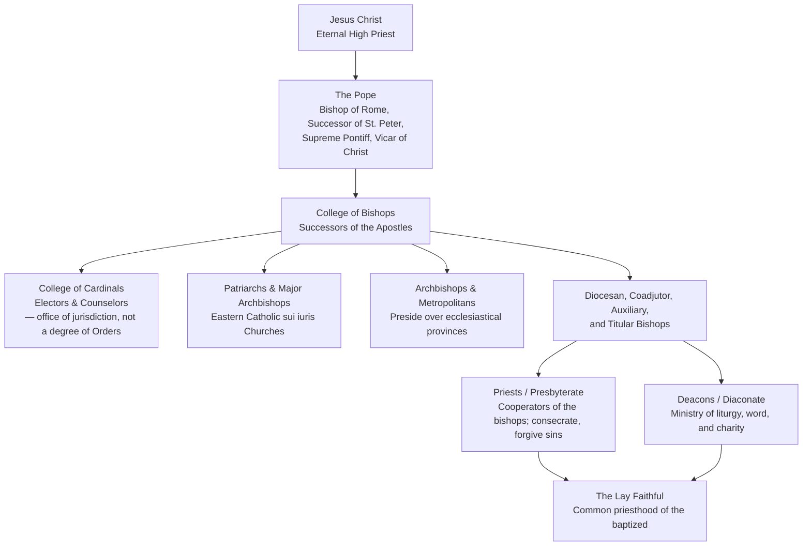

# The Hierarchy of the Catholic Church

A comprehensive doctrinal and structural study of the hierarchical constitution of the Catholic Church, from the Pope (Bishop of Rome) through the college of bishops, priests, and deacons — including the offices of cardinal, patriarch, archbishop, and metropolitan — with an explicit comparison of the diaconate and the presbyterate. Drawn from Sacred Scripture, the ecumenical councils (especially Vatican I and Vatican II), the [_Catechism of the Catholic Church_](https://www.magisterium.com/docs/0583c069-d4bf-42dd-97de-c19f0b80150f/ref/para-1), the Code of Canon Law, and the Code of Canons of the Eastern Churches.

---

## 1. Introduction: What the Hierarchy Is

The word **hierarchy** (Greek _hierarchia_, from _hieros_, "sacred," and _archein_, "to rule") denotes the totality of ruling powers established in the Church for the guidance of the faithful to salvation ([Catholic Encyclopedia, "Hierarchy"](https://www.magisterium.com/docs/f2c979a8-871d-4f46-a059-320d3b837a76/ref/Hierarchy)). The term entered common theological usage through the Pseudo-Dionysius the Areopagite (6th century), who modeled the earthly hierarchy on the nine choirs of the heavenly hierarchy.

The Catholic hierarchy is **not** a mere administrative chain of command. It is the visible, sacramental continuation of the apostolic ministry instituted by Jesus Christ:

> "For the nurturing and constant growth of the People of God, Christ the Lord instituted in His Church a variety of ministries, which work for the good of the whole body... Jesus Christ, the eternal Shepherd, established His holy Church, having sent forth the apostles as He Himself had been sent by the Father; and He willed that their successors, namely the bishops, should be shepherds in His Church even to the consummation of the world. And in order that the episcopate itself might be one and undivided, He placed Blessed Peter over the other apostles, and instituted in him a permanent and visible source and foundation of unity of faith and communion."
> — [_Lumen Gentium_ 18](https://www.magisterium.com/docs/5e832a8b-f1b9-4740-9bf4-8209f9910f2f/ref/18)

The hierarchy exists **for service** — for the sanctification, teaching, and governance of the People of God — and is ordered to communion. It is rooted in the Sacrament of Holy Orders, which is conferred in three degrees: the **episcopate** (bishop), the **presbyterate** (priest), and the **diaconate** (deacon) ([CCC 1536](https://www.magisterium.com/docs/0583c069-d4bf-42dd-97de-c19f0b80150f/ref/1536)).

### The Twofold Hierarchy: Order and Jurisdiction

Theological tradition distinguishes two intimately related hierarchies within the Church ([Catholic Encyclopedia, "Hierarchy"](https://www.magisterium.com/docs/f2c979a8-871d-4f46-a059-320d3b837a76/ref/Hierarchy)):

- **Hierarchy of Order** (_hierarchia ordinis_): the sacramental power conferred by Holy Orders, exercised over the Real Body of Christ in the Eucharist and the sanctification of souls. This comprises the three degrees of bishop, priest, and deacon.
- **Hierarchy of Jurisdiction** (_hierarchia jurisdictionis_): the power of governing and teaching, exercised over the Mystical Body of Christ, the Church. This includes the legislative, judicial, coercive, and administrative powers of the Pope and bishops, and the offices of cardinal, patriarch, archbishop, and so forth.

A man may belong to the hierarchy of jurisdiction without being a bishop (e.g., a priest who is a cardinal or a papal legate); but the supreme degrees of jurisdiction belong to the episcopate. The Pope holds supreme and full jurisdiction over the universal Church in virtue of his office as Vicar of Christ ([_Lumen Gentium_ 22](https://www.magisterium.com/docs/5e832a8b-f1b9-4740-9bf4-8209f9910f2f/ref/22)).

---

## 2. The Pope: Bishop of Rome and Supreme Pontiff

The Pope — from the Greek _pappas_, "father" — is the Bishop of Rome, the Successor of St. Peter, and the visible Head of the whole Church. His office descends in unbroken succession from the Prince of the Apostles (see [papal-chronology.md](papal-chronology.md)).

### 2.1 Titles of the Pope

The Pope bears several titles, each expressing an aspect of his office:

| Title                                                      | Meaning                                                                                 |
| ---------------------------------------------------------- | --------------------------------------------------------------------------------------- |
| **Bishop of Rome**                                         | His episcopal see, the Apostolic See (_Sedes Apostolica_), where St. Peter was martyred |
| **Successor of St. Peter**                                 | Heir of the Petrine office conferred in Matthew 16:18–19 and John 21:15–17              |
| **Vicar of Christ**                                        | Acting in the person of Christ as visible head of His Church                            |
| **Supreme Pontiff** (_Summus Pontifex_)                    | From the ancient title _Pontifex Maximus_, "greatest bridge-builder"                    |
| **Head of the College of Bishops**                         | The principle of unity of the episcopal college                                         |
| **Patriarch of the West**                                  | Historical title reflecting his patriarchal role in the Latin Church                    |
| **Servant of the Servants of God** (_Servus Servorum Dei_) | The humility of the office, first used by St. Gregory the Great                         |

### 2.2 The Primacy of the Roman Pontiff

The primacy of the Pope is a **dogma of faith**, defined by the First Vatican Council (1870) in _Pastor Aeternus_ and reaffirmed by Vatican II. It comprises:

- **Primacy of jurisdiction**: The Pope has "full, supreme and universal power over the whole Church, a power which he can always exercise unhindered" ([CCC 882](https://www.magisterium.com/docs/0583c069-d4bf-42dd-97de-c19f0b80150f/ref/882); [_Lumen Gentium_ 22](https://www.magisterium.com/docs/5e832a8b-f1b9-4740-9bf4-8209f9910f2f/ref/22)). This is a primacy of _jurisdiction_, not merely of honor.
- **Infallibility**: The Pope, when he teaches _ex cathedra_ (as supreme pastor and teacher of all the faithful, defining a doctrine concerning faith or morals), possesses that infallibility with which the divine Redeemer willed His Church to be endowed ([CCC 891](https://www.magisterium.com/docs/0583c069-d4bf-42dd-97de-c19f0b80150f/ref/891); Vatican I, _Pastor Aeternus_). The conditions are strict: he must speak _ex cathedra_, on faith or morals, and intend to bind the whole Church.
- **Universal ordinary power**: The Pope is always free to exercise his supreme authority, and the bishops are not "vicars of the Roman Pontiff," for they exercise an authority proper to themselves ([_Lumen Gentium_ 27](https://www.magisterium.com/docs/5e832a8b-f1b9-4740-9bf4-8209f9910f2f/ref/27)).

### 2.3 Election of the Pope

Since 1059 the Pope is elected exclusively by the **College of Cardinals** in conclave (the Latin _cum clave_, "with key," referring to the sequestration of the electors). A two-thirds majority is required. Cardinals under the age of eighty are the electors ([Code of Canon Law, Can. 349](https://www.magisterium.com/docs/927224e3-8c2d-44ed-a9fb-dc736030081d/ref/349); [_Universi Dominici Gregis_](https://www.magisterium.com/docs/927224e3-8c2d-44ed-a9fb-dc736030081d/ref/)).

### 2.4 The Roman Curia

The Pope governs the universal Church with the assistance of the **Roman Curia** — the dicasteries, congregations, tribunals, and offices that serve as his instruments. The principal bodies include the Secretariat of State, the Dicasteries for Doctrine, for Bishops, for Clergy, and for Eastern Churches, the Apostolic Signatura, and the Roman Rota. The Curia acts in the name and by the authority of the Pope.

---

## 3. The College of Bishops

### 3.1 Bishops: Successors of the Apostles

The bishops are the successors of the Apostles, and together with the Pope they constitute the **college of bishops**, the successor of the college of Apostles:

> "Just as in the Gospel, the Lord so disposing, St. Peter and the other apostles constitute one apostolic college, so in a similar way the Roman Pontiff, the successor of Peter, and the bishops, the successors of the apostles, are joined together... But the college or body of bishops has no authority unless it is understood together with the Roman Pontiff, the successor of Peter as its head."
> — [_Lumen Gentium_ 22](https://www.magisterium.com/docs/5e832a8b-f1b9-4740-9bf4-8209f9910f2f/ref/22)

The episcopate is the **fullness of the Sacrament of Holy Orders** ([CCC 1557](https://www.magisterium.com/docs/0583c069-d4bf-42dd-97de-c19f0b80150f/ref/1557); [_Lumen Gentium_ 21](https://www.magisterium.com/docs/5e832a8b-f1b9-4740-9bf4-8209f9910f2f/ref/21)). By episcopal consecration the bishop receives:

- The **threefold munera**: the office of **teaching** (_munus docendi_), of **sanctifying** (_munus sanctificandi_), and of **governing** (_munus regendi_) — exercised only in hierarchical communion with the head and members of the college.
- The **indelible character** configuring him to Christ the High Priest.
- The power to ordain, to confirm, and to act as the ordinary minister of all the sacraments.

The bishop governs his particular church (diocese) with **proper, ordinary, and immediate** power, which is "not destroyed by the supreme and universal power, but on the contrary... affirmed, strengthened and vindicated by it" ([_Lumen Gentium_ 27](https://www.magisterium.com/docs/5e832a8b-f1b9-4740-9bf4-8209f9910f2f/ref/27)).

### 3.2 The Ecumenical Council

The college of bishops, when it acts together with its head the Pope, exercises supreme authority over the whole Church. This supreme collegiate act is realized pre-eminently in the **Ecumenical Council** (e.g., Nicaea, Trent, Vatican I, Vatican II). A council is ecumenical only when confirmed or at least accepted by the Pope, without whose headship the college can act nothing (see [apostolic-foundation-councils.md](apostolic-foundation-councils.md)).

---

## 4. The Cardinals

The **College of Cardinals** (from Latin _cardo_, "hinge") is a body of senior churchmen appointed by the Pope to serve as his principal counselors and, since 1059, as his sole electors. The cardinalate is **not a degree of Holy Orders** — it is an office of jurisdiction and honor. Cardinals may be bishops, priests, or (historically) deacons. By ancient custom, those who are not already bishops are consecrated bishops upon appointment.

### 4.1 The Three Orders of Cardinals

The College is traditionally divided into three orders ([Code of Canon Law, Can. 350](https://www.magisterium.com/docs/927224e3-8c2d-44ed-a9fb-dc736030081d/ref/350)):

- **Cardinal Bishops**: the six cardinal-bishops of the suburbicarian sees of Rome (Ostia, Porto–Santa Rufina, Albano, Frascati, Palestrina, Sabina–Poggio Mirteto) and the cardinal patriarchs of the Eastern Catholic Churches; the Dean of the College is drawn from this order.
- **Cardinal Priests**: the great majority, titular holders of the ancient parish churches (_tituli_) of Rome.
- **Cardinal Deacons**: titular holders of the ancient diaconal churches; senior members may be promoted to the order of cardinal priests.

### 4.2 Functions of the Cardinals

- **Electing the Pope** in conclave (only cardinals under eighty years of age).
- **Advising the Pope**, individually and in consistory (the assembly of cardinals).
- **Governing the Church** during the vacancy of the Apostolic See.
- **Serving in the Roman Curia** and as papal legates.

---

## 5. Other Episcopal and Hierarchical Offices

Beyond the Pope, the bishops, and the cardinals, the Church's hierarchy of jurisdiction includes several other offices and titles:

### 5.1 Patriarchs and Major Archbishops (Eastern Catholic)

In the Eastern Catholic _sui iuris_ Churches, the highest offices are the **Patriarch** and the **Major Archbishop**, who govern their Churches with the authority proper to their office in communion with the Pope (see [eastern-catholic-churches.md](eastern-catholic-churches.md)). The Code of Canons of the Eastern Churches (CCEO, Canons 55–58, 151–154) governs their election, rights, and duties. The six Catholic patriarchates are: Alexandria (Coptic), Antioch (Syriac, Maronite, Melkite), Babylon (Chaldean), and Cilicia (Armenian); there are also major archbishops (e.g., Kyiv–Galicia, Ernakulam–Angamaly, Făgăraș–Alba Iulia).

### 5.2 Archbishops and Metropolitans

- **Archbishop**: the bishop of an archdiocese, an episcopal see of greater dignity; some are **titular archbishops** (without a residential see).
- **Metropolitan**: in the Latin Church, an archbishop who presides over an **ecclesiastical province** (a group of dioceses); he has limited supervisory power over his suffragan bishops and receives the **pallium** from the Pope as the sign of his office ([Code of Canon Law, Can. 435–437](https://www.magisterium.com/docs/927224e3-8c2d-44ed-a9fb-dc736030081d/ref/435)). In the Eastern Churches, **metropolitan _sui iuris_** Churches are governed by metropolitans with a defined autonomy.

### 5.3 Primates

A **primate** is an archbishop or bishop who holds precedence over the bishops of a nation or region (e.g., the Primate of Poland, the Primate of Hungary). The title is largely honorific today.

### 5.4 Kinds of Bishops

- **Diocesan (residential) bishop**: the shepherd of a particular church.
- **Coadjutor bishop**: appointed to succeed a diocesan bishop, with the right of succession.
- **Auxiliary bishop**: a bishop appointed to assist a diocesan bishop, without right of succession.
- **Titular bishop**: a bishop without a residential see, holding the title of a defunct ancient see (e.g., titular bishop of the see of a suppressed ancient city).

---

## 6. Priests: The Presbyterate

The **priest** (from _presbyter_, "elder") is the second degree of Holy Orders. Priests are "prudent cooperators with the Episcopal order, its aid and instrument," who "constitute one priesthood with their bishop although bound by a diversity of duties" ([_Lumen Gentium_ 28](https://www.magisterium.com/docs/5e832a8b-f1b9-4740-9bf4-8209f9910f2f/ref/28)).

### 6.1 The Priesthood of the New Testament

The priest is configured to Christ the eternal High Priest and acts **in the person of Christ the Head** (_in persona Christi capitis_). The Catechism of the Council of Trent describes the surpassing dignity of the priesthood:

> "The power of consecrating and offering the body and blood of our Lord and of forgiving sins, which has been conferred on them, not only has nothing equal or like to it on earth, but even surpasses human reason and understanding."
> — [Catechism of the Council of Trent, "The Sacraments – Holy Orders"](https://www.magisterium.com/docs/bca78fa8-4968-4ea8-8522-727db99ffac3/ref/The%20Sacraments%20-%20Holy%20Orders)

### 6.2 Powers Proper to the Priest

The priest, by the Sacrament of Holy Orders, possesses sacramental powers that the deacon does not:

- **Consecrating the Eucharist**: the power to change bread and wine into the Body and Blood of Christ at the consecration of the Mass.
- **Forgiving sins**: the power to absolve sins in the Sacrament of Penance (John 20:22–23), exercised under the jurisdiction granted by his bishop.
- **Anointing the sick**: administering the Sacrament of the Anointing of the Sick (James 5:14–15).
- **Preaching and teaching** in the name of the Church, and **shepherding** the faithful as pastor (_parochus_) of a parish.
- **Conferring** the sacraments of Baptism and Matrimony (the latter as the Church's witnessing minister), and assisting at Confirmation when delegated.

### 6.3 The Priest and the Bishop

Priests are united with their bishop in sacerdotal dignity, but "they do not possess the highest degree of the priesthood, and... are dependent on the bishops in the exercise of their power" ([_Lumen Gentium_ 28](https://www.magisterium.com/docs/5e832a8b-f1b9-4740-9bf4-8209f9910f2f/ref/28)). They cannot ordain, and their faculties for confession and preaching are received from the bishop. In the **Eastern Catholic Churches**, priests may also administer Confirmation (Chrismation) to the newly baptized, a function ordinarily reserved to the bishop in the Latin Rite.

---

## 7. Deacons: The Diaconate

The **deacon** (from Greek _diakonos_, "servant" or "minister") is the first degree of Holy Orders. The diaconate is traced to the institution of the Seven in Acts 6:1–6, the first of whom was St. Stephen the Protomartyr ([Catholic Encyclopedia, "Deacons"](https://www.magisterium.com/docs/f2c979a8-871d-4f46-a059-320d3b837a76/ref/Deacons)).

### 7.1 The Nature of the Diaconate

The Second Vatican Council describes the diaconate as service, not priesthood:

> "At a lower level of the hierarchy are deacons, upon whom hands are imposed 'not unto the priesthood, but unto a ministry of service.' For strengthened by sacramental grace, in communion with the bishop and his group of priests they serve in the diaconate of the liturgy, of the word, and of charity to the people of God."
> — [_Lumen Gentium_ 29](https://www.magisterium.com/docs/5e832a8b-f1b9-4740-9bf4-8209f9910f2f/ref/29)

### 7.2 Duties of the Deacon

The same text of _Lumen Gentium_ 29 enumerates the deacon's duties, "according as it shall have been assigned to him by competent authority":

- To **administer Baptism solemnly**.
- To be **custodian and dispenser of the Eucharist** (including distributing Holy Communion and bringing it to the sick).
- To **assist at and bless marriages** in the name of the Church.
- To **bring Viaticum to the dying**.
- To **read the Sacred Scripture to the faithful**, to **instruct and exhort the people**, and to **preach**.
- To **preside over the worship and prayer of the faithful** (e.g., funeral rites, Exposition of the Blessed Sacrament, Liturgy of the Hours).
- To **administer sacramentals** and to **officiate at funeral and burial services**.
- To devote himself to **duties of charity and of administration**.

The deacon does **not** consecrate the Eucharist, **does not** absolve sins, and **does not** anoint the sick — these belong to the priesthood.

### 7.3 Transitional and Permanent Deacons

- **Transitional deacons** are seminarians ordained to the diaconate as the final step before ordination to the priesthood.
- **Permanent deacons** are ordained to the diaconate as a permanent state of life, restored by the Second Vatican Council as "a proper and permanent rank of the hierarchy" ([_Lumen Gentium_ 29](https://www.magisterium.com/docs/5e832a8b-f1b9-4740-9bf4-8209f9910f2f/ref/29)). In the Latin Rite, permanent deacons may be married men (though a married deacon cannot remarry after the death of his wife without dispensation); in the Eastern Catholic Churches, married men may be ordained to the diaconate and presbyterate, while bishops are chosen from among celibates.

---

## 8. Deacon vs. Priest: A Direct Comparison

| Aspect                             | **Deacon**                                                                                                                                        | **Priest**                                                         |
| ---------------------------------- | ------------------------------------------------------------------------------------------------------------------------------------------------- | ------------------------------------------------------------------ |
| **Degree of Holy Orders**          | First degree (diaconate)                                                                                                                          | Second degree (presbyterate)                                       |
| **Ordination formula**             | "Not unto the priesthood, but unto a ministry of service" ([LG 29](https://www.magisterium.com/docs/5e832a8b-f1b9-4740-9bf4-8209f9910f2f/ref/29)) | Consecrated to act _in persona Christi capitis_                    |
| **Consecrating the Eucharist**     | **No**                                                                                                                                            | **Yes** — the power to confect the Body and Blood of Christ        |
| **Forgiving sins (Penance)**       | **No**                                                                                                                                            | **Yes** — absolves sins in Christ's name                           |
| **Anointing of the Sick**          | **No**                                                                                                                                            | **Yes**                                                            |
| **Ordaining others**               | **No**                                                                                                                                            | **No** (reserved to bishops)                                       |
| **Baptism**                        | May administer solemnly                                                                                                                           | May administer                                                     |
| **Marriage**                       | May assist at and bless marriages                                                                                                                 | May assist at and bless marriages                                  |
| **Proclaiming the Gospel**         | Yes, and may preach                                                                                                                               | Yes, as ordinary preacher                                          |
| **Liturgical role at Mass**        | Assists, proclaims the Gospel, serves the altar, distributes Communion                                                                            | Presides as celebrant, offers the Eucharistic sacrifice            |
| **Sacramental character**          | Indelible character of service                                                                                                                    | Indelible character of priesthood                                  |
| **Marriage/celibacy (Latin Rite)** | Permanent deacons may be married                                                                                                                  | Must be celibate (discipline, not dogma)                           |
| **Ordinary minister of**           | Baptism, and (delegated) Exposition, funerals, sacramentals                                                                                       | All sacraments except Orders and (ordinarily) Confirmation         |
| **Relation to bishop**             | Serves the bishop and his priests in liturgy, word, charity                                                                                       | Cooperates with and is dependent on the bishop in exercising power |

In summary: **the priest is ordained to offer sacrifice and forgive sins; the deacon is ordained to serve** — in the liturgy, the word, and charity. The deacon's service is real and sacramental, but it is ordered to the ministry of the bishop and the priests, not to the priestly act of consecration and absolution.

---

## 9. The Hierarchy and the Laity

The hierarchical ministry must be distinguished from the **common priesthood of the faithful**, in which all the baptized share (1 Peter 2:9; [CCC 1141](https://www.magisterium.com/docs/0583c069-d4bf-42dd-97de-c19f0b80150f/ref/1141)). These two participations in the one priesthood of Christ "differ essentially and not only in degree" ([_Lumen Gentium_ 10](https://www.magisterium.com/docs/5e832a8b-f1b9-4740-9bf4-8209f9910f2f/ref/10)). The ministerial or hierarchical priesthood is at the service of the common priesthood, and exists to build up the Body of Christ. The laity, for their part, participate in the Church's mission through their baptismal priesthood, their witness in the world, and their cooperation in the apostolate.

---

## 10. Summary Diagram

---

## 11. Related Documents

- [papal-chronology.md](papal-chronology.md) — the complete chronological list of popes from St. Peter to the present.
- [apostolic-foundation-councils.md](apostolic-foundation-councils.md) — the apostolic foundation, the Petrine office, and the ecumenical councils.
- [eastern-catholic-churches.md](eastern-catholic-churches.md) — the theology and structure of the 23 Eastern Catholic _sui iuris_ Churches, including patriarchs and major archbishops.
- [../sacraments/holy-orders.md](../sacraments/holy-orders.md) — the Sacrament of Holy Orders in its three degrees: episcopate, presbyterate, diaconate.
- [../saints/patron-st-peter.md](../saints/patron-st-peter.md) — biography of St. Peter, the Prince of the Apostles and first Bishop of Rome.
- [../saints/patron-st-paul.md](../saints/patron-st-paul.md) — biography of St. Paul, Apostle to the Gentiles.
- [../sacraments/README.md](../sacraments/README.md) — the master index of the seven sacraments.
