# Eastern Catholic Churches: History, Liturgy, and Canonical Structure

The **Eastern Catholic Churches** (often referred to as Eastern-rite Catholic Churches or _sui iuris_ Churches) are self-governing, particular Eastern Christian Churches in full communion with the Bishop of Rome (the Pope). They represent a fundamental ecclesiological reality within the Catholic Church: that Catholicity is not synonymous with "Latinity" or uniformity, but is a communion of Churches expressing a single faith through diverse liturgical, theological, spiritual, and canonical traditions.

---

## 1. Theological and Ecclesiological Foundations

### Unity in Diversity

The central concept of the Eastern Catholic Churches is **"unity in diversity."** As the Second Vatican Council's decree _Orientalium Ecclesiarum_ (Decree on the Eastern Catholic Churches) states:

> "The Holy Catholic Church, which is the Mystical Body of Christ, is made up of the faithful who are organically united in the Holy Spirit by the same faith, the same sacraments and the same government and who, combining into various groups held together by a hierarchy, form particular Churches or Rites... It is the mind of the Catholic Church that each individual Church or Rite should retain its traditions whole and entire and likewise that it should adapt its way of life to the different needs of time and place." (OE 2)

Eastern Catholics are in full communion with the Pope and accept papal primacy (dogma), but they are not subject to the Code of Canon Law (_Codex Iuris Canonici_ - CIC) of the Latin Church. Instead, they are governed by their own law, the **Code of Canons of the Eastern Churches** (_Codex Canonum Ecclesiarum Orientalium_ - CCEO) and their respective synodical structures.

### Dogma vs. Discipline

A critical distinction in Catholic theology is made between **dogma** (immutable, divinely revealed truth necessary for salvation) and **discipline** (ecclesiastical laws, practices, and customs that can be modified or differ by region and Rite).

- **Dogmatic Unity:** All Catholic Churches—both Latin and Eastern—share the exact same dogmas of the faith, including the Trinity, the Incarnation, the Seven Sacraments, and the Primacy and Infallibility of the Bishop of Rome.
- **Disciplinary Diversity:** Many practices that Latin Catholics consider "universal" are actually Latin disciplines. Eastern Catholics preserve ancient disciplines regarding liturgical languages, bread for the Eucharist, sacramental timing, and clerical celibacy.

---

## 2. Historical Origins and Milestone Unions

The history of the Eastern Catholic Churches is rooted in the early division of the Christian world and the subsequent efforts to restore unity.

### The Ancient Pentarchy and the Great Schism

In the first millennium, the Christian Church was organized around five ancient patriarchal sees (the Pentarchy): **Rome, Constantinople, Alexandria, Antioch, and Jerusalem**.
Over centuries, theological, cultural, and political differences accumulated, culminating in the **Great Schism of 1054** between Rome (the Latin West) and Constantinople (the Byzantine East).

### Historical Reunions (Unions after Schisms)

While the majority of Eastern Christians remained in the Orthodox or Non-Chalcedonian Communions, several reunion movements occurred over the centuries. In many cases, a portion of an Eastern Christian community desired to restore communion with Rome while fully retaining their liturgical and governance heritage.

Key milestone unions include:

- **Council of Florence (1439):** A major ecumenical council that achieved temporary unions with the Byzantine Greeks, Armenians, and Copts, though most of these unions were short-lived due to political pressures and popular opposition in the East.
- **Union of Brest (1595–1596):** In the Polish-Lithuanian Commonwealth, Metropolitan Michael Rohoza and other bishops of the Kyiv Metropolitanate formally entered communion with Rome, establishing the Ukrainian Greek Catholic Church.
- **Union of Uzhhorod (1646):** Sixty-three priests of the Byzantine Rite in Central Europe entered into union with Rome, which eventually grew into the Ruthenian Greek Catholic Church.
- **Continuity without Schism:** Some communities never formally separated from Rome. The **Maronites** of Lebanon assert that they never entered into schism and have always maintained communion with the Pope. Similarly, the **Italo-Albanian Catholics** of Southern Italy never severed communion.

### Rejection of "Uniatism" as a Method

Historically, the movement to form Eastern Catholic Churches was often referred to as "Uniatism" (from _Unia_, meaning union). In modern ecumenical dialogue, both the Catholic Church and the Orthodox Church reject "uniatism" as a coercive or proselytizing method of achieving union because it sought to draw individual communities away from their mother churches rather than seeking full communion between the sister churches as wholes.
However, the Catholic Church emphasizes that the existing Eastern Catholic Churches have an absolute right to exist, govern themselves, and minister to their faithful as full, legitimate expressions of the Catholic Church.

---

## 3. Liturgical Traditions and the 5 Rite Families

Every Eastern Catholic Church belongs to one of five major liturgical traditions. Liturgical tradition (or "Rite") is not merely a different set of prayers; it is a holistic expression of theology, spirituality, art, and administrative history.

```mermaid
graph TD
    classDef default fill:#f9f9f9,stroke:#333,stroke-width:2px;

    Catholic[Catholic Church] --> Latin[Latin Church]
    Catholic --> Eastern[Eastern Catholic Churches]

    Eastern --> Alex[Alexandrian Tradition]
    Eastern --> Anti[Antiochene Tradition]
    Eastern --> Arm[Armenian Tradition]
    Eastern --> Chal[Chaldean Tradition]
    Eastern --> Const[Constantinopolitan / Byzantine Tradition]

    Alex --> Coptic[Coptic Catholic Church]
    Alex --> Eth[Ethiopian Catholic Church]
    Alex --> Eri[Eritrean Catholic Church]

    Anti --> Mar[Maronite Catholic Church]
    Anti --> Syr[Syrian Catholic Church]
    Anti --> SyroM[Syro-Malankara Catholic Church]

    Arm --> ArmC[Armenian Catholic Church]

    Chal --> ChalC[Chaldean Catholic Church]
    Chal --> SyroMal[Syro-Malabar Catholic Church]

    Const --> Mel[Melkite Greek Catholic]
    Const --> Ukr[Ukrainian Greek Catholic]
    Const --> Rom[Romanian Greek Catholic]
    Const --> Rut[Ruthenian Catholic]
    Const --> Slov[Slovak Greek Catholic]
    Const --> Hun[Hungarian Greek Catholic]
    Const --> Italo[Italo-Albanian Catholic]
    Const --> OtherByz[Others: Belarusian, Russian, Albanian, Georgian, Greek, etc.]
```

### I. Alexandrian (Coptic) Tradition

Characterized by liturgical structures descending from the ancient Church of Alexandria in Egypt.

- **Coptic Catholic Church** (Egypt)
- **Ethiopian Catholic Church** (Ethiopia)
- **Eritrean Catholic Church** (Eritrea - established in 2015)

### II. Antiochene (West Syrian) Tradition

Following the ancient West Syrian liturgy of Jerusalem and Antioch, heavily utilizing Western Syriac or liturgical languages.

- **Maronite Catholic Church** (Lebanon; entirely Catholic with no non-Catholic counterpart)
- **Syrian Catholic Church** (Levant/Syria)
- **Syro-Malankara Catholic Church** (India)

### III. Armenian Tradition

A highly unique liturgy and liturgical calendar native to the Armenian people.

- **Armenian Catholic Church** (HQ in Beirut, Lebanon)

### IV. Chaldean (East Syrian) Tradition

Originating in ancient Mesopotamia and Persia, using the East-Syriac liturgical rite.

- **Chaldean Catholic Church** (Iraq)
- **Syro-Malabar Catholic Church** (India; one of the largest and most vibrant Eastern Catholic Churches, tracing its lineage back to St. Thomas the Apostle)

### V. Constantinopolitan (Byzantine) Tradition

Based on the Liturgy of St. John Chrysostom and St. Basil the Great, originating from the Patriarchate of Constantinople. This comprises the largest number of Eastern Catholic Churches.

- **Melkite Greek Catholic Church** (Middle East/Levant)
- **Ukrainian Greek Catholic Church** (The largest Eastern Catholic Church)
- **Romanian Greek Catholic Church** (Romania)
- **Ruthenian Catholic Church** (Ruthenia/USA)
- **Slovak Greek Catholic Church** (Slovakia)
- **Hungarian Greek Catholic Church** (Hungary)
- **Italo-Albanian Catholic Church** (Italy; never broke communion)
- **Greek Catholic Church of Croatia and Serbia** (Balkans)
- Liturgical communities with smaller hierarchies:
  - **Belarusian Greek Catholic Church**
  - **Russian Greek Catholic Church**
  - **Albanian Greek Catholic Church**
  - **Georgian Byzantine Catholic Church**
  - **Greek Byzantine Catholic Church** (Greece)

---

## 4. Canonical Structures and Governance

In Roman Catholicism, the primary code is the _Codex Iuris Canonici_ (CIC). For the Eastern Churches, the **Code of Canons of the Eastern Churches (CCEO)** governs all aspects of life.

### Categories of Churches _Sui Iuris_

The CCEO recognizes four categories of self-governing (_sui iuris_) Churches, based on their degree of administrative independence and historical standing:

1. **Patriarchal Churches:** The most autonomous Eastern Churches. The Synod of Bishops of a Patriarchal Church elects its own Patriarch, who is then in communion with the Pope. The Synod can establish eparchies and elect bishops for its territory, needing only papal consultation rather than direct appointment. Examples: _Maronite, Melkite, Chaldean, Syrian, Armenian, Coptic._
2. **Major Archiepiscopal Churches:** Governed identically to Patriarchal Churches, but headed by a Major Archbishop rather than a Patriarch. Examples: _Ukrainian, Romanian, Syro-Malabar, Syro-Malankara._
3. **Metropolitan Churches _Sui Iuris_:** Headed by a Metropolitan who is appointed directly by the Pope from a list of candidates submitted by the Church's hierarchy. Examples: _Ethiopian, Slovak, Ruthenian (Pittsburgh)._
4. **Other Churches _Sui Iuris_:** Smaller Churches governed by an Eparch or Apostolic Administrator appointed by Rome. Examples: _Italo-Albanian, Hungarian, Greek._

### Eparchies vs. Dioceses

In the Eastern Churches, the equivalent of a "diocese" is called an **eparchy**, and its bishop is an **eparch**. The eparch is the shepherd of the local portion of the people of God, possessing legislative, executive, and judicial powers within his assigned eparchy under CCEO canon 191.

---

## 5. Major Differences in Liturgy and Sacrament

Because Eastern Catholics preserve Eastern Christian traditions, several major practices differ substantially from those found in the Latin (Roman) Rite.

| Practice / Sacrament         | Latin (Roman) Rite                                                                                    | Eastern Catholic Churches                                                                                         | Style                  |
| :--------------------------- | :---------------------------------------------------------------------------------------------------- | :---------------------------------------------------------------------------------------------------------------- | :--------------------- |
| **Clerical Celibacy**        | Mandatory discipline for the priesthood (some exceptions apply, such as the Oridinariate).            | Prominent ancient discipline allowing the ordination of married men (bishops must be celibate).                   | _Discipline_           |
| **Sacraments of Initiation** | Baptism, Confirmation (usually around age 7–16), and Holy Communion are typically separated by years. | Holy Baptism, Chrismation (Confirmation), and the Holy Eucharist are administered to infants in a single liturgy. | _Liturgy / Discipline_ |
| **Eucharistic Bread**        | Unleavened wheat bread (_host_).                                                                      | Leavened bread (_leaven_ is symbolic of the Holy Spirit, except in the Armenian and Maronite Rites).              | _Liturgy / Discipline_ |
| **Liturgy Structure**        | Holy Mass (Roman Rite), structured around brief, direct prayers.                                      | Divine Liturgy (Byzantine, etc.) with extensive iconography, chanting, use of incense, and active participation.  | _Liturgy_              |
| **Sign of the Cross**        | Left shoulder to right shoulder, typically with open hand.                                            | Right shoulder to left shoulder (Byzantine Rite), joining three fingers to symbolize the Holy Trinity.            | _Spirituality_         |

---

## 6. Ecumenical Significance

The existence and thriving of Eastern Catholic Churches are of paramount importance for the future of Christian unity. Popes in the modern era, particularly Pope John Paul II in his apostolic letter _Orientale Lumen_ (1995), have emphasized that the Church must **"breathe with her two lungs"**—East and West:

> "The members of the Catholic Church of the Latin tradition must also be fully opened to this treasure and feel... the need to be offered the possibility of breathing in all its fullness the wisdom of the Christian East... The Church must breathe with her two lungs!" (OL 28)

While their presence has historically been a point of friction with the Eastern Orthodox and Oriental Orthodox Churches (who sometimes view them as obstacles to direct reconciliation), contemporary Catholic theology views Eastern Catholics as living proof that full communion with Rome does not entail the loss of unique theological, liturgical, and spiritual patrimonies. They represent the living bridge between the Christian East and West.

---

## 7. Inter-Ritual Participation: Latin Catholics in Eastern Liturgies

Because the Eastern Catholic Churches are in full, visible communion with the Bishop of Rome, they are fully Catholic. Consequently, Latin (Roman) Catholics are permitted and encouraged to participate in Eastern liturgies and spiritual practices under Catholic canon law.

### I. Fulfilling the Sunday and Holy Day Obligation

A Latin Catholic **fully satisfies** their Sunday or Holy Day of obligation by participating in an Eastern Catholic Divine Liturgy (or equivalent Eucharistic Liturgy).

- **Canonical Basis:** Under the Latin Church's Code of Canon Law, [CIC can. 1248 §1](eastern-catholic-churches.md#L4) provides:
  > "A person who assists at a Mass celebrated anywhere in a Catholic rite either on the holy day itself or in the evening of the preceding day satisfies the obligation of participating in the Mass."
- **Application:** Divine Liturgies celebrated in any of the Eastern Catholic Churches satisfy this obligation as they are Eucharistic sacrifices celebrated in a valid Catholic rite.

### II. Receiving Holy Communion

A Latin Catholic **may licitly and validly receive Holy Communion** at any Eastern Catholic Divine Liturgy, provided they are properly disposed (i.e., in a state of grace, having observed the eucharistic fast).

- **Canonical Basis:** Under [CIC can. 923](eastern-catholic-churches.md#L4):
  > "The Christian faithful can participate in the eucharistic sacrifice and receive holy communion in any Catholic rite, without prejudice to the prescript of can. 844."
- **Liturgical Practice:** Roman Catholics should respect and follow the receiving custom of the particular Eastern Church they are visiting. For example, in Byzantine parishes, Holy Communion is typically received under both kinds via a liturgical spoon (intinction), while standing, opening the mouth wide, and not repeating the Roman custom of saying "Amen" before receiving.

### III. Reception of Other Sacraments

- **Sacrament of Penance (Confession):** Latin Catholics can validly and licitly receive absolution from any Eastern Catholic priest who possesses the faculties to hear confessions.
- **Confirmation / Chrismation:** Under the Second Vatican Council's decree _Orientalium Ecclesiarum_ (OE 14) and the Eastern Code (_Codex Canonum Ecclesiarum Orientalium_ - CCEO c. 696 §2), Eastern Catholic priests have the valid faculty to administer Chrismation (Confirmation) to Latin Catholics.
- **Matrimony, Baptism, and Holy Orders:** While sacramental graces are identical and valid, these major life-state sacraments are governed by specific jurisdictional rules to ensure the faithful remain properly registered within their parent Church _sui iuris_ (normally the Latin Church for Roman Catholics). Generally, receiving these sacraments within an Eastern Catholic parish requires the permission or coordination of one's local Latin bishop or pastor.
