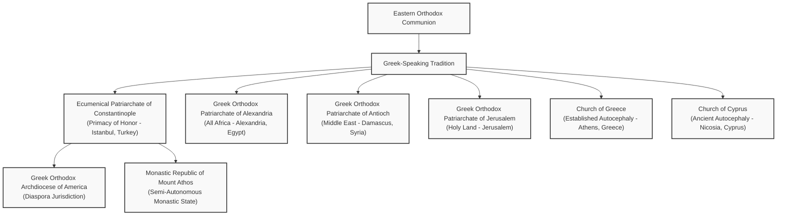

# The Greek Orthodox Church: History, Theology, and Ecclesiological Structure

The **Greek Orthodox Church** (Greek: Ἑλληνορθόδοξη Ἐκκλησία, _Hellēnorthodoxē Ekklēsia_) is a body of several self-governing (autocephalous) Churches within the larger family of Eastern Orthodox Christianity. Historically and sacramentally in full communion with one another, these Churches share a common Byzantine liturgical tradition, theological heritage, and canonical structure.

While the term "Greek Orthodox" historically referred to the Greek-speaking Christian communities of the eastern Roman (Byzantine) Empire, in modern usage it encompasses the ancient Greek-speaking Patriarchates, the Church of Greece, the Church of Cyprus, and their various archdioceses and diaspora communities worldwide.

---

## 1. Historical Origins and Development

The history of the Greek Orthodox Church is indissolubly linked to the expansion of early Christianity in the eastern Mediterranean and the eventual consolidation of the Byzantine Empire.

### The Ancient Pentarchy

During the first millennium of Christian history, ecclesiastical administrative structure solidified around five major patriarchal sees (the Pentarchy): **Rome, Constantinople, Alexandria, Antioch, and Jerusalem**.

Aside from Rome, these patriarchates operated within the cultural and political sphere of the Greek-speaking East. Under the patronage of eastern Roman emperors, Constantinople (founded as "New Rome") rose to immense influence, and its bishop was granted the title of **Ecumenical Patriarch** at the Council of Chalcedon (451 AD).

### The Great Schism of 1054

Tensions between the Latin-speaking West (centered on Rome) and the Greek-speaking East (centered on Constantinople) accumulated over centuries due to linguistic, political, and theological divergences:

- **Papal Supremacy:** Rome asserted direct, universal jurisdiction over all local Churches. Constantinople and the other eastern sees maintained a collegiate model where the Pope held a primacy of honor (_primus inter pares_) but not absolute rule.
- **The Filioque Clause:** The Latin Church unilaterally added the phrase _Filioque_ ("and the Son") to the Nicene-Constantinopolitan Creed. The Eastern Church rejected this dogmatically (arguing it distorted the Trinity) and canonically (arguing that only an ecumenical council could alter the Creed).
- **Liturgical Practices:** Divergences such as the western use of unleavened bread (_azymes_) for the Eucharist vs. the eastern use of leavened bread (_artos_), and mandatory clerical celibacy in the West.

The accumulated friction culminated in July 1054 when Cardinal Humbert of Silva Candida placed a bull of excommunication on the altar of Hagia Sophia in Constantinople, and the Ecumenical Patriarch Michael I Cerularius responded by excommunicating the papal legates. This event marked the formalization of the **Great Schism** between Roman Catholicism and Eastern Orthodoxy.

### Ottoman Rule and the Rum Millet

With the Fall of Constantinople to the Ottoman Empire in 1453, the political landscape of Greek Christianity transformed radically. The Ottoman sultans established the **Rum Millet** (the Roman nation), placing the Ecumenical Patriarch of Constantinople in a dual role as both the supreme spiritual leader and the civil ruler (_Ethnarch_) of all Orthodox Christians within the empire.

This preserved the religious identity of Greek-speaking Christians under Islamic rule, though it also fused Greek ethnic identity closely with Orthodox Church administration.

### The Modern Era and National Autocephaly

With the rise of nationalism in the 19th century and the Greek War of Independence (1821–1829), the centralized authority of the Ecumenical Patriarchate over the Balkans and Greece began to shift.

In 1833, the local bishops declared the Church of Greece independent of Constantinople, a status formally recognized by the Ecumenical Patriarchate in 1850. Similar transformations saw the reorganization of other historic Greek-speaking jurisdictions into national or regional autocephalous bodies.

---

## 2. Theological and Ecclesiological Foundations

The Greek Orthodox Church is deeply patristic, seeking to preserve the faith "once for all delivered to the saints" (Jude 1:3). Its theology is shaped by the mystical, experiential, and synodical traditions of the Christian East.

### Synodical Ecclesiology

Unlike the Roman Catholic Church, which is organized under a single, supreme visible head (the Pope), the Greek Orthodox Church operates on a **synodical or conciliar model**:

- **Communion of Sister Churches:** Every autocephalous (self-governing) Church is led by its own synod of bishops and patriarch or archbishop.
- **Primacy of Honor:** The Ecumenical Patriarch of Constantinople is recognized as the _primus inter pares_ ("first among equals") within the Eastern Orthodox world. He serves as a symbolic point of unity and holds certain historical prerogatives (such as convening pan-Orthodox synods and hearing appeals), but he does not possess universal administrative jurisdiction or infallibility outside his own self-governing territory.
- **Infallibility of the Council:** In Orthodoxy, dogmatic infallibility resides not in any single bishop, but in the entire Church as represented in Ecumenical Council when received by the consensus of the faithful.

### The Seven Ecumenical Councils

Orthodox theology is anchored in the decisions, creeds, and canons of the **Seven Ecumenical Councils** held between 325 AD and 787 AD:

1.  **Nicaea I (325):** Confirmed the divinity of Christ; formulated the original Nicene Creed against Arianism.
2.  **Constantinople I (381):** Confirmed the divinity of the Holy Spirit; completed the Creed.
3.  **Ephesus (431):** Defended the title _Theotokos_ (Mother of God) for the Virgin Mary against Nestorianism.
4.  **Chalcedon (451):** Confirmed Christ's two complete natures (divine and human) in one Person.
5.  **Constantinople II (553):** Reconfirmed Christological dogmas; condemned Origenist errors.
6.  **Constantinople III (680–681):** Confirmed Christ's two wills (divine and human) working in harmony.
7.  **Nicaea II (787):** Defeated Iconoclasm; affirmed that icons of Christ, the Virgin Mary, and the saints may be venerated (_proskynesis_), distinguishing this from the worship (_latreia_) due to God alone.

### Essence-Energies Distinction and Hesychasm

A hallmark of Greek Orthodox theology is the distinction between God's **Essence** (_ousia_) and His **Energies** (_energeiai_), formalized by St. Gregory Palamas in the 14th century:

- **Essence:** God's inner nature is entirely transcendent, incomprehensible, and inaccessible to created beings.
- **Energies:** God's uncreated operations, love, and grace are truly communicated and made present to creation. Through these uncreated energies, human beings can participate in the divine life—a process called **Theosis** (deification or divinization), which is the ultimate goal of human existence.
- **Hesychasm:** A traditional practice of silent, contemplative prayer focusing on the Jesus Prayer ("Lord Jesus Christ, Son of God, have mercy on me, a sinner") to experience the uncreated Light of Tabor (the light witnessed by the Apostles at Christ's Transfiguration).

---

## 3. Structural Organization and Jurisdictions

The term "Greek Orthodox" primarily identifies the following six historical, self-governing churches that utilize Greek as their liturgical or administrative heritage:

### The Four Ancient Patriarchates

1.  **Ecumenical Patriarchate of Constantinople:** Based in Istanbul, Turkey. The historic maternal tree of Eastern Orthodoxy. It directly oversees the Greek Orthodox communities in Turkey, various Aegean islands, Mount Athos, and major western diaspora archdioceses (such as the Greek Orthodox Archdiocese of America and the Archdiocese of Australia).
2.  **Greek Orthodox Patriarchate of Alexandria and All Africa:** Based in Alexandria, Egypt. Possesses canonical jurisdiction over the entire continent of Africa, carrying out extensive missionary work.
3.  **Greek Orthodox Patriarchate of Antioch and All the East:** Based in Damascus, Syria. Historically Greek and West Syrian, its administrative and liturgical language is now predominantly Arabic.
4.  **Greek Orthodox Patriarchate of Jerusalem:** Based in Jerusalem. The "Mother of all Churches," custodian of the Holy Sepulchre and other major biblical holy sites.

### Historic Autocephalous National Churches

5.  **Church of Cyprus:** One of the oldest autocephalous churches, recognized at the Council of Ephesus (431 AD) and independent of any patriarch.
6.  **Church of Greece:** Headed by the Archbishop of Athens and All Greece, governing the Greek mainland and most Peloponnesian dioceses.

---

## 4. Liturgical and Sacramental Traditions

As heirs to the Byzantine Rite, Greek Orthodox Christians participate in a liturgical tradition rich in symbolism, sensory engagement, and monastic spirituality.

### The Byzantine Rite

- **The Divine Liturgy:** The primary Eucharistic service, normally celebrated using the **Divine Liturgy of St. John Chrysostom** (used on most Sundays and feast days) or the longer **Divine Liturgy of St. Basil the Great** (celebrated ten times a year, particularly during Great Lent).
- **The Liturgical Language:** Ecclesiastical Greek (the ancient _Koine_ of the New Testament) is the traditional liturgical language, though the vernacular language (such as English, Arabic, or Swahili) is increasingly utilized in diaspora and missionary territories.
- **Iconography:** Churches are adorned with rich arrays of icons separated from the altar by an **iconostasis** (icon screen). Icons are viewed as "windows into heaven" and are integral to liturgy and private devotions.
- **A Cappella Chanting:** Traditional Greek Byzantine worship relies strictly on vocal music (Byzantine chant) without instrumental accompaniment, echoing early Christian practice.

### The Sacraments (Holy Mysteries)

Orthodox theology recognizes the sacraments as effective means of receiving God's uncreated grace. Typically referred to as the "Holy Mysteries," their administration differs from Western customs:

- **Sacraments of Initiation:** Infant baptism is practiced via **triple immersion** in water (symbolizing Christ's three days in the tomb). Immediately following baptism, the infant is **chrismated** (confirmed) with Holy Myron and receives **Holy Communion** (intinction of leavened bread and wine from a liturgical spoon). This maintains the ancient unity of Eastern Christian initiation.
- **The Holy Eucharist:** Leavened wheat bread (_artos_) and warm water (_zeon_, symbolizing the warmth of the Holy Spirit) are mixed with wine in the chalice. Communicants receive Holy Communion standing, directly from the priest's spoon.
- **Marriage and Divorce:** Marriage is seen as an eternal icon of Christ's union with the Church. It is performed through the Service of Betrothal (exchange of rings) and the Service of Crowning. While marriage is permanent, the Church under pastoral discretion (_oikonomia_) may grant ecclesiastical divorces and permit up to three marriages to avoid greater spiritual harm.
- **Clerical Celibacy:** Married men may be ordained to the diaconate and priesthood. However, once ordained, a cleric cannot marry (or re-marry if widowed). Bishops are selected exclusively from the celibate monastic clergy.

---

## 5. Theological Comparison: Greek Orthodoxy vs. Roman Catholicism

While sharing the same first-millennium apostolic heritage and recognizing each other's valid apostolic succession and sacraments, several deep theological and canonical differences remain.

| Theological Concept          | Greek Orthodox Church                                                                                                          | Roman Catholic Church                                                                                                         | Canonical Category             |
| :--------------------------- | :----------------------------------------------------------------------------------------------------------------------------- | :---------------------------------------------------------------------------------------------------------------------------- | :----------------------------- |
| **Primacy & Authority**      | Conciliar framework with the Ecumenical Patriarch as _primus inter pares_ (first among equals); rejects papal supremacy.       | Universal and immediate jurisdiction of the Pope over the entire global Church.                                               | _Ecclesiology / Canon Law_     |
| **Infallibility**            | Resides in the consensus of the whole Church, expressed through Ecumenical Councils.                                           | Dogma of Papal Infallibility when speaking _ex cathedra_ (from the chair) on faith or morals.                                 | _Ecclesiology / Dogma_         |
| **The Holy Creed**           | Retains original Nicene Creed; Holy Spirit proceeds from "the Father" alone (_John 15:26_).                                    | Creed includes _Filioque_ ("and the Son") stating the Spirit proceeds from both Father and Son.                               | _Trinitarian Theology / Dogma_ |
| **Original / Ancestral Sin** | Focuses on "ancestral sin" (_propatoriko hamartema_) as the inheritance of mortality and a wounded nature, not personal guilt. | Focuses on original sin as an inherited stain of guilt and lack of sanctifying grace, cleansed by baptism.                    | _Hamartiology / Dogma_         |
| **Marian Dogmas**            | Venerates the Virgin Mary as _Panagia_ (All-Holy) and _Theotokos_, but rejects her immaculate exemption from ancestral sin.    | Dogma of the Immaculate Conception (defined in 1854): Mary preserved from all stain of original sin from her conception.      | _Mariology / Dogma_            |
| **Eucharistic Element**      | Uses leavened wheat bread (_artos_) signifying the living presence and the active Holy Spirit.                                 | Historically mandates unleavened wheat bread (_host_) in the Latin Rite, though Eastern Catholics use leavened.               | _Liturgy / Discipline_         |
| **Eschatology (Afterlife)**  | Rejects Purgatory as a place of cleansing fire and satisfaction, but prays for the dead in their progressive passage to God.   | Dogma of Purgatory: a state of temporal punishment and purification for those dying in friendship with God.                   | _Eschatology / Dogma_          |
| **Marriage Indissolubility** | Permitted to apply pastoral _oikonomia_ (economy) to grant ecclesiastical divorce and permit up to three marriages.            | Mandates absolute indissolubility of a consummated sacramental marriage. Declaration of nullity (annulment) required instead. | _Sacramental Discipline_       |

---

## 6. Ecumenical Dialogue and Catholic-Orthodox Relations

In recent decades, significant efforts have been made to bridge the historical and theological divide between Eastern Orthodoxy and Roman Catholicism.

### The Lifting of Mutual Anathemas (1965)

A major milestone of modern ecumenical history occurred on December 7, 1965, during the closing days of the Second Vatican Council. Pope Paul VI and Ecumenical Patriarch Athenagoras I of Constantinople issued a joint declaration:

- They **retracted and erased from memory** the mutual excommunications and anathemas of 1054 AD.
- They lamented the offensive words, groundless accusations, and untoward gestures that characterized the split.
- They committed to a dialogue of charity and a theological search for full reconciliation.

(For a sequential list of popes who oversaw these ecumenical transformations, see [papal-chronology.md](papal-chronology.md).)

### The Dialogue of Truth

In 1979, the **Joint International Commission for Theological Dialogue Between the Catholic Church and the Orthodox Church** was established. The commission has issued several agreed-upon statements on critical issues, including:

- **The Munich Document (1982):** On the relationship of the mystery of the Church to the Holy Eucharist.
- **The Balamand Declaration (1993):** Reissued principles on ecumenical dialogue. Both sides formally rejected "uniatism" (the proselytization or creation of Eastern-rate Catholic bodies out of Orthodox populations) as a method for seeking unity, while simultaneously affirming the legitimate rights of existing Eastern Catholic Churches (see [eastern-catholic-churches.md](eastern-catholic-churches.md)) to exist and minister to their faithful.
- **The Ravenna Document (2007):** Agreed that during the first millennium, the Bishop of Rome was recognized as the first (_protos_) among patriarchs, but noted that there remains disagreement on how this primacy should be exercised in a reunited Church.
- **The Chieti (2016) and Alexandria (2023) Documents:** Continued the historical exploration of Synodal ecclesiology and primacy in the first millennium.

Despite these theological steps, hurdles remain. The structural status of Eastern Catholic Churches (often called Byzantine-rite Catholics, see [eastern-catholic-churches.md](eastern-catholic-churches.md)), questions of local jurisdiction, and deep-seated historical memories (such as the Fourth Crusade's sack of Constantinople in 1204) continue to shape relations between the two ancient Communions. Nonetheless, many clergy, monastics, and laypeople in both Greek Orthodoxy and Roman Catholicism share a profound mutual respect and hope for eventual full communion.
