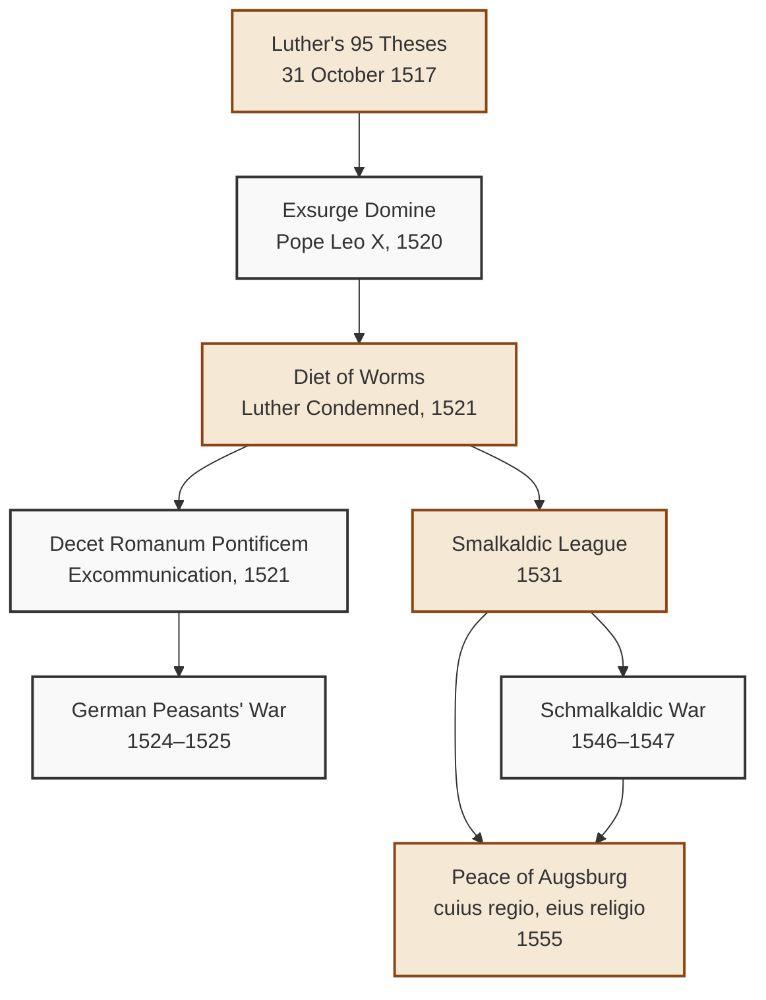
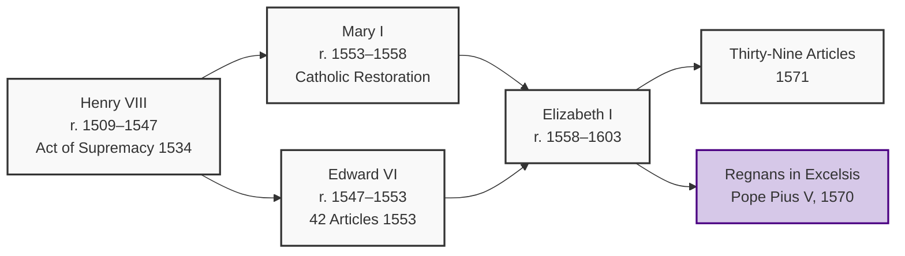

# The Protestant Reformation: Historical Origins, Doctrinal Errors, and Catholic Response

The **Protestant Reformation** (Latin: _Reformatio_; German: _Reformation_) was not a single event, but a long, many-sided rupture in Western Christianity that unfolded through theology, politics, preaching, translation, and contested ecclesial authority—culminating in Catholic clarification, especially at the **Council of Trent (1545–1563)**, and eventually producing the global family of churches known as **Protestantism**.

From a Catholic perspective, the Reformation is understood as a complex historical episode that combined genuine aspirations for spiritual renewal with grave doctrinal errors, ecclesial disobedience, and unprecedented political upheaval. As the Second Vatican Council taught:

> "Other divisions arose more than four centuries later in the West, stemming from the events which are usually referred to as 'The Reformation.' As a result, many Communions, national or confessional, were separated from the Roman See. Among those in which Catholic traditions and institutions in part continue to exist, the Anglican Communion occupies a special place."
> — _Unitatis Redintegratio_, 13 (Vatican II)

This document examines the historical origins of the Reformation, the principal reformers and their movements, the major doctrinal differences with Catholic teaching, the Council of Trent's definitive response, and the contemporary Catholic posture of ecumenical engagement.

---

## 1. Background: The Late Medieval Crisis and the Roots of Reform

### 1.1 The Late Medieval Church

The Catholic Church of the 14th and 15th centuries retained the full sacramental, theological, and institutional structure inherited from the patristic and medieval periods. Councils such as **Constance (1414–1418)**, **Basel–Ferrara–Florence (1431–1449)**, and the **Fifth Lateran Council (1512–1517)** had addressed questions of ecclesiastical reform, conciliar authority, and the pastoral life of the Church. While genuine abuses existed—particularly in the sale of indulgences, clerical ignorance, and the entanglement of ecclesiastical benefices with political patronage—the Church's doctrine, sacraments, and hierarchical structure remained intact.

### 1.2 The Theological Climate

Late medieval theology had been shaped by the nominalist school (e.g., William of Ockham, d. 1347), which emphasized the absolute sovereignty of God and the contingency of created order. Martin Luther was an Augustinian friar trained within this nominalist and Augustinian framework before his famous crisis over justification. As Magisterium sources note, "Averroism, Nominalism, and Mechanization" had introduced philosophical currents that, while not heretical in themselves, prepared fertile soil for an eventual rupture between faith and ecclesiastical authority.

### 1.3 The Indulgence Controversy

The immediate trigger for Luther's protest was the indulgence campaign of 1515–1517, especially the aggressive preaching of the Dominican **Johann Tetzel**, commissioned by Albert of Brandenburg, Archbishop of Mainz, to raise funds (in part to repay a large loan from the Fugger banking house used to pay for his multiple episcopal dispensations). Catholic theology, as later clarified by the Council of Trent and by Pope Paul VI in _Indulgentiarum Doctrina_ (1967), holds that indulgences are a remission of the **temporal punishment due to sin** (already forgiven sacramentally), granted by the Church's treasury of merits applied through ecclesiastical authority.

> "Since by their acts the faithful can obtain, in addition to the merit which is the principal fruit of the act, a further remission of temporal punishment in proportion to the degree to which the charity of the one performing the act is greater, and in proportion to the degree to which the act itself is performed in a more perfect way, it has been considered fitting that this remission of temporal punishment which the Christian faithful acquire through an action should serve as the measurement for the remission of punishment which the ecclesiastical authority bountifully adds by way of partial indulgence."
> — _Indulgentiarum Doctrina_ (Pope Paul VI, 1967)

Luther's critique, however, was not merely a call for reform of abuses; it quickly expanded into a fundamental challenge to the Church's authority to apply Christ's merits, to define doctrine, and to govern Christian life.

---

## 2. Martin Luther and the German Reformation (1517–1555)

### 2.1 The Ninety-Five Theses (31 October 1517)

On **31 October 1517**, the Augustinian friar and theology professor **Martin Luther (1483–1546)** affixed (or, more likely, mailed) his **Disputatio pro declaratione virtutis indulgentiarum**—the famous **Ninety-Five Theses**—to the door of the Castle Church (Schlosskirche) in Wittenberg. Addressed principally against the sale of indulgences, the theses implicitly raised broader questions about repentance, the treasury of merits, and the Church's teaching authority.

The **Catholic Encyclopedia** records that Luther had earlier appealed "from the pope to a general council" on **28 November 1518**, convinced that he would be condemned at Rome for his doctrines.

### 2.2 The Papal Response: _Exsurge Domine_ (1520)

On **15 June 1520**, Pope **Leo X** issued the bull **_Exsurge Domine_**, condemning forty-one propositions drawn from Luther's writings and giving him sixty days to recant or face excommunication. Among the propositions condemned were the following errors:

- "**Indulgences are necessary only for public crimes**, and are properly conceded only to the harsh and impatient."
- "**Excommunications are only external penalties** and they do not deprive man of the common spiritual prayers of the Church."
- "**The Roman Pontiff, the successor of Peter, is not the vicar of Christ over all the churches of the entire world**, instituted by Christ Himself in blessed Peter."
- "**The word of Christ to Peter: 'Whatsoever you shall loose on earth,' etc., is extended merely to those things bound by Peter himself.**"
- "**It is certain that it is not in the power of the Church or the pope to decide upon the articles of faith**, and much less concerning the laws for morals or for good works."
- "**Some articles of John Hus, condemned in the Council of Constance, are most Christian**, wholly true and evangelical; these the universal Church could not condemn."
- "**In every good work the just man sins.**"
- "**A good work done very well is a venial sin.**"

> — _Exsurge Domine_ (Pope Leo X, 15 June 1520)

When Luther publicly burned the bull, Pope Leo X issued **_Decet Romanum Pontificem_** on **3 January 1521**, formally excommunicating him:

> "He has now been declared a heretic; and so also others, whatever their authority and rank, who have cared nought of their own salvation but publicly and in all men's eyes become followers of Martin's pernicious and heretical sect… such men have incurred the punishments set out in that missive, and are to be treated rightfully as heretics and avoided by all faithful Christians, as the Apostle says (Titus iii. 10-11)."
> — _Decet Romanum Pontificem_ (Pope Leo X, 1521)

### 2.3 The Diet of Worms (April 1521)

Summoned by the newly elected Holy Roman Emperor **Charles V**, Luther appeared before the **Diet of Worms** in April 1521. Refusing to recant unless convinced by Scripture or reason (his famous stand later codified as "**Here I stand; I can do no other**"), Luther was condemned by the Edict of Worms as a notorious heretic and placed under the ban of the Empire. Protected by Elector Frederick the Wise of Saxony in the Wartburg Castle, Luther translated the New Testament into German (the **September Testament**, 1522) and later the entire Bible into German (the **Lutherbibel**, completed 1534).

### 2.4 The Smalkaldic League and Political Protestantism (1531)

The **Smalkaldic League**, formally concluded on **27 February 1531** at Smalkalden in Hesse-Nassau, was a politico-religious alliance among German Protestant princes and cities for mutual defense:

> "The parties to it were: the Landgrave Philip of Hesse; the Elector John of Saxony and his son John Frederick; the dukes Philip of Brunswick-Grubenhagen and Otto, Ernest, and Francis of Brunswick-Lünenburg; Prince Wolfgang of Anhalt; the counts Gebhard and Albrecht of Mansfeld and the towns of Strasburg, Ulm, Constance, Reutlingen, Memmingen, Lindau, Biberach, Isny, Magdeburg, and Bremen."
> — Catholic Encyclopedia, _Smalkaldic League_

This transformed religious dissent into a political-military force, foreshadowing the later Wars of Religion.

### 2.5 The Origin of the Name "Protestant"

The very term **"Protestant"** arose from a specific historical act. At the **Diet of Speyer in April 1529**, the imperial recess resolved that communities in which the new religion was established should not introduce further innovations, should not forbid the Mass, and should not hinder Catholics from attending it. Against this decree—particularly against the last clause protecting Catholic worship—the adherents of the new Evangel formally **protested**.

> "Against this decree, and especially against the last article, the adherents of the new Evangel—the Elector Frederick of Saxony, the Landgrave of Hesse, the Margrave Albert of Brandenburg, the Dukes of Lüneburg, the Prince of Anhalt, together with the deputies of fourteen of the free and imperial cities—entered a solemn protest as unjust and impious. The meaning of the protest was that the dissentients did not intend to tolerate Catholicism within their borders."
> — Catholic Encyclopedia, _Protestantism_ (Origin of the Name)

The name "Protestant" thus reflects not a positive confession but a political-theological act of dissent against Catholic worship and authority.

### 2.6 The Augsburg Confession (1530)

In **1530**, the Lutheran princes and cities presented the **_Confessio Augustana_** (Augsburg Confession), drafted principally by Luther's close collaborator **Philip Melanchthon (1497–1560)** and read at the Diet of Augsburg. The Augsburg Confession became the foundational confession of Lutheranism, articulating doctrines that diverged from Catholic teaching on original sin, free will, the cause of justification, the sacraments, the Mass, and ecclesiastical authority.

### 2.7 The Peace of Augsburg (1555)

The **Religious Peace of Augsburg (1555)**, signed between Emperor Charles V and the Lutheran princes, established the principle of **_cuius regio, eius religio_** ("whose realm, his religion"): the religion of the territorial ruler would determine the religion of his subjects. This political settlement formally recognized Lutheranism as a legal confession within the Empire and effectively partitioned imperial Christianity along territorial lines.

---

## 3. The Swiss and Reformed Reformation: Zwingli and Calvin

### 3.1 Huldrych Zwingli (1484–1531) in Zurich

As the Catholic Encyclopedia notes, in **Switzerland**:

> "There were no princes to put themselves at the head of the new national Churches, but their place was taken by the cantonal governments, wherever these had been captured by the Protestant faction. Thus **Zwingli**, who began his fiery preachings against the Catholic Church in 1518, and in a few years' time had gathered round himself a band of fanatical followers with their aid and by holding out the confiscation of the church property as an inducement, was able by 1525 to draw over to his side the majority of the members of the State Council of Zurich. By this majority the Catholic members of the council were overpowered and extruded, which done, at the instigation of Zwingli, the Catholic religion, though it had been the religion of their ancestors for many centuries and was still the religion of the quiet people in the land, was summarily proscribed, even the celebration of the Mass being forbidden under the severest penalties."
> — Catholic Encyclopedia, _Union of Christendom_

Zwingli's program extended beyond Lutheran teaching: he rejected the Real Presence of Christ in the Eucharist more radically than Luther, holding that the bread and wine were mere symbols. Zwingli was killed in battle at Kappel am Albis in 1531.

### 3.2 John Calvin (1509–1564) in Geneva

**John Calvin**, a French humanist lawyer converted to Protestantism, established a Protestant theocratic republic in **Geneva**, a model that profoundly influenced Reformed Protestantism in the Netherlands, Scotland (via John Knox), France (Huguenots), and the English Puritans. His _Institutio Christianae Religionis_ (1536; expanded 1559) became the definitive theological textbook of the Reformed tradition.

Calvinist theology developed distinctive positions:

- **Double Predestination**: God unconditionally elects some to salvation and reprobates others, irrespective of foreseen merits or demerits. The Council of Trent's Decree on Justification and subsequent Catholic teaching firmly rejected this view while affirming the mystery of divine election.
- **Strict Iconoclasm**: The wholesale removal of images, statues, and elaborate ceremonial from worship.
- **Sacramental Minimalism**: Baptism and the Lord's Supper were retained, but their efficacy was reduced to signs or symbols of divine grace rather than true instruments of salvation.

### 3.3 The Radical Reformation: Anabaptists

A third stream, often called the **Radical Reformation** or **Anabaptists** (Greek: ἀναβαπτισταί, "re-baptizers"), emerged in the 1520s, particularly in Zurich, Moravia, and the Netherlands. The Anabaptists:

- Rejected **infant baptism**, insisting on believers' baptism upon a confession of faith.
- Rejected any participation in civil government or the bearing of arms.
- Advocated for a visible, separated church of committed believers.
- Produced the **Schleitheim Confession (1527)** under **Michael Sattler**, which set out seven articles on baptism, the ban (excommunication), the breaking of bread, separation from the world, the role of pastors, the sword, and the oath.

The Anabaptists suffered severe persecution from both Catholic and Lutheran authorities, most tragically at the **Münster Rebellion (1534–1535)**. From the Anabaptist movement descend the later **Mennonites**, **Hutterites**, and **Amish** communities.

---

## 4. The English Reformation (1534–1603)

### 4.1 Henry VIII and the Act of Supremacy (1534)

The English Reformation is unique among the major Reformation movements in that it originated not from theological conviction but from the dynastic crisis of **King Henry VIII** (r. 1509–1547), who sought to annul his marriage to **Catherine of Aragon** (his brother's widow) in order to marry **Anne Boleyn**. When Pope **Clement VII** refused to grant the annulment, Henry pressed Parliament to enact a series of laws severing England from Rome.

> "The climax of the whole work of disruption may be considered to have been reached in November, 1534, by the passing of the **Act of Supremacy**, which declared the king Supreme Head of the Church of England, this time without any qualification, and which annexed the title to his imperial crown."
> — Catholic Encyclopedia, _England (Before the Reformation)_

In 1535, the bishop and chancellor **St. John Fisher** and the former Lord Chancellor **St. Thomas More** were executed for refusing to take the Oath of Supremacy. Both were later canonized by the Catholic Church (Fisher in 1935; More in 1935). They are commemorated as martyrs for the **Primacy of the Roman Pontiff**.

Despite his break with Rome, Henry himself retained much Catholic doctrine. The **Ten Articles (1536)** and the **Six Articles (1539)** upheld the Real Presence, transubstantiation, auricular confession, clerical celibacy, and the prohibition of clerical marriage. Those who denied the Real Presence were burned at the stake under Henry's regime. As the Catholic Encyclopedia notes, "Probably all these things… even the destruction of shrines and images, reflect a certain rapacity in the king's nature rather than hostility to what would now be called popish practices."

### 4.2 Edward VI and the Protestant Settlement (1547–1553)

Under **Edward VI** (r. 1547–1553), with regents favoring Reformed theology (especially the Archbishop of Canterbury **Thomas Cranmer**), England moved decisively toward Protestantism. The **Book of Common Prayer (1549, revised 1552)** established an English-language liturgy, and the **Forty-Two Articles (1553)** articulated a Reformed confession of faith.

### 4.3 Mary Tudor and the Catholic Restoration (1553–1558)

**Queen Mary I** (r. 1553–1558), daughter of Henry VIII and Catherine of Aragon, sought to restore England to full communion with Rome. Her reign saw the persecution and execution of prominent Protestants (earning her the epithet "**Bloody Mary**" in Protestant historiography), as well as the restoration of Catholic ecclesiastical structures.

### 4.4 Elizabeth I and the Elizabethan Settlement (1558–1603)

The accession of **Queen Elizabeth I** in 1558 produced a definitive Protestant settlement. The papal bull **_Regnans in Excelsis_** (1570) by **Pope St. Pius V** excommunicated Elizabeth, declared her deposed, and absolved her Catholic subjects from allegiance:

> "Prohibiting with a strong hand the use of the true religion, which after its earlier overthrow by Henry VIII (a deserter therefrom) Mary, the lawful queen of famous memory, had with the help of this See restored, she has followed and embraced the errors of the heretics. She has removed the royal Council… abolished the sacrifice of the mass, prayers, fasts, choice of meats, celibacy, and Catholic ceremonies; and has ordered that books of manifestly heretical content be propounded to the whole realm and that impious rites and institutions after the rule of Calvin, entertained and observed by herself, be also observed by her subjects."
> — _Regnans in Excelsis_ (Pope St. Pius V, 1570)

Elizabeth's settlement produced the **Thirty-Nine Articles (1571)**, the revised **Book of Common Prayer**, and the **Oath of Supremacy** required of all officeholders. From the Catholic perspective, the Anglican Church of the Articles rejected transubstantiation, the sacrificial character of the Mass, the invocation of saints, the veneration of images and relics, the doctrine of purgatory, and the supremacy of the Roman Pontiff.

> "In 1571, the XXIXth Article, despite the opposition of Bishop Guest, was inserted, to the effect that the wicked do not eat the Body of Christ. The Articles, thus increased to Thirty-nine, were ratified by the Queen, and the bishops and clergy were required to assent and subscribe thereto."
> — Catholic Encyclopedia, _Anglicanism_

### 4.5 The Anglican Formularies and Apostolicae Curae

The Catholic Church's definitive assessment of Anglican orders came with Pope **Leo XIII**'s bull **_Apostolicae Curae_** (1896), which declared Anglican ordinations "**absolutely null and utterly void**" because of a defect both of intention and of form in the Edwardine ordination rites.

---

## 5. The Continental Reformed and Radical Traditions

### 5.1 The Dutch Reformed Church

Following the conversion of the Low Countries to Calvinism under the leadership of figures like **John à Lasco (Jan Łaski)**, the **Dutch Reformed Church** became a major center of Reformed theology. The **Belgic Confession (1561)**, the **Heidelberg Catechism (1563)**, and the **Canons of Dort (1618–1619)** defined the Dutch Reformed tradition.

### 5.2 The Huguenots in France

French Calvinists, known as **Huguenots**, formed a significant minority in France during the 16th century. The **St. Bartholomew's Day Massacre (24 August 1572)** saw the killing of thousands of Huguenots across France. The **Edict of Nantes (1598)**, issued by King **Henry IV** after his conversion to Catholicism ("_Paris vaut bien une messe_"), granted limited toleration:

> "The Huguenots obtained the free exercise of their religious worship in all places where it actually existed… They were eligible for all public offices, for admission to colleges and academies, could hold synods and even political meetings; they received 45,000 crowns annually for expenses of worship and support of schools."
> — Catholic Encyclopedia, _Huguenots_

The Edict was revoked by **Louis XIV** in the **Edict of Fontainebleau (1685)**, prompting the persecution and emigration (the "**Refuge**") of hundreds of thousands of Huguenots.

### 5.3 John Knox and the Scottish Reformation

**John Knox (1514–1572)**, a disciple of Calvin, returned to Scotland in 1559 and led the Scottish Reformation. The **Scottish Confession of Faith (1560)** and the **Scots Confession** articulated a Reformed theology, while the **National Covenant (1638)** and the **Solemn League and Covenant (1643)** later bound Scotland to Presbyterian polity.

---

## 6. Major Doctrinal Differences and the Catholic Response

The Catholic Church identifies several foundational doctrines of Protestantism that conflict with the deposit of faith. The Council of Trent (1545–1563) provided the definitive Catholic response; Vatican II and the Catechism articulate the contemporary magisterial position.

### 6.1 _Sola Scriptura_: Scripture Alone vs. Scripture and Sacred Tradition

**Protestant Claim**: Scripture (the Bible) is the sole infallible rule of faith, sufficient in itself for Christian doctrine and life.

**Catholic Response**: Sacred Scripture and Sacred Tradition together form the single deposit of the Word of God, transmitted by the apostolic Church and authoritatively interpreted by the Magisterium. The Council of Trent's Fourth Session (1546) affirmed that the "**unwritten traditions, received from the mouth of Christ himself**" and the "**old Vulgate edition**" of the Bible were both authoritative.

> "The Council of Trent decreed that 'in public lectures, disputations, preaching, and exposition,' the Vulgate is the 'authentic' version; and this is the existing custom of the Church."
> — _Providentissimus Deus_ (Pope Leo XIII, 1893)

The Catholic faith therefore rejects the principle that the Bible can be interpreted independently of the Church that compiled, canonized, and transmitted it. The Catholic canon of **73 books** (including the seven deuterocanonical books of the Old Testament, listed in [scripture/bible-history-canon.md](scripture/bible-history-canon.md)) differs from the shorter Protestant canon of **66 books**.

### 6.2 _Sola Fide_: Justification by Faith Alone vs. Justification by Faith and Works

**Protestant Claim**: The sinner is justified (declared righteous) by faith alone, apart from any cooperation with grace through works.

**Catholic Response**: The Council of Trent's **Sixth Session (1547)** issued the Decree on Justification, which condemned the Lutheran doctrine of forensic justification by faith alone. Catholic teaching holds that:

- Justification is the **infusion of sanctifying grace**, not merely an extrinsic declaration.
- Justification is received through **faith and baptism**, but it is not exhausted by initial faith; it must be **preserved and increased** through the cooperation of grace and the sacraments.
- **Good works**, performed by the justified with the aid of grace, are **truly meritorious** for the increase of grace and for eternal life—not as the ground of justification, but as its fruit and reward.

### 6.3 The Sacramental System: Seven Sacraments vs. Two (or None)

**Protestant Claim**: Christ instituted only **two sacraments**—Baptism and the Eucharist (or, in some Reformed and Anabaptist traditions, no properly sacramental rites at all).

**Catholic Response**: Christ instituted **seven sacraments**: Baptism, Confirmation, Holy Eucharist, Penance, Anointing of the Sick, Holy Orders, and Matrimony. The Council of Trent's Seventh Session (1547) and Twenty-First Session (1562) defended the sacramental system and the sacrificial character of the Mass. The **_Tridentine Profession of Faith_** (Pope Pius IV, 1565) summarized these commitments.

### 6.4 The Mass: Sacrifice vs. Mere Memorial

**Protestant Claim**: The Mass is not a true sacrifice; the Lord's Supper is a memorial meal, in which Christ is not truly present.

**Catholic Response**: The Mass is the **re-presentation** (not repetition) of the one sacrifice of Calvary, and the Eucharist is the **Real Presence** of Christ—Body, Blood, Soul, and Divinity—under the appearances of bread and wine.

> "Christ instituted the Eucharistic sacrifice of his Body and Blood to perpetuate the sacrifice of the cross throughout the ages until he should come again, and in this way to entrust to his beloved spouse, the Church, a memorial of his death and resurrection."
> — _Catechism of the Catholic Church_, 1323 (Cited in CCC 1323)

> "The Eucharist is 'the source and summit of the Christian life.'… All the sacraments, and indeed all ecclesiastical ministries and works of apostolate, are bound up with the Eucharist and are oriented toward it."
> — _Catechism of the Catholic Church_, 1324

### 6.5 The Papacy and Ecclesiastical Authority

**Protestant Claim**: Christ did not entrust supreme, universal, ordinary, and immediate jurisdiction to the Bishop of Rome; the Pope is an antichrist or at most a human invention of ecclesiastical power.

**Catholic Response**: The Roman Pontiff, as successor of St. Peter, holds by divine institution the "**full and supreme power of jurisdiction over the whole Church**" (Vatican I, _Pastor Aeternus_, 1870). This primacy is grounded in Christ's words to Peter (cf. Matthew 16:18–19; John 21:15–17) and is an essential mark of the Church's unity. The Church is one, holy, catholic, and apostolic precisely through communion with Peter's successor.

> "Christ willed that the apostles and their successors… should preach the Gospel faithfully, administer the sacraments, and rule the Church in love."
> — _Unitatis Redintegratio_, 2 (Vatican II)

### 6.6 Purgatory, Saints, Images, and Indulgences

**Protestant Claim**: Purgatory, the veneration of saints, the invocation of the Blessed Virgin Mary, the veneration of images and relics, and indulgences are unbiblical innovations or idolatry.

**Catholic Response**: The **_Tridentine Profession of Faith_** (Pope St. Pius IV, 1565) summarizes Catholic teaching on these disputed points:

> "[The Catholic Church] firmly believes… that **a purgatory exists**, and that the souls detained there are aided by the prayers of the faithful… She also holds that the saints who reign with Christ should be venerated and invoked… and that they offer prayers to God for us. She holds also that the bodies of the saints… should be venerated… She affirms that images of Christ, of the Blessed Virgin Mother of God, and of the saints… are to be kept, and that due honor and veneration are to be paid to them… She declares that **the power of indulgences** has been left in the Church."
> — _Tridentine Profession of Faith_ (Pope St. Pius IV, 1565)

### 6.7 Predestination and the Grace Controversy

**Calvinist Claim**: God unconditionally elects some to salvation and reprobates others, irrespective of foreseen merits or demerits (double predestination).

**Catholic Response**: The Catholic Church teaches that God's election is grounded in foreknown merits foreseen in those whom he calls, while emphasizing the mystery of divine sovereignty and the necessity of grace. The Council of Trent, the Jesuits (especially Luis de Molina's _Concordia_, 1588), the Dominicans (especially Domingo Báñez), and Pope **Pius V** condemned the radical Calvinist doctrine of predestination in the Bull **_Excommunicamus_** (1567) and related documents.

### 6.8 Comparative Summary

| Doctrine                  | Catholic Position                              | Lutheran Position                              | Reformed Position                         | Anglican Position (Articles)                                       |
| :------------------------ | :--------------------------------------------- | :--------------------------------------------- | :---------------------------------------- | :----------------------------------------------------------------- |
| **Scripture & Tradition** | Scripture + Sacred Tradition; 73-book canon    | _Sola Scriptura_; 66-book canon                | _Sola Scriptura_; 66-book canon           | _Sola Scriptura_; 66-book canon                                    |
| **Justification**         | Infusion of grace; faith + works (meritorious) | Forensic; _sola fide_                          | Forensic; _sola fide_                     | Forensic; faith working through love                               |
| **Sacraments**            | Seven sacraments                               | Two (Baptism, Eucharist)                       | Two (or sometimes no true sacraments)     | Two (Baptism, Eucharist)                                           |
| **Eucharist**             | Real Presence; transubstantiation; sacrifice   | Sacramental union; rejected transubstantiation | Symbolic memorial; rejected Real Presence | Real Presence (Art. 28), but rejected transubstantiation (Art. 28) |
| **Mass**                  | True propitiatory sacrifice                    | Not a sacrifice; rejected                      | Not a sacrifice; rejected                 | Not a propitiatory sacrifice (Art. 31)                             |
| **Papacy**                | Divinely instituted primacy of Bishop of Rome  | Antichrist (early Luther); later softened      | Antichrist                                | Rejected (Art. 37)                                                 |
| **Purgatory**             | Exists; suffrage of the faithful               | Rejected                                       | Rejected                                  | Tolerated but not defined (Art. 22)                                |
| **Saints & Images**       | Veneration lawful                              | Idolatry                                       | Idolatry                                  | Veneration discouraged (Art. 22, 25)                               |

---

## 7. The Council of Trent (1545–1563): The Catholic Response

### 7.1 Convocation and Opening

The **Council of Trent** was the 19th Ecumenical Council of the Catholic Church, convened in three major periods (1545–1547, 1551–1552, 1562–1563) under Pope **Paul III**, Pope **Julius III**, and Pope **Pius IV**.

> "The nineteenth ecumenical council opened at Trent on 13 December, 1545, and closed there on 4 December, 1563. Its main object was the **definitive determination of the doctrines of the Church** in answer to the heresies of the Protestants; a further object was the execution of a thorough reform of the inner life of the Church by removing the numerous abuses that had developed in it."
> — Catholic Encyclopedia, _Council of Trent_

The Council met in a politically tense environment—often under threat of Protestant armies—and produced a body of doctrinal decrees and disciplinary reforms of enduring authority.

### 7.2 Major Decrees of Trent

| Session | Date           | Subject                                                                           |
| :------ | :------------- | :-------------------------------------------------------------------------------- |
| III     | February 1546  | Symbol of Faith (Nicene Creed with _Filioque_)                                    |
| IV      | April 1546     | Canonical Scriptures and Sacred Tradition; **Vulgate** edition                    |
| V       | June 1546      | Original Sin                                                                      |
| VI      | January 1547   | **Justification**                                                                 |
| VII     | March 1547     | **Sacraments in General**; Baptism and Confirmation                               |
| XIII    | October 1551   | **Most Holy Sacrament of the Eucharist** (Real Presence, Transubstantiation)      |
| XXI     | July 1562      | Communion under both kinds; Communion of small children                           |
| XXII    | September 1562 | Most Holy Sacrifice of the **Mass**                                               |
| XXIII   | July 1563      | Holy Orders                                                                       |
| XXIV    | November 1563  | **Matrimony** (Tametsi Decree on clandestine marriages)                           |
| XXV     | December 1563  | **Purgatory**; invocation of saints; veneration of relics and images; indulgences |

### 7.3 The Tridentine Profession of Faith

At the request of Pope St. Pius IV, the **_Tridentine Profession of Faith_** (also called the _Professio fidei Tridentina_ or "**Pius IV's Creed**") was promulgated in 1565 in the bull **_Iniunctum nobis_** and was required of all clergy, converts, and certain lay officials. It remains, alongside the Nicene Creed and the Apostles' Creed, a faithful summary of the Catholic faith as clarified at Trent.

---

## 8. The Wars of Religion (1524–1648)

The Reformation unleashed a century and a half of devastating religious warfare in Europe. The Catholic Encyclopedia, citing the Peace of Westphalia (1648), records the brutal legacy:

> "Sweden and a large number of the Protestant estates were not willing to consent to this. To settle the claims made by the different religious denominations to one and the same territory the year 1624 was taken as the normal year, and the denomination which had prevailed in that year in a territory was, as a rule, to be the permanent religion of that territory. Calvinism was included in the religious peace. The compulsory force of the principle, _cuius regio, eius religio_, was restricted by granting private liberty of conscience, but only to a limited extent."
> — Catholic Encyclopedia, _The Thirty Years War_

### 8.1 The German Peasants' War (1524–1525)

Luther's revolt against Rome unleashed social forces he could not control. The **German Peasants' War (1524–1525)** saw some 100,000 peasants killed as they revolted against their lords, with Luther himself urging their brutal suppression in his pamphlet _Against the Murderous, Thieving Hordes of Peasants_.

### 8.2 The French Wars of Religion (1562–1598)

A series of eight civil wars between Catholic and Huguenot factions culminated in the **St. Bartholomew's Day Massacre (1572)** and finally the **Edict of Nantes (1598)** under Henry IV. Pope St. Pius V, Pope Gregory XIII, and the Catholic League actively supported the Catholic cause.

### 8.3 The Dutch Revolt (1568–1648)

The **Eighty Years' War** led to the independence of the **Dutch Republic** from Catholic Spanish rule, with the northern provinces becoming predominantly Calvinist and the southern provinces (modern Belgium) remaining Catholic.

### 8.4 The Thirty Years' War (1618–1648)

The **Thirty Years' War**, fought primarily in the Holy Roman Empire, was the last and most devastating of the European Wars of Religion. It began as a revolt of Protestant Bohemian nobles against the Catholic Habsburg king Ferdinand II (the **Defenestration of Prague**, 1618) and escalated to involve Spain, France, Sweden, Denmark, and the German princes. By its end, Germany had lost roughly one-third of its population. The war concluded with the **Peace of Westphalia (1648)**, which recognized Calvinism alongside Catholicism and Lutheranism, and the Dutch Republic as independent.

The Treaty of Westphalia "received a more formal kind of imperial sanction, against which an ineffectual protest was made on behalf of Pope Innocent X by his nuncio, Chigi."

---

## 9. The Post-Reformation Protestant World

### 9.1 Lutheranism

Lutheran churches spread from Germany to Scandinavia (Denmark-Norway, Sweden-Finland, Iceland), the Baltic states (Latvia, Estonia), and through emigration to North America. Today the Lutheran World Federation represents the major expression of Lutheran communion.

### 9.2 Reformed Protestantism

The Reformed tradition, defined by Calvinist theology and Presbyterian or Congregational polity, spread from Switzerland to the Netherlands, Scotland, parts of Germany and Hungary, and through colonization to North America (especially the Dutch Reformed, Presbyterian, and Congregational traditions), South Africa (the Dutch Reformed Church and its later controversy under apartheid), and Korea.

### 9.3 Anglicanism

The **Anglican Communion**, formally constituted only in the 19th century but rooted in the Elizabethan settlement, today comprises over 80 million adherents worldwide. The **Oxford Movement (1833–1845)** within Anglicanism produced the Anglo-Catholic revival, emphasizing Catholic liturgical and theological heritage; several of its leaders (notably John Henry Newman) eventually entered the Catholic Church.

### 9.4 The Radical Reformation's Legacy

From the Anabaptist tradition emerged the **Mennonites** (named after the Dutch priest **Menno Simons**, d. 1561), **Hutterites**, and **Amish**. Later "**Brethren**" groups, the **Church of the Brethren**, and eventually **Quakers** (founded by George Fox in 17th-century England) extended the Anabaptist emphasis on adult baptism, pacifism, and the visible church of committed believers.

### 9.5 Later Movements

- **Methodism** (18th century): Founded by **John Wesley** within the Anglican Church, emphasizing personal conversion, sanctification, and social holiness. The Methodist movement split from Anglicanism in the United States after the American Revolution.
- **Baptists** (17th century onward): Rejecting infant baptism entirely, Baptists arose from both Puritan Separatist and Anabaptist roots.
- **Pentecostalism** (early 20th century): Originating in the Azusa Street Revival (1906, Los Angeles), Pentecostalism emphasized baptism in the Holy Spirit, divine healing, and spiritual gifts; it is now the fastest-growing Christian tradition globally.
- **Evangelicalism** (18th century onward): A transdenominational movement emphasizing biblical authority, personal conversion, the centrality of Christ's atoning work, and active evangelization.

---

## 10. Catholic Ecumenical Engagement: Vatican II and Beyond

### 10.1 The Second Vatican Council (1962–1965)

The **Second Vatican Council** dramatically shifted the Catholic Church's posture toward Protestantism from polemical confrontation to **ecumenical dialogue**. Two key documents shaped this new approach:

- **_Unitatis Redintegratio_** (Decree on Ecumenism, 1964) articulated the principles of ecumenical engagement, acknowledging that Protestants, despite their separation from Rome, "have been not a little influenced by the Gospel" and possess many elements of sanctification and truth.
- **_Nostra Aetate_** (Declaration on the Relation of the Church to Non-Christian Religions, 1965) included a landmark statement rejecting deicide accusations against the Jewish people and recognizing the spiritual bonds that unite Christians to Jews.

> "Other divisions arose more than four centuries later in the West, stemming from the events which are usually referred to as 'The Reformation.'… these various divisions differ greatly from one another not only by reason of their origin, place and time, but especially in the nature and seriousness of questions bearing on faith and the structure of the Church."
> — _Unitatis Redintegratio_, 13

### 10.2 The World Council of Churches and Bilateral Dialogues

The Catholic Church is not a member of the **World Council of Churches (founded 1948)**, but cooperates with it through the **Commission on Faith and Order**. Since Vatican II, the Vatican has established numerous bilateral ecumenical dialogues:

- **Catholic-Lutheran Dialogue**: Culminating in the **Joint Declaration on the Doctrine of Justification (1999)**, signed by the Catholic Church and the Lutheran World Federation, which declared a consensus on fundamental truths of justification while acknowledging remaining differences.
- **Catholic-Reformed Dialogue**: Producing substantial studies on the Eucharist, ecclesiology, and predestination.
- **Catholic-Anglican Dialogue**: Including the **ARCIC (Anglican-Roman Catholic International Commission)** conversations on Eucharist, ministry, and authority.
- **Catholic-Methodist Dialogue**: Continuing on issues of sanctification, sacraments, and ecclesiology.
- **Catholic-Baptist Dialogue**: A more recent conversation on baptism and the nature of the Church.

### 10.3 Principles of Catholic Ecumenism

Catholic ecumenism is grounded in several principles:

1. **The Church of Christ subsists in the Catholic Church** (_Lumen Gentium_, 8), but elements of sanctification and truth exist outside her visible bounds.
2. **Truth is sought, not compromised**: Ecumenical dialogue does not entail indifference to doctrinal truth, but the patient articulation of the Catholic faith in conversation with others.
3. **Spiritual ecumenism**: Prayer, conversion of heart, and holiness of life are the "soul" of ecumenical movement.
4. **Visible unity**: The prayer of Christ "**that they may all be one**" (John 17:21) remains the goal—the restoration of full visible communion among all Christians.

---

## 11. Distinguishing Levels of Doctrinal Weight

When assessing the differences between Catholic and Protestant teaching, it is essential to distinguish levels of doctrinal weight:

| Level                         | Examples                                                                                                    | Binding Force                                                   |
| :---------------------------- | :---------------------------------------------------------------------------------------------------------- | :-------------------------------------------------------------- |
| **Divine Revelation / Dogma** | Trinity; Incarnation; Real Presence; sacrificial character of the Mass; Papal primacy by divine institution | Immutably binding on all Catholics                              |
| **Ecclesial Dogma**           | Papal infallibility (Vatican I); canon of 73 books; seven sacraments                                        | Definitive, requiring firm and definitive assent                |
| **Ecclesiastical Discipline** | Clerical celibacy (Latin Rite); liturgical calendars; vernacular translations                               | Mutable; may change under authority of the Church               |
| **Theological Opinion**       | Specific theories of sacramental causality; particular eschatologies                                        | Open to debate; does not bind                                   |
| **Private Revelation**        | Apparitions, interior locutions                                                                             | May be "worthy of belief" but adds nothing to public Revelation |

The Catholic Church's response to Protestantism must be calibrated to these levels. Where Protestantism has preserved doctrines of divine revelation (e.g., the Trinity, the Incarnation, the canon of the New Testament, the Real Presence in some sense in high Lutheranism), Catholic theology acknowledges this with gratitude. Where Protestantism has formally rejected dogmatic truths, Catholic theology firmly maintains them.

---

## 12. Conclusion

The Protestant Reformation was a turning point in the history of Western Christianity—an event whose religious, political, cultural, and demographic consequences continue to shape the world. From the Catholic perspective, the Reformation combined legitimate concerns for pastoral reform and biblical preaching with grave doctrinal errors (the rejection of the sacrificial Mass, transubstantiation, the sacramental system, papal primacy, and purgatory) and political upheavals that unleashed unprecedented violence.

The Council of Trent's response remains the definitive Catholic articulation of the faith in the face of Protestant challenges. The Second Vatican Council's opening to ecumenical dialogue has enabled Catholic engagement with our Protestant brethren without sacrificing doctrinal truth. As the Catholic Church continues to proclaim the Gospel of Jesus Christ—the same Gospel preached by Peter and Paul, Augustine and Aquinas, Trent and Vatican II—she does so in the hope of the unity for which her Lord prayed: "_Ut unum sint_" ("that they may be one").

---

## Related Documents

For further study within this repository:

- [church-history/apostolic-foundation-councils.md](apostolic-foundation-councils.md): The structural and historical development of the Church from apostolic times.
- [church-history/eastern-catholic-churches.md](eastern-catholic-churches.md): The Eastern Catholic _sui iuris_ Churches and their relations with Rome.
- [church-history/greek-orthodox-church.md](greek-orthodox-church.md): Theological relations with Eastern Orthodoxy.
- [church-history/hebrew-catholicism-relations.md](hebrew-catholicism-relations.md): Catholic-Jewish relations, including _Nostra Aetate_.
- [church-history/papal-chronology.md](papal-chronology.md): Comprehensive list of the Popes from St. Peter to the present.
- [scripture/bible-history-canon.md](../scripture/bible-history-canon.md): The Catholic canon of 73 books and the Council of Trent's decree on the Vulgate.
- [liturgy/foundational-prayers.md](../liturgy/foundational-prayers.md): The Mass and the sacraments, at the heart of Catholic-Protestant differences.

---

## Magisterial and Historical Sources Consulted

- _Exsurge Domine_ (Pope Leo X, 1520) – Condemnation of 41 Lutheran propositions.
- _Decet Romanum Pontificem_ (Pope Leo X, 1521) – Formal excommunication of Luther.
- _Regnans in Excelsis_ (Pope St. Pius V, 1570) – Excommunication of Elizabeth I and her adherents.
- _Providentissimus Deus_ (Pope Leo XIII, 1893) – On the study of Holy Scripture and the Vulgate.
- _Apostolicae Curae_ (Pope Leo XIII, 1896) – Declaration of the nullity of Anglican orders.
- _Unitatis Redintegratio_ (Vatican II, 1964) – Decree on Ecumenism.
- _Lumen Gentium_ (Vatican II, 1964) – Dogmatic Constitution on the Church.
- _Indulgentiarum Doctrina_ (Pope Paul VI, 1967) – Revised doctrine on indulgences.
- _Catechism of the Catholic Church_ (1992) – especially CCC 1323, 1324, 805, 2643, 1524.
- _Tridentine Profession of Faith_ (Pope St. Pius IV, 1565) – Summary of Trent's doctrinal definitions.
- _Joint Declaration on the Doctrine of Justification_ (Catholic Church and Lutheran World Federation, 1999).
- _The Sources of Catholic Dogma (Enchiridion Symbolorum)_ (Henry Denzinger) – Denz. 1448, 1449, 1467, 1506, 1510, 1513, 1514, 1516, 1624, 1835, 1867, 2643, 2854, 3128, 3280, 3547, 3825.
- _Catholic Encyclopedia_ (Robert Appleton Company, 1907–1914) – Articles on _Anglicanism_, _Augsburg_, _Council of Trent_, _The Reformation_, _The Thirty Years War_, _Huguenots_, _Smalkaldic League_, _Speyer_, _Henry IV_, _Martin Luther_, _Westphalia_, _Union of Christendom_, _Protestantism_.
- _The Oxford Movement (1833–1845)_ – _Catholic Encyclopedia_.
- _Code of Canon Law_ (1983) – Canon 995.
- _Bullarium Romanum_: Tomus I, III, IV, V, VIII, XV.
