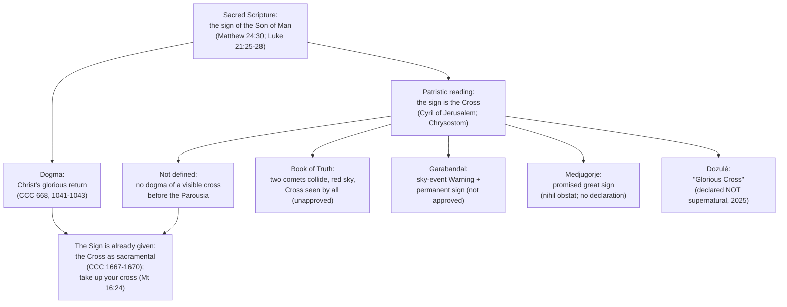

# "Signs in the Heavens and the Cross": Doctrine, Private Revelation, and Catholic Discernment

> ⚠️ **Not a defined Catholic doctrine — and not approved where it rests on unapproved claims.** This document reports, **as claims**, what the _Book of Truth_ corpus (Maria Divine Mercy) and a range of other alleged private revelations say about **signs in the heavens and a Cross appearing in the sky** before the end of the age. It proposes none of it for belief. The corpus has **no ecclesiastical approval**, and several bishops and dioceses have prohibited it or judged it contrary to Catholic faith; see [church-assessment-and-warnings.md](../book-of-truth/church-assessment-and-warnings.md). For the Church's actual doctrine on the Last Things, see [doctrinal-foundations.md](doctrinal-foundations.md).

> **A note on registers.** Throughout this page, four things are kept strictly separate: **(a) Sacred Scripture and Catholic dogma** (cited to the Bible, the Catechism, councils, and papal or dicasterial documents); **(b) the patristic reading** of the Scriptural sign (a venerable interpretation, not a definition); **(c) quoted private-revelation text** (as its promoters publish it, each item labelled with its own canonical status); and **(d) analysis**. A private-revelation claim — even an approved one — never becomes Church teaching, and belief in it is never required for salvation ([CCC 66–67](https://www.magisterium.com/docs/0583c069-d4bf-42dd-97de-c19f0b80150f/ref/para-67)). Where the _Book of Truth_ corpus is quoted, the citation names the message date as the promoters published it; see [book-of-truth/resources.md](../book-of-truth/resources.md) for where the primary text circulates and its citation caveats.

---

## Contents

1. [What the Event Is](#1-what-the-event-is)
2. [Biblical Background](#2-biblical-background)
3. [The Cross in Christian Memory — Historical Precedents](#3-the-cross-in-christian-memory--historical-precedents)
4. [The Signs in the Heavens in the _Book of Truth_ Corpus](#4-the-signs-in-the-heavens-in-the-_book-of-truth_-corpus)
5. [The Same Motif in Other Private Revelations](#5-the-same-motif-in-other-private-revelations)
6. [The Catholic Doctrine of the "Sign of the Son of Man"](#6-the-catholic-doctrine-of-the-sign-of-the-son-of-man)
7. [What the Church Actually Teaches](#7-what-the-church-actually-teaches)
8. [Common Errors and Pastoral Dangers](#8-common-errors-and-pastoral-dangers)
9. [The Proper Catholic Response](#9-the-proper-catholic-response)
10. [Frequently Asked Questions](#10-frequently-asked-questions)
11. [Closing Pastoral Reflection](#11-closing-pastoral-reflection)
12. [See Also](#12-see-also)
13. [Sources](#sources)

---

## 1. What the Event Is

### 1.1 The several names for one motif

The claim that **the heavens will display a great sign — most often the Cross of Christ — before the end** is a recurring motif of Catholic devotional and private-revelation literature. It travels under several names, and they are not interchangeable in origin, even though popular usage often fuses them:

| Term                                            | Origin and usual meaning                                                                                                                                                                                                                                                                          |
| ----------------------------------------------- | ------------------------------------------------------------------------------------------------------------------------------------------------------------------------------------------------------------------------------------------------------------------------------------------------- |
| **"The sign of the Son of Man in heaven"**      | The Scriptural phrase from [Matthew 24:30](https://www.drbo.org/x/d?b=drb&c=mt&g=24&p=30). Most of the Fathers read "the sign" as **the Cross** (see §6.1). It is tied in the text itself to the **Second Coming**.                                                                               |
| **"Signs in the heavens" / "signs in the sky"** | The wider biblical motif of cosmic portents in the sun, moon, and stars before the Day of the Lord ([Luke 21:25–28](https://www.drbo.org/x/d?b=drb&c=lk&g=21&p=25); [Joel 2:30–31](https://www.drbo.org/x/d?b=drb&c=jl&g=2&p=30); [Acts 2:19–20](https://www.drbo.org/x/d?b=drb&c=act&g=2&p=19)). |
| **"The Cross in the sky"**                      | The devotional shorthand for the specific claim that a **luminous Cross** will be seen visibly in the heavens.                                                                                                                                                                                    |
| **"The Divine Sign"**                           | The _Book of Truth_ corpus's own name for the Cross in the sky it says will announce its "**Warning**" (§4).                                                                                                                                                                                      |
| **"The Great Sign" / "the sign"**               | The permanent sign (or sign-miracle) promised at **Garabandal** and at **Medjugorje**, left at the site as a lasting proof (§5.3).                                                                                                                                                                |
| **"The Glorious Cross"**                        | The monumental illuminated cross requested in the alleged **Dozulé** revelations — which the Church **declared not supernatural in origin** in 2025 (§5.3.3).                                                                                                                                     |

Two near-neighbours must be kept distinct. The **"Three Days of Darkness"** is a different (though related) devotional expectation, treated fully in [three-days-of-darkness.md](three-days-of-darkness.md). And the **"Warning" / Illumination of Conscience** is a separate motif, treated in [the-warning.md](the-warning.md); the Cross-in-the-sky claim is chiefly attached to it as its **precursor**.

### 1.2 What the Church has, and has not, defined

| Question                                                                                                            | Catholic status                                                                                                                                                                                                                                                                                                                     |
| ------------------------------------------------------------------------------------------------------------------- | ----------------------------------------------------------------------------------------------------------------------------------------------------------------------------------------------------------------------------------------------------------------------------------------------------------------------------------- |
| Will Christ come again in glory, visibly, to judge the living and the dead?                                         | **Defined dogma** ([CCC 668, 1041–1043](https://www.magisterium.com/docs/0583c069-d4bf-42dd-97de-c19f0b80150f)).                                                                                                                                                                                                                    |
| Does Scripture speak of a "sign of the Son of Man in heaven" at His coming?                                         | **Yes** ([Matthew 24:30](https://www.drbo.org/x/d?b=drb&c=mt&g=24&p=30)).                                                                                                                                                                                                                                                           |
| Did the Fathers generally understand that sign to be the Cross?                                                     | **Yes** — a widespread and venerable patristic reading (St. Cyril of Jerusalem, St. John Chrysostom, Origen; see §6.1).                                                                                                                                                                                                             |
| Has the Church **defined** that a visible cross will appear in the sky as a distinct event **before** the Parousia? | **No.** The Cross reading is a patristic interpretation; the Church has not defined the form, timing, or physical nature of the sign, nor erected it into a separate "pre-Warning" event.                                                                                                                                           |
| Is there a defined doctrine of a worldwide sign announcing an "Illumination of Conscience"?                         | **No.** This is a **private-revelation motif**, not an article of faith ([CCC 65–67](https://www.magisterium.com/docs/0583c069-d4bf-42dd-97de-c19f0b80150f)).                                                                                                                                                                       |
| May anyone **date** the sign, the Warning, or the end?                                                              | **No — forbidden.** "Of that day or hour, no one knows" ([Mark 13:32](https://www.drbo.org/x/d?b=drb&c=mk&g=13&p=32); [Matthew 24:36](https://www.drbo.org/x/d?b=drb&c=mt&g=24&p=36); [Acts 1:7](https://www.drbo.org/x/d?b=drb&c=act&g=1&p=7); [CCC 1040](https://www.magisterium.com/docs/0583c069-d4bf-42dd-97de-c19f0b80150f)). |
| Is belief in any particular sky-sign prediction required?                                                           | **No.** Even approved private revelation binds no one ([CCC 66–67](https://www.magisterium.com/docs/0583c069-d4bf-42dd-97de-c19f0b80150f/ref/para-67); _Dei Verbum_ 4).                                                                                                                                                             |

### 1.3 Why the distinction matters

The distinction is not pedantry. Two opposite failures are common:

1. **Treating the sign as dogma.** The Catholic who concludes that a Cross in the sky is a certain, imminent, datable event has confused a private claim with the faith. This is precisely the confusion the **2024 Dicastery norms** were issued to correct: some past ecclesiastical declarations led the faithful "to think they had to believe in these phenomena, which sometimes were valued more than the Gospel itself."
2. **Treating the sign superstitiously.** The Catholic who scans the sky for omens, buys "protective" objects, or lives in dread has exchanged the **sacraments and sacramentals** the Church gives for our good ([CCC 1667–1679](https://www.magisterium.com/docs/0583c069-d4bf-42dd-97de-c19f0b80150f)) for **charms**, which she forbids ([CCC 2111, 2117](https://www.magisterium.com/docs/0583c069-d4bf-42dd-97de-c19f0b80150f)).

The correct posture lies between them: **the Cross is already the sign God has given** — in Baptism, in the sacraments, in the daily taking up of one's cross — and the moral goods the devotion recommends (conversion, penance, the Rosary, the sacramental life) are always good, whether or not any particular prediction is true.

---

## 2. Biblical Background

Catholic doctrine on the signs of the end rests on the words of Christ and the apostles, read within the Church's living Tradition. Four groups of texts are relevant, and all of them are to be read in the light of the **parousia** — the one, public, glorious coming of Christ in judgment.

### 2.1 The "sign of the Son of Man in heaven" (Matthew 24:30)

In the Olivet Discourse, after describing the cosmic disturbance, Christ says:

> "Then will appear in heaven the sign of the Son of Man, and then all the tribes of the earth will mourn, and they will see the Son of Man coming on the clouds of heaven with power and great glory."
>
> — [Matthew 24:30](https://www.drbo.org/x/d?b=drb&c=mt&g=24&p=30)

Note the grammar: the sign **appears**, and **then** the Son of Man is **seen coming**. The sign belongs to the moment of the coming, not to a distant, separate, earlier event. It is a **sign of the coming One**, not a herald detached from Him.

### 2.2 Signs in the sun, moon, and stars (Luke 21:25–28)

> "And there will be signs in sun and moon and stars, and upon the earth distress of nations in perplexity at the roaring of the sea and the waves, men fainting with fear and with foreboding of what is coming on the world; for the powers of the heavens will be shaken. And then they will see the Son of Man coming in a cloud with power and great glory. Now when these things begin to take place, look up and raise your heads, because your redemption is drawing near."
>
> — [Luke 21:25–28](https://www.drbo.org/x/d?b=drb&c=lk&g=21&p=25)

The Lord's purpose in naming these signs is **not** to start a countdown but to command **hope**: "look up and raise your heads." The Church reads the passage as a summons to vigilance, not a timetable.

### 2.3 Portents in the heavens (Joel 2:30–31; Acts 2:19–20)

The prophet Joel foretold "wonders in the heavens and on the earth, blood and fire and columns of smoke; the sun shall be turned to darkness, and the moon to blood, before the great and terrible day of the Lord comes" ([Joel 2:30–31](https://www.drbo.org/x/d?b=drb&c=jl&g=2&p=30)). St. Peter applies this very text to **Pentecost** ([Acts 2:19–20](https://www.drbo.org/x/d?b=drb&c=act&g=2&p=19)), showing that the Church has always read such "portents" in a **Christological and ecclesial** key — as signs of the messianic age already begun, culminating in the Lord's return — and not merely as a literal astronomical calendar.

### 2.4 The great sign in heaven (Revelation 6:12–17; 12:1)

The Apocalypse describes the heavens shaken at the opening of the sixth seal — "the sun became black as sackcloth … the stars of the sky fell to the earth" ([Revelation 6:12–13](https://www.drbo.org/x/d?b=drb&c=rv&g=6&p=12)) — and, in a different vision, "a great portent appeared in heaven, a woman clothed with the sun" ([Revelation 12:1](https://www.drbo.org/x/d?b=drb&c=rv&g=12&p=1)). The Church reads these as **symbolic** visions of the conflict between Christ and the dragon, of the Church and her persecution, and of the final victory — not as a photographic description of a future sky.

### 2.5 The doctrinal key: the signs belong to the Parousia

Taken together, the biblical signs of the heavens belong to **one event**: the return of Christ in glory. The Church has never separated them into a distinct "sign-stage" years before the end. Any scheme that borrows the biblical vocabulary of sky-signs but re-anchors it to a **separate, dated, prior event** — a "Warning," a "Glorious Cross to be built," a "collision of two comets" — has moved beyond what Scripture says and into **private interpretation**.

---

## 3. The Cross in Christian Memory — Historical Precedents

Christians have repeatedly reported seeing the **sign of the Cross in the heavens**. Two events from the fourth century are part of the Church's historical memory, and one from 1917 is an **approved** public miracle. None of them is the "end-times sign" of the private revelations, and the distinction matters.

### 3.1 The vision of Constantine (312 A.D.)

Before the battle of the Milvian Bridge, Constantine reported seeing a **cross of light above the sun**, with the words "**Conquer by this**" (Greek: ἐν τούτῳ νίκα). Eusebius records that Constantine told him the story under oath, and that he afterwards had the **labarum** — a standard bearing the Cross — made, and used it to win ([Eusebius, _Life of Constantine_ I.28–29, 32](https://www.magisterium.com/docs/db095dbe-275a-418e-8344-260f03859792/ref/Book%20I.%20Chapter%2028)). This is an event of **Christian history**, and its historical details are reported at second hand; it is not a prophecy of the end.

### 3.2 The Cross over Jerusalem (351 A.D.)

St. Cyril of Jerusalem, in a letter to the Emperor Constantius, described a **cross-shaped light** seen over Jerusalem on **7 May 351**, stretching from Golgotha toward the Mount of Olives, brighter than the sun and visible to the whole city for several hours (the letter's authenticity has been questioned, but its style is judged consistent with Cyril; the historian Sozomen also recounts the event and says Cyril informed the emperor: [Sozomen, _Ecclesiastical History_ IV.5](https://www.magisterium.com/docs/85183031-999d-4781-b809-1381be36a239/ref/Book%20IV%20-%20Chapter%205)). The city gathered in the churches to give thanks; some conversions followed.

### 3.3 The Miracle of the Sun at Fátima (1917) — approved, but not a cross

On **13 October 1917**, before a large crowd at Fátima, Portugal, the three shepherd children and many of the onlookers reported extraordinary solar phenomena — the sun appearing to "dance," to spin, and to plunge toward the earth — followed by the drying of soaked clothing and ground. The local bishop declared the events **worthy of belief** on 13 October 1930. This is the paradigm of an **approved** public celestial sign; yet Fátima gave the Church **no** cross-in-the-sky fulfilment and **no** date for the end. See [../miracles/marian-apparitions/approved/fatima.md](../miracles/marian-apparitions/approved/fatima.md) and the CDF's [_The Message of Fátima_](https://www.magisterium.com/docs/6f7fcd27-57f5-442e-9265-48f113eb48ce/ref/page1) (2000).

> **The pattern to notice.** Historical cross-in-the-sky reports (Constantine, Jerusalem) are **retrospective history**, not prophecy, and their evidentiary details are reported at second hand. The approved Fátima sign was a **solar** prodigy, not a cross, and the Church attached no chronology to it. The claim of a **future** sky-cross announcing a "Warning" is a different kind of claim altogether — a **private prediction**, subject to the tests of discernment in §8.

---

## 4. The Signs in the Heavens in the _Book of Truth_ Corpus

### 4.1 The corpus and its status

_The Book of Truth_ (Maria Divine Mercy) is an **unapproved** body of alleged private revelation (messages dated 2010–2015) that several bishops and dioceses have prohibited or judged contrary to Catholic faith — Brisbane (2013), Portland (2013), Dublin (2014), and the Catholic Bishops' Conference of the Philippines (2019). Its text is documented in this repository **for study, not for belief**; see [../book-of-truth/README.md](../book-of-truth/README.md), [church-assessment-and-warnings.md](../book-of-truth/church-assessment-and-warnings.md), and [book-of-truth/resources.md](../book-of-truth/resources.md) for where the primary text circulates and its citation caveats.

### 4.2 What the corpus claims

The corpus makes the Cross in the sky the **precursor** of its central event, the "**Warning**" (Illumination of Conscience). Two 2011 messages are the clearest, quoted here **as the corpus's promoters have published them** (short excerpts only):

- **5 June 2011 — "Two comets will collide, My cross will appear in a red sky":** "They will see great signs in the skies, before The Warning takes place. Stars will clash with such impact that man will confuse the spectacle they see in the sky as being catastrophic. As these comets infuse, a great red sky will result and the Sign of My Cross will be seen all over the world, by everyone."
- **8 June 2011 — "Prepare your family to witness My Cross in the Sky":** the Cross in the sky is presented as the "Divine Sign" marking that the Illumination has begun; "when they see My Cross in the sky they will be prepared."

On the corpus's own terms the sign is (a) **worldwide and simultaneous**, (b) **visible to everyone**, (c) **physical and celestial** — caused by "two comets" colliding — and (d) the **trigger** of the Warning.

### 4.3 Where the image comes from

The corpus did not invent the image. The "event in the sky / collision of two comets" that becomes the Warning is an element of the earlier, **unapproved** Garabandal tradition (§5.3.1), and the corpus elsewhere openly invokes Garabandal ("The prophecies given at Garabandal will now become a reality," 31 May 2011). The corpus takes a **pre-existing devotional image** and re-anchors it to its own dated timeline. See [the-warning.md](the-warning.md).

### 4.4 Catholic assessment of the corpus's sky-sign

- **Unapproved, and prohibited in places.** No ecclesiastical approval has ever been granted; see the bishops' judgments above.
- **The prediction failed on its own terms.** The sign was tied to the Warning, and the Warning was tied to Benedict XVI's departure from Rome. The Warning has not occurred more than a decade after the corpus's own deadlines, and no "two comets collide / Cross seen worldwide" event occurred as urged in 2011. Scripture's test is exacting: "If the word does not come to pass … the prophet has spoken it presumptuously" ([Deuteronomy 18:21–22](https://www.drbo.org/x/d?b=drb&c=dt&g=18&p=21)).
- **It relocates the biblical sign.** Scripture places the "sign of the Son of Man" **at the coming of the Son of Man** ([Matthew 24:30](https://www.drbo.org/x/d?b=drb&c=mt&g=24&p=30)); the corpus places a Cross-sign **years earlier**, as the herald of a separate interior event. That is the corpus's framing, not the Gospel's.
- **It date-sets, which Christ forbids** ([Mark 13:32](https://www.drbo.org/x/d?b=drb&c=mk&g=13&p=32); [CCC 1040](https://www.magisterium.com/docs/0583c069-d4bf-42dd-97de-c19f0b80150f)).
- **It is bound to a doctrinal error elsewhere.** The corpus's sequence culminates in a **literal 1,000-year earthly reign** — millenarianism, which the Church has rejected ([CCC 676](https://www.magisterium.com/docs/0583c069-d4bf-42dd-97de-c19f0b80150f)). A sky-sign in service of that scheme inherits the scheme's defects.

---

## 5. The Same Motif in Other Private Revelations

The sky-sign motif is **older than the _Book of Truth_** and appears across revelations of very different canonical status. Canonical status is the first thing to note about each: an **approved** apparition, a **canonized** mystic's private writings, a **not-approved** claimed apparition, and a **declared-not-supernatural** claim are not on the same footing.

### 5.1 Canonized and beatified mystics

These are holy figures whose **sanctity** the Church has recognized. Canonization or beatification is a judgment on their **holiness**, not a certification of every eschatological detail later attributed to them.

#### 5.1.1 St. Faustina Kowalska (1905–1938; canonized 2000)

St. Faustina supplies both a **darkness-with-the-Cross** passage (**_Diary_ 83**, where she describes a coming darkness and the sign of the Cross in the sky) and the **theological key** to the whole chastisement motif: the divine warning is an act of **mercy preceding justice** — "Before the Day of Justice, I am sending the Day of Mercy" (_Diary_ 1588). Her canonization certifies her sanctity and the Divine Mercy message; it does not enroll the world in a dated sky-sign. See [the-warning.md](the-warning.md) and [three-days-of-darkness.md](three-days-of-darkness.md).

#### 5.1.2 Blessed Anna Maria Taigi (1769–1837; beatified 1920)

An Italian wife, mother of seven, and Trinitarian tertiary, known for mystical visions and prophecy. Popular literature attributes to her predictions of a coming chastisement and of a period of darkness, often accompanied by a **great light or sign**. The Church's beatification recognizes her **holiness**; it does **not** certify any specific prophecy attributed to her.

#### 5.1.3 Blessed Elisabetta Canori Mora (1774–1825; beatified 1994)

A Roman wife and Trinitarian tertiary who offered her sufferings for the conversion of her husband, for the Church, and for Rome. Her writings, approved within her cause, describe visions of a coming chastisement. As with Bl. Anna Maria Taigi, the beatification is not a certification of her specific eschatological details.

#### 5.1.4 St. Mary of Jesus Crucified (Mariam Baouardy, 1846–1878; canonized 2015)

A Greek-Melkite Discalced Carmelite mystic and stigmatist, canonized by Pope Francis in 2015 and named patroness of peace in the Middle East. Popular accounts of the chastisement cite her for the claim that only "a fourth of humanity" would survive — a **devotional attribution**, not magisterial teaching.

### 5.2 Approved Marian apparitions

#### 5.2.1 Fátima (1917) — approved, and conditional

The most authoritative Marian apparition of the modern era (declared worthy of belief in 1930). Fátima's message is one of **penance, the Rosary, and reparation**, with **conditional** threats and the promise that "in the end, my Immaculate Heart will triumph." Fátima supplies the approved **Miracle of the Sun** (§3.3) but **no** cross-in-the-sky prophecy and **no** date for the end. See [../miracles/marian-apparitions/approved/fatima.md](../miracles/marian-apparitions/approved/fatima.md).

#### 5.2.2 La Salette (1846) — approved apparition, restricted "Secret"

The Blessed Virgin reportedly appeared in tears to Mélanie Calvat and Maximin Giraud; Bishop Philibert de Bruillard of Grenoble declared the apparition **worthy of belief** (1851). The message is one of **reconciliation**, with conditional warnings. The later, separately published "**Secret**" material — the source of much of the sky-sign and "three days" lore — was **restricted by the Holy Office on 21 December 1915** (a decree that did not touch the La Salette devotion itself). See [../miracles/marian-apparitions/approved/la-salette.md](../miracles/marian-apparitions/approved/la-salette.md).

#### 5.2.3 Akita (1973) — approved, and conditional

Sister Agnes Sasagawa's reported locutions were approved by Bishop John Shojiro Ito of Niigata (1984), with CDF confirmation that his judgment could be followed. The message is a **conditional** warning, mitigated by prayer, penance, and the Rosary, and it names "**the sign left by my Son**" — i.e., the Cross — as one of the believer's "only weapons." That is a **devotional reference to the Cross**, not a prediction of a sky-sign. See [../miracles/marian-apparitions/approved/akita.md](../miracles/marian-apparitions/approved/akita.md).

### 5.3 Unapproved and investigated apparitions

#### 5.3.1 Garabandal (1961–1965) — no declaration of supernatural origin

Four girls in San Sebastián de Garabandal, Spain, reported apparitions of St. Michael and the Blessed Virgin. In 1967 the Bishop of Santander declared that the events could not be established as supernatural (_non constat de supernaturalitate_), and clerical involvement was prohibited; Garabandal has **never been approved**, though it has never been formally condemned, and pilgrimages are now permitted. Its schema is **Warning → Great Miracle → conditional Chastisement**. The seers described the Warning as beginning as an event **in the sky** (in later devotional retellings, "like the collision of two comets") and then passing into the soul; the **Great Miracle** will leave a **permanent sign** at Garabandal, visible and photographable but not touchable. Both remain unfulfilled. See [../miracles/marian-apparitions/ongoing-investigations/garabandal.md](../miracles/marian-apparitions/ongoing-investigations/garabandal.md).

#### 5.3.2 Medjugorje (1981– ) — _nihil obstat_, no declaration of the supernatural

Since 24 June 1981, six young people in Medjugorje, Bosnia-Herzegovina, have reported daily apparitions of the "Queen of Peace," with a series of **"secrets."** Popular accounts within the Medjugorje literature speak of a coming **"Warning"** and of a permanent **"great sign"** to be left on the hill. On **19 September 2024**, the Dicastery for the Doctrine of the Faith issued the note _"The Queen of Peace"_ and granted a **_nihil obstat_**: the faithful may adhere prudently and pilgrimages may be organized — **without any declaration that the events are of supernatural origin**. The "secrets," including any "sign," must therefore **not** be presented as prophecy. See [../miracles/marian-apparitions/ongoing-investigations/medjugorje.md](../miracles/marian-apparitions/ongoing-investigations/medjugorje.md).

#### 5.3.3 Dozulé (1972–1978) — the "Glorious Cross," declared **not supernatural**

This is the most instructive modern case, because the Church has now ruled on it definitively. Between 1972 and 1978, Madeleine Aumont reported 49 alleged apparitions of Jesus at **Dozulé** (Normandy, France), asking that a monumental illuminated **"Glorious Cross"** be erected, with messages read as an annunciation of the return of Christ in continuity with the Fátima secrets. Bishop Jean Badré rejected the phenomena (Communiqué of 10 April 1983; Declaration of 8 December 1985). Two of the alleged messages are starkly predictive:

- **31 May 1974:** Jesus "asks that 'the Glorious Cross' and the Shrine be built before the end of the Holy Year [1975], for it will be the last Holy Year." This **did not occur**.
- **1 November 1974:** "If the cross is not erected, I will cause it to appear — but there will be no more time."

On **3 November 2025**, the Dicastery for the Doctrine of the Faith issued the letter "**_The Only Cross of Salvation_**" to the Bishop of Bayeux-Lisieux, approved by the Holy Father, **declaring the alleged apparitions at Dozulé definitively not supernatural in origin**. The letter warns against "**millenarian or chronological interpretations**" that would set the time or modalities of the Final Judgment, teaches that "no private message can anticipate or determine 'the times or seasons which the Father has fixed by his own authority'" ([Acts 1:7](https://www.drbo.org/x/d?b=drb&c=act&g=1&p=7)), and redirects the faithful to **the Cross as a sacramental** (§6.3).

> **The discernment lesson.** Dozulé is what a "cross-sign" claim looks like when it fails: a requested monumental cross as a **condition** of averting disaster, an **unfulfilled prophecy** (the Glorious Cross before the "last" Holy Year of 1975), a promised astral "appearance" of the Cross if people did not comply, and a final ruling that the whole phenomenon was **not supernatural**. It is the negative counterpart to the approved Fátima case.

### 5.4 Mystics, locutionists, and movements (all unverified)

| Source                                                 | Claim relevant to a sky-sign                                                                                                                            | Status                                                                                                                                                                                                                                                                           |
| ------------------------------------------------------ | ------------------------------------------------------------------------------------------------------------------------------------------------------- | -------------------------------------------------------------------------------------------------------------------------------------------------------------------------------------------------------------------------------------------------------------------------------- |
| **Marie-Julie Jahenny** (1850–1941; French stigmatist) | Popular accounts attribute to her a **great cross in the sky** before the chastisement, alongside the Three Days of Darkness and the "Purple Scapular." | **No formal ecclesiastical declaration.** Note also that the schismatic **Palmarian** sect "canonized" her in 1978 — a caution, not a credential.                                                                                                                                |
| **Servant of God Luisa Piccarreta** (1865–1947)        | Her 36-volume _Book of Heaven_ contains eschatological passages read by some as foretelling a great light/cross and a chastisement.                     | Cause opened 1994 (Trani); **writings not approved** as supernatural revelation; some theological positions were contested in her lifetime.                                                                                                                                      |
| **Fr. Stefano Gobbi / Marian Movement of Priests**     | Locutions (1972–1997) describing an illumination of conscience, a "Second Pentecost," and signs in the heavens.                                         | The **movement** has standing (pontifical right, 1993); the **messages** enjoy no such judgment — in October 1994 the Vatican nunciature in the U.S. reportedly conveyed that CDF officials regarded the locutions as Fr. Gobbi's own meditations. His cause was opened in 2024. |
| **Modern locutionists and prophecy blogs** (various)   | Recurring claims of a coming sky-sign, cross, or "comet."                                                                                               | Unapproved; dates shift and are "corrected." See [three-days-of-darkness.md](three-days-of-darkness.md#45-other-mystics-locutionists-and-movements-all-unverified).                                                                                                              |

### 5.5 The modern popularization

Much of today's talk of a Cross in the sky flows through popular devotional media rather than any single apparition:

- **Fr. Chris Alar, MIC**, in his end-times catechesis, presents a sequence (chastisement → the Warning → the Antichrist → the three days of darkness → the era of peace → the Parousia) drawn "from the saints and mystics," while explicitly cautioning that it is **not dogmatic** and not something Catholics must believe. See [alar-end-times-interview.md](alar-end-times-interview.md#2-the-order-of-end-time-events-according-to-the-saints).
- **Fr. Chad Ripperger, S.T.D.**, treats chastisement and preparation with the same caution, distinguishing **prophetic interpretation** from Catholic doctrine. See [ripperger-our-times-part-iii-detachment-suffering-hope.md](ripperger-our-times-part-iii-detachment-suffering-hope.md).
- **Christine Watkins, _The Warning_ (2018)** — a popular **devotional anthology**, not an ecclesial act; its selections and readings should be checked against the original sources.

**Catholic note.** That a motif appears in many mystics does **not** make it doctrine. Concurrence among private revelations is a _prudential_ consideration, not a proof; and where a compiler's framing goes beyond what a given mystic actually wrote, the compiler's framing is the compiler's.

---

## 6. The Catholic Doctrine of the "Sign of the Son of Man"

### 6.1 The patristic reading: the sign is the Cross

The interpretation of [Matthew 24:30](https://www.drbo.org/x/d?b=drb&c=mt&g=24&p=30) as **the Cross** is ancient, widespread, and beautiful. St. Cyril of Jerusalem, in his _Catechetical Lectures_, writes:

> "But what is the sign of His coming? Lest a hostile power dare to counterfeit it. And then shall appear, He says, the sign of the Son of Man in heaven. Now Christ's own true sign is the Cross; **a sign of a luminous Cross shall go before the King**, plainly declaring Him who was formerly crucified … The sign of the Cross shall be a terror to His foes; but joy to His friends who have believed in Him."
>
> — St. Cyril of Jerusalem, [_Catechetical Lectures_ 15.22](https://www.magisterium.com/docs/8992848b-14dc-4c48-bccb-480070643e2a/ref/22)

St. John Chrysostom, in [_Homily 76 on Matthew_](https://www.magisterium.com/docs/f1f69b8f-5b97-4f3d-a2d6-a16ff6c8f823/ref/3), likewise reads the sign as the Cross displayed as evidence of Christ's victory and Passion; Origen and the _Catena Aurea_ preserve similar readings ([_Catena Aurea on Matthew_ 24.7](https://www.magisterium.com/docs/fc19ca0d-2ad5-4369-b4d2-1de4942345c4/ref/24.7)); Hippolytus of Rome wrote of the sign in his [_On the End of the World_ 36](https://www.magisterium.com/docs/27892bb0-a94d-4359-87b4-d424322f837f/ref/36).

### 6.2 A venerable interpretation — not a definition

The distinction between an **interpretation** and a **definition** is essential:

- The Cross reading of "the sign of the Son of Man" is **traditional, ancient, and entirely orthodox**. A Catholic may hold it.
- But it is **not a formally defined article of faith** that a visible cross must appear in the sky, in a specified form, at a specified time. The Fathers themselves differ on other details of the accompanying cosmic imagery (see [_Catena Aurea on Luke_ 21.6](https://www.magisterium.com/docs/252e7281-bd1a-4a42-9f7e-1ec6b4d50a7b/ref/21.6)), and the Church has left the manner of the sign undefined.
- Above all, the sign belongs to the **one, public, glorious coming of Christ** — not to a separate, earlier "illumination," and certainly not to a datable calendar. Any such re-anchoring is an **addition** to the faith, not a development of it.

### 6.3 What the 2025 Dozulé letter adds: the Cross as sacramental

The Dicastery's 2025 letter "**_The Only Cross of Salvation_**" draws the positive lesson from a failed cross-apparition. It teaches that:

- **the definitive revelation is accomplished in Christ**, and "every other spiritual experience must be evaluated in the light of the Gospel, of Sacred Tradition, and of the Magisterium";
- the **Cross is a sacramental** — "a sacred sign instituted by the Church to prepare people to receive the principal effects of the sacraments" ([CCC 1667–1670](https://www.magisterium.com/docs/0583c069-d4bf-42dd-97de-c19f0b80150f)) — which "does not confer grace in itself, but recalls it and awakens the desire for it";
- the faithful who wear or venerate a blessed cross make "an act of embodied faith," a daily call to "take up [their] cross" ([Matthew 16:24](https://www.drbo.org/x/d?b=drb&c=mt&g=16&p=24)) and to be conformed to Christ; and
- authentic devotion must **not** be accompanied by "claims to supernatural authority apart from the Church's discernment."

In other words: **the Cross God has already given is not in the sky; it is in the sacrament, in the home, on the breast, and in the daily carrying of it.**

---

## 7. What the Church Actually Teaches

| Element                                                                  | Catholic status                                                                     | Source                                                                                                                                                                                                         |
| ------------------------------------------------------------------------ | ----------------------------------------------------------------------------------- | -------------------------------------------------------------------------------------------------------------------------------------------------------------------------------------------------------------- |
| The Second Coming of Christ in glory                                     | **Dogma**                                                                           | [CCC 668, 1041–1043](https://www.magisterium.com/docs/0583c069-d4bf-42dd-97de-c19f0b80150f)                                                                                                                    |
| The "sign of the Son of Man in heaven" at His coming                     | **Scriptural**; **not defined** in its form                                         | [Matthew 24:30](https://www.drbo.org/x/d?b=drb&c=mt&g=24&p=30)                                                                                                                                                 |
| The patristic reading of that sign as the Cross                          | **Venerable interpretation** (not dogma)                                            | St. Cyril of Jerusalem, _Cat. Lect._ 15.22; St. John Chrysostom, _Hom._ 76                                                                                                                                     |
| The Cross as a sacramental of the Church                                 | **Defined teaching**                                                                | [CCC 1667–1670](https://www.magisterium.com/docs/0583c069-d4bf-42dd-97de-c19f0b80150f); DDF, "The Only Cross of Salvation" (2025)                                                                              |
| A coming **final trial** and great apostasy                              | **Dogma** (in substance)                                                            | [CCC 675–676](https://www.magisterium.com/docs/0583c069-d4bf-42dd-97de-c19f0b80150f)                                                                                                                           |
| A worldwide "illumination of conscience" / "Warning"                     | **Not taught**; a private-revelation motif                                          | [CCC 66–67](https://www.magisterium.com/docs/0583c069-d4bf-42dd-97de-c19f0b80150f)                                                                                                                             |
| A visible Cross in the sky announcing a "Warning"                        | **Not taught**; a private claim (unapproved _Book of Truth_; unapproved Garabandal) | [the-warning.md](the-warning.md); [../book-of-truth/end-times-event-sequence.md](../book-of-truth/end-times-event-sequence.md)                                                                                 |
| A mandatory monumental "Glorious Cross" as a condition to avert disaster | **Declared not supernatural**                                                       | DDF, "The Only Cross of Salvation" (3 November 2025), on Dozulé                                                                                                                                                |
| A literal 1,000-year earthly reign before the judgment                   | **Rejected as error** (millenarianism)                                              | [CCC 676](https://www.magisterium.com/docs/0583c069-d4bf-42dd-97de-c19f0b80150f)                                                                                                                               |
| Any specific date for these events                                       | **Forbidden**                                                                       | [Matthew 24:36](https://www.drbo.org/x/d?b=drb&c=mt&g=24&p=36); [Mark 13:32](https://www.drbo.org/x/d?b=drb&c=mk&g=13&p=32); [CCC 1040](https://www.magisterium.com/docs/0583c069-d4bf-42dd-97de-c19f0b80150f) |

**Figure 1.** One Scriptural phrase, two readings, and many claims. The **dogmatic** trunk is Christ's return; the **patristic** reading is the Cross; the **private claims** branch off at different canonical statuses; and the Church's pastoral answer points back to the Cross already given as a sacramental.

---

## 8. Common Errors and Pastoral Dangers

### 8.1 Date-setting

The 2025 Dozulé letter is explicit: the Church "remains alert against millenarian or chronological interpretations, which risk setting the time or determining the modalities for the Final Judgment," and "no private message can anticipate or determine 'the times or seasons which the Father has fixed by his own authority'" ([Acts 1:7](https://www.drbo.org/x/d?b=drb&c=act&g=1&p=7)). Every scheme that assigns a calendar to the sky-sign — 2011, 2012, "the last Holy Year," "this generation" — has already failed this test ([Mark 13:32](https://www.drbo.org/x/d?b=drb&c=mk&g=13&p=32)).

### 8.2 Sky-watching and sensationalism

The Catholic who scans the news for "two comets" or "a red sky" has inverted the Gospel's posture. "The eschatological vigilance that Jesus recommends to his disciples — to 'watch and pray' ([Matthew 26:41](https://www.drbo.org/x/d?b=drb&c=mt&g=26&p=41)) — is a stable spiritual attitude, and not a temporal prediction or a geographically localized event."

### 8.3 Treating a private claim as more certain than the Gospel

The **2024 Dicastery norms** warn that when alleged phenomena are valued above the Gospel, the faithful are led astray. No unapproved or even approved private revelation may be treated with the assent owed to the faith ([CCC 66–67](https://www.magisterium.com/docs/0583c069-d4bf-42dd-97de-c19f0b80150f)).

### 8.4 Making signs a condition of salvation or protection

A sign presented as **necessary** — build this cross, display this card, recite this formula exactly — is a recognized **warning sign** in the discernment of spirits. The Church's protection is the **sacramental life**, not a proprietary object or a required structure. See [../book-of-truth/catholic-discernment-guide.md](../book-of-truth/catholic-discernment-guide.md) and [../gifts-holy-spirit/discernment-of-spirits.md](../gifts-holy-spirit/discernment-of-spirits.md).

### 8.5 Superstition

Expecting the sky to give private omens, or treating a blessed cross as a **charm** rather than a sacramental, is superstition ([CCC 2111, 2117](https://www.magisterium.com/docs/0583c069-d4bf-42dd-97de-c19f0b80150f)). See [../sacramentals/README.md](../sacramentals/README.md) and [../sacramentals/sacred-images.md](../sacramentals/sacred-images.md).

### 8.6 Millenarianism

The sky-sign is often pressed into service as the **prelude to a literal earthly millennium**. That scheme is **rejected** ([CCC 676](https://www.magisterium.com/docs/0583c069-d4bf-42dd-97de-c19f0b80150f)); the Church's eschatology has **no interim earthly millennium**. See [doctrinal-foundations.md](doctrinal-foundations.md).

### 8.7 Fear

Coercive fear — "the end is at hand, prepare or perish" — is a negative fruit, not the Spirit of Christ ([2 Timothy 1:7](https://www.drbo.org/x/d?b=drb&c=2tm&g=1&p=7)). The approved apparitions (Fátima, Lourdes, La Salette, Akita) speak of penance and mercy; they do not traffic in dread.

---

## 9. The Proper Catholic Response

1. **Receive the sign God has already given.** In Baptism you were "marked with the sign of the cross"; the Cross is a sacramental; the Lord's own call is "take up your cross and follow me" ([Matthew 16:24](https://www.drbo.org/x/d?b=drb&c=mt&g=16&p=24)). That — not a future display in the sky — is the sign by which a Christian is known.
2. **Do not date-set, and do not sky-watch.** "Of that day or hour, no one knows" ([Mark 13:32](https://www.drbo.org/x/d?b=drb&c=mk&g=13&p=32)).
3. **Watch and pray** ([Matthew 26:41](https://www.drbo.org/x/d?b=drb&c=mt&g=26&p=41)) — vigilance expressed as conversion, prayer, and charity, not as prediction.
4. **Test everything** ([1 Thessalonians 5:21](https://www.drbo.org/x/d?b=drb&c=1th&g=5&p=21)): apply the Church's criteria to every such claim, as the repository does in [../book-of-truth/catholic-discernment-guide.md](../book-of-truth/catholic-discernment-guide.md).
5. **Return to what is certain** — the Mass, the sacraments, Sacred Scripture, the Rosary, and the Catechism, including its true teaching on the Last Things at [doctrinal-foundations.md](doctrinal-foundations.md).
6. **Do not fear.** "God did not give us a spirit of timidity but a spirit of power and love and self-control" ([2 Timothy 1:7](https://www.drbo.org/x/d?b=drb&c=2tm&g=1&p=7)).
7. **Remember the rule of faith.** Even an approved private revelation never adds to the deposit of faith ([CCC 66–67](https://www.magisterium.com/docs/0583c069-d4bf-42dd-97de-c19f0b80150f/ref/para-67)).

---

## 10. Frequently Asked Questions

**Does the Church teach that a cross will appear in the sky before the end?**
No. The Fathers generally read the Scriptural "sign of the Son of Man" ([Matthew 24:30](https://www.drbo.org/x/d?b=drb&c=mt&g=24&p=30)) as the Cross, and that reading is venerable and orthodox — but the Church has **not defined** that a visible cross will appear in the sky as a distinct event before the Second Coming, nor has she given it a date.

**Is a "Cross in the sky" a sign of the "Warning"?**
Only in **private claims** — chiefly the unapproved _Book of Truth_ corpus and the unapproved Garabandal tradition. There is no defined Catholic doctrine of a "Warning," and therefore none of a sky-sign announcing it ([the-warning.md](the-warning.md)).

**What about the alleged apparitions at Dozulé and the "Glorious Cross"?**
The Dicastery for the Doctrine of the Faith, in the letter "**_The Only Cross of Salvation_**" (3 November 2025), approved by the Holy Father, **declared the alleged apparitions at Dozulé definitively not supernatural in origin**, noting that the prediction about the "Glorious Cross" was unfulfilled, and warning against millenarian and chronological interpretations. The Cross, it teaches, is a **sacramental**, not a future astral sign.

**Did the vision of Constantine or the 351 A.D. cross over Jerusalem prove such a thing?**
No. Those are **historical reports** of past events, transmitted at second hand, not prophecies of the end; the approved Fátima sign of 1917 was a **solar** prodigy, not a cross. None of them is the "end-times sign."

**May I read books and blogs about the coming warning-sign?**
You may, but with the discernment the Church asks for. Weigh the **canonical status** of the claimed source, refuse date-setting, and never let a private claim become more certain to you than the Gospel (see the 2024 norms and [../book-of-truth/catholic-discernment-guide.md](../book-of-truth/catholic-discernment-guide.md)).

**What should I actually do, then?**
Live the sacramental life: frequent the sacraments, pray the Rosary, venerate the Cross, take up your daily cross, and entrust the future to Divine Mercy. That is what the Church asks of every generation — and it is enough.

---

## 11. Closing Pastoral Reflection

The Christian already possesses the sign. It was traced on the brow at Baptism; it hangs above the bed and stands at the front of the church; it is carried in the body of every believer who suffers with Christ. The Church does not ask the faithful to wait for a sign in the clouds; she asks them to **live the sign they have received**.

If the Lord in His mercy should ever grant a public sign — as the Fathers expected the Cross to accompany His coming — it will be His gift, not our watch. Our part is the part of the wise virgins: **lamps trimmed, oil ready, hearts converted** ([Matthew 25:1–13](https://www.drbo.org/x/d?b=drb&c=mt&g=25&p=1)). "Behold, I am coming like a thief! Blessed is he who is awake" ([Revelation 16:15](https://www.drbo.org/x/d?b=drb&c=rv&g=16&p=15)).

---

## 12. See Also

- [doctrinal-foundations.md](doctrinal-foundations.md) — the Church's true doctrine on the Last Things.
- [the-warning.md](the-warning.md) — the "Warning"/Illumination of Conscience motif, and the sky-sign attached to it.
- [three-days-of-darkness.md](three-days-of-darkness.md) — the "Three Days of Darkness" devotional tradition evaluated.
- [alar-end-times-interview.md](alar-end-times-interview.md) — the popular end-times sequence as a catechist presents it.
- [../book-of-truth/end-times-event-sequence.md](../book-of-truth/end-times-event-sequence.md) — the corpus's claimed sequence, with row A6 on the sky-sign.
- [../book-of-truth/the-book-of-truth.md](../book-of-truth/the-book-of-truth.md) — the corpus's content, claims, and unfulfilled predictions.
- [../book-of-truth/church-assessment-and-warnings.md](../book-of-truth/church-assessment-and-warnings.md) — the bishops' judgments.
- [../book-of-truth/catholic-discernment-guide.md](../book-of-truth/catholic-discernment-guide.md) — how to evaluate unapproved private revelation.
- [../book-of-truth/resources.md](../book-of-truth/resources.md) — where the corpus's primary text circulates (a pointer list, for study only).
- [../miracles/marian-apparitions/approved/fatima.md](../miracles/marian-apparitions/approved/fatima.md) — the approved Miracle of the Sun (1917).
- [../miracles/marian-apparitions/approved/la-salette.md](../miracles/marian-apparitions/approved/la-salette.md) — approved apparition, restricted "Secret."
- [../miracles/marian-apparitions/approved/akita.md](../miracles/marian-apparitions/approved/akita.md) — approved conditional warning; "the sign left by my Son."
- [../miracles/marian-apparitions/ongoing-investigations/garabandal.md](../miracles/marian-apparitions/ongoing-investigations/garabandal.md) — the Warning, the Great Miracle, and the promised sign.
- [../miracles/marian-apparitions/ongoing-investigations/medjugorje.md](../miracles/marian-apparitions/ongoing-investigations/medjugorje.md) — the "secrets" and the promised sign.
- [../gifts-holy-spirit/discernment-of-spirits.md](../gifts-holy-spirit/discernment-of-spirits.md) — the charism of discernment.
- [../sacramentals/sacred-images.md](../sacramentals/sacred-images.md) and [../sacramentals/README.md](../sacramentals/README.md) — the theology of sacred signs and sacramentals, including the Cross.
- [../miracles/README.md](../miracles/README.md) — the discernment of authentic private revelation.

---

## Sources

- **Sacred Scripture:** [Matthew 16:24](https://www.drbo.org/x/d?b=drb&c=mt&g=16&p=24); [Matthew 24:29–31, 36](https://www.drbo.org/x/d?b=drb&c=mt&g=24&p=29); [Matthew 25:1–13](https://www.drbo.org/x/d?b=drb&c=mt&g=25&p=1); [Matthew 26:41](https://www.drbo.org/x/d?b=drb&c=mt&g=26&p=41); [Mark 13:32](https://www.drbo.org/x/d?b=drb&c=mk&g=13&p=32); [Luke 21:25–28](https://www.drbo.org/x/d?b=drb&c=lk&g=21&p=25); [Acts 1:7](https://www.drbo.org/x/d?b=drb&c=act&g=1&p=7); [Acts 2:19–20](https://www.drbo.org/x/d?b=drb&c=act&g=2&p=19); [Joel 2:30–31](https://www.drbo.org/x/d?b=drb&c=jl&g=2&p=30); [Deuteronomy 18:21–22](https://www.drbo.org/x/d?b=drb&c=dt&g=18&p=21); [1 Thessalonians 5:21](https://www.drbo.org/x/d?b=drb&c=1th&g=5&p=21); [2 Timothy 1:7](https://www.drbo.org/x/d?b=drb&c=2tm&g=1&p=7); [Revelation 6:12–17](https://www.drbo.org/x/d?b=drb&c=rv&g=6&p=12); [Revelation 12:1](https://www.drbo.org/x/d?b=drb&c=rv&g=12&p=1); [Revelation 16:15](https://www.drbo.org/x/d?b=drb&c=rv&g=16&p=15).
- **Catechism of the Catholic Church** 65–67, 668, 675–677, 1021–1022, 1038–1050, 1040, 1667–1679, 2111, 2117.
- **Patristic and historical:** St. Cyril of Jerusalem, [_Catechetical Lectures_ 15.22](https://www.magisterium.com/docs/8992848b-14dc-4c48-bccb-480070643e2a/ref/22); St. John Chrysostom, [_Homily 76 on Matthew_ 3](https://www.magisterium.com/docs/f1f69b8f-5b97-4f3d-a2d6-a16ff6c8f823/ref/3); Origen, [_Commentary on Matthew_](https://www.magisterium.com/docs/fc19ca0d-2ad5-4369-b4d2-1de4942345c4/ref/24.7) (in the _Catena Aurea_); Hippolytus of Rome, [_On the End of the World_ 36](https://www.magisterium.com/docs/27892bb0-a94d-4359-87b4-d424322f837f/ref/36); Eusebius, [_Life of Constantine_ I.28–29, 32](https://www.magisterium.com/docs/db095dbe-275a-418e-8344-260f03859792/ref/Book%20I.%20Chapter%2028); Sozomen, [_Ecclesiastical History_ IV.5](https://www.magisterium.com/docs/85183031-999d-4781-b809-1381be36a239/ref/Book%20IV%20-%20Chapter%205); Socrates Scholasticus, _Church History_ I.2.
- **Magisterial:** Congregation for the Doctrine of the Faith, [_The Message of Fátima_](https://www.magisterium.com/docs/6f7fcd27-57f5-442e-9265-48f113eb48ce/ref/page1) (2000); Dicastery for the Doctrine of the Faith, [_Norms for Proceeding in the Discernment of Alleged Supernatural Phenomena_](https://www.magisterium.com/docs/76978af5-0981-4655-bd22-3a4e1d1b251d/ref/2) (2024); Dicastery for the Doctrine of the Faith, letter to the Bishop of Bayeux-Lisieux, "**_The Only Cross of Salvation_**" (3 November 2025), approved by the Holy Father, declaring the alleged apparitions at Dozulé not supernatural in origin.
- **Reference works:** _Catholic Encyclopedia_, "General Judgment" and "Prophecy."
- **_Book of Truth_ corpus (unapproved; quoted only as the promoters publish it):** "Two comets will collide, My cross will appear in a red sky" (5 June 2011); "Prepare your family to witness My Cross in the Sky" (8 June 2011); and the messages of 31 May 2011 and 20 February 2013. For where the primary text circulates and its citation caveats, see [book-of-truth/resources.md](../book-of-truth/resources.md); for the bishops' judgments, see [church-assessment-and-warnings.md](../book-of-truth/church-assessment-and-warnings.md).
- **Other private revelations referenced (each with its canonical status in §5):** St. Faustina Kowalska, _Diary_ 83, 1588; Bl. Anna Maria Taigi; Bl. Elisabetta Canori Mora; St. Mary of Jesus Crucified (Mariam Baouardy); Marie-Julie Jahenny; Servant of God Luisa Piccarreta; Fr. Stefano Gobbi / Marian Movement of Priests; Fátima (1917, approved); La Salette (1846, approved; Secret restricted 1915); Akita (1973, approved); Garabandal (1961–1965, _non constat_ 1967); Medjugorje (1981– , _nihil obstat_ 2024); Dozulé (1972–1978, declared not supernatural 2025).
