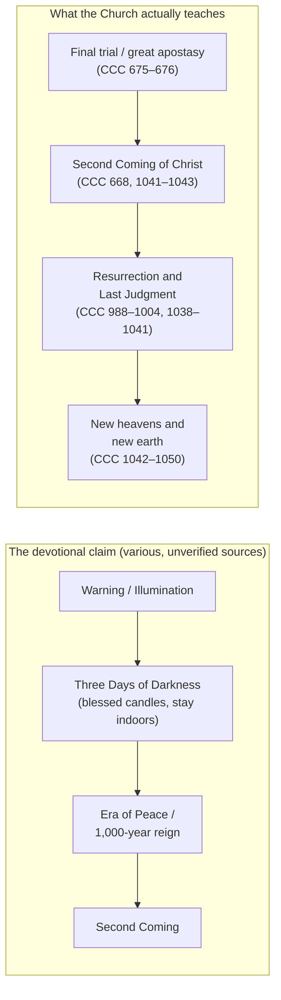

# The "Three Days of Darkness": Doctrine, Private Revelation, and Catholic Discernment

> ⚠️ **Not a defined Catholic doctrine — and not approved where it rests on unapproved claims.** This document reports, **as claims**, what the _Book of Truth_ corpus (Maria Divine Mercy) and a range of other alleged private revelations say about a coming "**Three Days of Darkness**." It proposes none of it for belief. The corpus has **no ecclesiastical approval**, and several bishops and dioceses have prohibited it or judged it contrary to Catholic faith; see [church-assessment-and-warnings.md](../book-of-truth/church-assessment-and-warnings.md). For the Church's actual doctrine on the Last Things, see [doctrinal-foundations.md](doctrinal-foundations.md).

> **A note on registers.** Throughout this page, three things are kept strictly separate: **(a) quoted private-revelation text** (as its promoters publish it, each item labelled with its own canonical status), **(b) Catholic doctrine** (cited to the Catechism, Scripture, councils, and papal documents), and **(c) analysis**. A private-revelation claim — even an approved one — never becomes Church teaching. Where the corpus is quoted, the citation names the edition or message date as the promoters published it; see [book-of-truth/resources.md](../book-of-truth/resources.md) for where the primary text circulates and its citation caveats.

---

## Contents

1. [What the Devotion Is](#1-what-the-devotion-is)
2. [Biblical Background](#2-biblical-background)
3. [The Three Days in the _Book of Truth_ Corpus](#3-the-three-days-in-the-_book-of-truth_-corpus)
4. [The Three Days in Other Private Revelations](#4-the-three-days-in-other-private-revelations)
5. [The Claimed Details, Compared](#5-the-claimed-details-compared)
6. [What the Church Actually Teaches](#6-what-the-church-actually-teaches)
7. [The Practices Associated with the Devotion](#7-the-practices-associated-with-the-devotion)
8. [Common Errors and Pastoral Dangers](#8-common-errors-and-pastoral-dangers)
9. [The Proper Catholic Posture](#9-the-proper-catholic-posture)
10. [Frequently Asked Questions](#10-frequently-asked-questions)
11. [Recommended Reading](#11-recommended-reading)
12. [Closing Pastoral Reflection](#12-closing-pastoral-reflection)
13. [See Also](#13-see-also)
14. [Sources](#sources)

---

## 1. What the Devotion Is

### 1.1 The name

The "**Three Days of Darkness**" (also "**Three Days of Eucharistic Darkness**," "**Les Trois Jours de Ténèbres**," and the "**Days of Absolute Darkness**") is a **popular Catholic devotion** — a devotional expectation, not a defined doctrine — that envisions a brief, worldwide period of supernatural darkness and demonic assault immediately before (in most versions) the Second Coming of Christ. It circulates chiefly through devotional books, prophecy blogs, and oral tradition, and it is attached to the _Book of Truth_ corpus more than to any other single source.

### 1.2 The core claim

Stated at its most general, the devotion holds:

- that a **preternatural darkness** will cover the whole earth for **three days and three nights**;
- that during it **demons roam visibly**, so that no one may safely leave the home or open the door;
- that only **blessed candles of pure wax** will give light and protection;
- that it is a **chastisement** for sin and a **prelude to the Lord's return** (or, in some versions, to a period of peace);
- that the faithful should **prepare** by prayer, conversion, sacramental Confession, and the keeping of blessed sacramentals.

Every one of those details is a **claim**, and the sources disagree among themselves about all of them — including whether the darkness lasts three days, whether it precedes the Warning or follows it, and what precisely it accomplishes.

### 1.3 What the Church has, and has not, defined

| Question                                                          | Catholic status                                                                                                                                                                                                                                                                                                                     |
| ----------------------------------------------------------------- | ----------------------------------------------------------------------------------------------------------------------------------------------------------------------------------------------------------------------------------------------------------------------------------------------------------------------------------- |
| Will Christ come again in glory to judge the living and the dead? | **Defined dogma** ([CCC 668, 1041–1043](https://www.magisterium.com/docs/0583c069-d4bf-42dd-97de-c19f0b80150f)).                                                                                                                                                                                                                    |
| Must the Church pass through a final trial before His return?     | **Defined** in substance — a "supreme religious deception" and a trial of faith ([CCC 675–676](https://www.magisterium.com/docs/0583c069-d4bf-42dd-97de-c19f0b80150f)).                                                                                                                                                             |
| May anyone date the end, or the darkness?                         | **No — forbidden**. "Of that day or hour, no one knows" ([Mark 13:32](https://www.drbo.org/x/d?b=drb&c=mk&g=13&p=32); [Matthew 24:36](https://www.drbo.org/x/d?b=drb&c=mt&g=24&p=36); [Acts 1:7](https://www.drbo.org/x/d?b=drb&c=act&g=1&p=7); [CCC 1040](https://www.magisterium.com/docs/0583c069-d4bf-42dd-97de-c19f0b80150f)). |
| Is there a defined doctrine of a literal three-day darkness?      | **No.** It is a **private-revelation motif** and a popular devotion, never taught by the Church's ordinary or extraordinary Magisterium.                                                                                                                                                                                            |
| Is belief in it required for salvation?                           | **No.** Even approved private revelation binds no one; belief is not required ([CCC 66–67](https://www.magisterium.com/docs/0583c069-d4bf-42dd-97de-c19f0b80150f/ref/para-67); _Dei Verbum_ 4).                                                                                                                                     |

### 1.4 Why the distinction matters

The distinction is not pedantry. Two failures are common, and both are harmful:

1. **Treating the devotion as dogma.** The Catholic who reads a prophecy blog and concludes that the Three Days are certain, imminent, and datable has confused a private claim with the faith — the very error the **2024 Dicastery norms** were issued to correct: some past declarations led the faithful "to think they had to believe in these phenomena, which sometimes were valued more than the Gospel itself."
2. **Treating it as superstition.** The Catholic who tapes windows, buys "three-day candles," and lives in dread has mistaken **sacramentals** (which the Church gives for our good) for **charms** (which she forbids). See [CCC 2111, 2117](https://www.magisterium.com/docs/0583c069-d4bf-42dd-97de-c19f0b80150f) and [sacramentals/README.md](../sacramentals/README.md).

The correct posture lies between them: the moral and devotional goods the devotion recommends (conversion, Confession, the Rosary, devotion to Our Lady) are always good — **regardless of whether any particular prediction is true**.

---

## 2. Biblical Background

The devotion borrows its imagery from Scripture, though no Scripture text prescribes a "three days of darkness" before the end. Four passages are routinely invoked:

- **The ninth plague of Egypt** — "there was a thick darkness in all the land of Egypt three days" ([Exodus 10:21–23](https://www.drbo.org/x/d?b=drb&c=ex&g=10&p=21)). This is the clearest source of the "**three days**" figure, and the one most often cited in devotional literature.
- **The darkness at the Crucifixion** — "there was darkness over the whole earth" from the sixth to the ninth hour ([Matthew 27:45](https://www.drbo.org/x/d?b=drb&c=mt&g=27&p=45); [Mark 15:33](https://www.drbo.org/x/d?b=drb&c=mk&g=15&p=33); [Luke 23:44](https://www.drbo.org/x/d?b=drb&c=lk&g=23&p=44)). Note that this was **three hours**, not three days.
- **The "day of the Lord" as darkness** — the prophets describe the Day of the Lord as "darkness, and not light" ([Amos 5:18–20](https://www.drbo.org/x/d?b=drb&c=am&g=5&p=18); [Joel 2:2](https://www.drbo.org/x/d?b=drb&c=jl&g=2&p=2); [Zephaniah 1:15](https://www.drbo.org/x/d?b=drb&c=so&g=1&p=15)).
- **The darkened sun and the plagues of Revelation** — [Revelation 6:12](https://www.drbo.org/x/d?b=drb&c=rv&g=6&p=12), [8:12](https://www.drbo.org/x/d?b=drb&c=rv&g=8&p=12), [16:10](https://www.drbo.org/x/d?b=drb&c=rv&g=16&p=10).

**What Scripture does not do.** None of these texts says that a three-day darkness will occur as a distinct, worldwide, datable event before the Parousia, nor does any of them prescribe blessed candles, closed doors, or stockpiling. The step from the biblical imagery of darkness to the **devotional program** of the Three Days is the step the private-revelation literature takes — and it takes it on its own authority, not Scripture's. Catholic biblical commentary on the "day of the Lord" is also careful to note that the prophets' language is often **symbolic and liturgical** rather than a timetable.

---

## 3. The Three Days in the _Book of Truth_ Corpus

### 3.1 The corpus and its status

The _Book of Truth_ is a body of roughly 1,250–1,330 alleged messages given between **8 November 2010 and 4 March 2015** to an anonymous Irish woman the promoters call "Maria Divine Mercy." The corpus is **unapproved private revelation**. It has been judged "patently fraudulent" (Archdiocese of Brisbane, 2013), had its dissemination prohibited (Diocese of Portland, 27 August 2013), and been found to have "no ecclesiastical approval" with "many of the texts … in contradiction with Catholic theology" (Archdiocese of Dublin, 16 April 2014); the Catholic Bishops' Conference of the Philippines issued similar warnings in 2019. See [church-assessment-and-warnings.md](../book-of-truth/church-assessment-and-warnings.md).

The corpus is documented in this repository **for study, not for belief**: see [the-book-of-truth.md](../book-of-truth/the-book-of-truth.md) and [end-times-event-sequence.md](../book-of-truth/end-times-event-sequence.md). Its central doctrinal error — a literal 1,000-year earthly reign — is **millenarianism**, which the Church rejects ([CCC 676](https://www.magisterium.com/docs/0583c069-d4bf-42dd-97de-c19f0b80150f)).

### 3.2 What the corpus actually says

Two cautions frame everything in this section:

1. **The corpus rarely uses the phrase "Three Days of Darkness."** That exact phrase is chiefly the **promoters'** devotional framing, not the corpus's own vocabulary. A search of the corpus's own text archive returns no message so titled. What the corpus does is (a) describe a period of **darkness and chastisement** before the Second Coming, (b) attach to it **practical protective instructions**, and (c) place it in its own post-Warning sequence. Promoters have then gathered those statements under the heading "Maria Divine Mercy on the Three Days of Darkness," presenting the darkness as the event "immediately before the Day of the Second Coming."
2. **Nothing the corpus places after its "Warning" has occurred** — because the Warning itself has not occurred. The Warning is the **hinge** of the whole scheme (see [the-warning.md](the-warning.md)). The darkness, on the corpus's own terms, is therefore a **still-future claim**.

### 3.3 The corpus's claims about the darkness

Reported below **as claims**, with message dates as the promoters published them.

| Aspect                    | The corpus's claim                                                                                                                                                                             |
| ------------------------- | ---------------------------------------------------------------------------------------------------------------------------------------------------------------------------------------------- |
| **Place in the sequence** | The darkness falls **after the Warning** (the Illumination of Conscience) and **before the Second Coming**; it belongs to the period of chastisement and the Great Tribulation.                |
| **Nature**                | A **supernatural darkness**, not merely a natural night; in the corpus's wider scheme it accompanies the release of Satan and the demons, who "will try to devour the souls" of the faithful.  |
| **Precursor**             | Signs in the heavens, chiefly the **Cross in a red sky** after "two comets … collide" — the sign the corpus attaches to the Warning itself (messages of 5 and 8 June 2011 and 2 October 2011). |
| **Effect**                | A time of terror and of the demonic assault against the faithful; those who are unprepared are said to be in danger.                                                                           |
| **Duration**              | The corpus itself does **not** clearly fix "three days and three nights"; the three-day figure comes from the wider devotional tradition the promoters invoke.                                 |

Two quoted messages carry the practical content:

- **"Rejoice when the sky explodes for you will know that I am coming" (2 October 2011)** — after describing the sky, the Cross, and the coming of Satan and the demons, the message instructs: "This is why I must urge you all to **sprinkle your home with Holy Water and have blessed candles everywhere**. You must keep yourselves protected."
- **"Aftermath of The Warning" (29 September 2011)** — followers are told to "**prepare your homes with blessed candles and a supply of water and food to last for a couple of weeks**."

### 3.4 The protective practices the corpus commends

The corpus's practical program for the darkness is a recognizable patchwork of ordinary Catholic sacramentals and a few novel additions:

- **Blessed candles** — recommended "everywhere" in the home.
- **Holy Water** — to be sprinkled through the home.
- **A supply of water and food** for "a couple of weeks."
- **The "Seal of the Living God"** — a prayer card bearing a "Crusade Prayer," drawn from the sealing of the elect in [Revelation 7:2–3](https://www.drbo.org/x/d?b=drb&c=rv&g=7&p=2), to be displayed on the door of the home.
- **The "Medal of Salvation"** and a scapular, sold through the promoters' store.

> **Catholic note.** The first three items are legitimate in themselves: **holy water** and **blessed candles** are genuine **sacramentals** ([CCC 1667–1679](https://www.magisterium.com/docs/0583c069-d4bf-42dd-97de-c19f0b80150f); [sacramentals/holy-water.md](../sacramentals/holy-water.md)), and prudent provision for one's household is ordinary prudence. The last two are a **novel devotional system presented as necessary** — and sold — which is a recognized warning sign in the discernment of spirits (see the checklist in [catholic-discernment-guide.md](../book-of-truth/catholic-discernment-guide.md)). The Church's protection is the sacramental life — Baptism, the Eucharist, Penance, the sacramentals — not a proprietary card or medal.

### 3.5 Catholic assessment of the corpus's material

- **It is unapproved private revelation**, and locally prohibited in several dioceses.
- **It date-sets**, tying the Warning and the darkness to the papacy (the Warning "will take place after My Holy Vicar [Benedict XVI] has left Rome," 20 February 2013) — which Christ forbids ([Mark 13:32](https://www.drbo.org/x/d?b=drb&c=mk&g=13&p=32); [CCC 1040](https://www.magisterium.com/docs/0583c069-d4bf-42dd-97de-c19f0b80150f)).
- **Its own deadlines have passed** without the hinge event occurring.
- **It contradicts dogma elsewhere in the same system** — a literal earthly millennium ([CCC 676](https://www.magisterium.com/docs/0583c069-d4bf-42dd-97de-c19f0b80150f)) and the claim that the successor of Peter is a "false prophet" (against the Church's indefectibility, [Matthew 16:18–19](https://www.drbo.org/x/d?b=drb&c=mt&g=16&p=18); [CCC 869](https://www.magisterium.com/docs/0583c069-d4bf-42dd-97de-c19f0b80150f)) — a claim that risks **schism** (CIC 751; 1364 §1).
- **The category is not absurd; the package is.** The Church does teach a coming final trial and a chastisement, and holy water and blessed candles are good. What disqualifies the corpus is the **specific package**: the private timeline, the failed hinge, the papal claims, the millenarianism, and the parallel devotional system built on top.

---

## 4. The Three Days in Other Private Revelations

The Three Days motif is **older than the _Book of Truth_** and appears across revelations of very different canonical status. Canonical status is the first thing to note about each: an **approved** apparition, a **beatified** or **canonized** mystic's private writings, an **unapproved** claim, and a **promoter's** compilation are not on the same footing.

### 4.1 Our Lady of La Salette (1846) — approved apparition, restricted "Secret"

On 19 September 1846, the Blessed Virgin Mary reportedly appeared in tears to two young shepherds, **Mélanie Calvat** (age 14) and **Maximin Giraud** (age 11), at La Salette-Fallavaux in the French Alps. Bishop **Philibert de Bruillard** of Grenoble declared the apparition **worthy of belief** (decree of 19 September 1851; see also his pastoral letter of 16 November 1851), and the devotion was approved under the title "**Our Lady, Reconciler of Sinners, of La Salette**."

The message itself is one of **reconciliation**: Mary's grief over blasphemy, the neglect of Sunday, and the disregard of the Lenten fast, with **conditional** warnings of chastisement and promises of mercy if people amend. The **apparition** is approved; the later, separately published "**Secret**" material is another matter:

- Maximin's secret was never published.
- Mélanie's secret appeared in 1879.
- On **21 December 1915**, the **Holy Office** issued a decree **restricting** unauthorized discussion and publication of the "Secret of La Salette" — a decree that explicitly did **not** touch the La Salette devotion itself (see the _Acta Apostolicae Sedis_, 1915).

The specific "three days" details often attributed to La Salette come from the later Secret material and from **speculative interpretations** of it, precisely the territory the 1915 decree restrained. See [../miracles/marian-apparitions/approved/la-salette.md](../miracles/marian-apparitions/approved/la-salette.md).

### 4.2 Canonized and beatified mystics

These are holy figures whose **sanctity** the Church has recognized. Canonization or beatification is a judgment on their **holiness**, not a certification of every eschatological detail later attributed to them in popular literature.

#### 4.2.1 St. Faustina Kowalska (1905–1938; canonized 2000)

St. Faustina supplies the **theological key** to the whole chastisement theme: the divine warning is an act of **mercy preceding justice** — "Before the Day of Justice, I am sending the Day of Mercy" (_Diary_ 1588). Popular accounts of the Three Days also cite **Diary 83**, where she describes a coming darkness with the Cross in the sky. Her canonization certifies her sanctity and the Divine Mercy message; it does not enroll the earth in a three-day darkness. See [../liturgy/divine-mercy-feast-and-novena.md](../liturgy/divine-mercy-feast-and-novena.md).

#### 4.2.2 Blessed Anna Maria Taigi (1769–1837; beatified 1920)

An Italian wife, mother of seven, and Trinitarian tertiary, known for mystical visions, prophecy, and bilocation; feast day 9 June. Popular literature — and much of the modern Three Days genre — attributes to her predictions of a coming chastisement and of a period of darkness in which only blessed candles would give light. The Church's beatification recognizes her **holiness**; it does **not** certify any specific prophecy attributed to her. The specific eschatological details are **not** part of the deposit of faith.

#### 4.2.3 Blessed Elisabetta Canori Mora (1774–1825; beatified 1994)

A Roman wife and Trinitarian tertiary who offered her sufferings for the conversion of her unfaithful husband, for the Church, and for Rome. Her writings, which received ecclesiastical approval in her cause, describe visions of a coming chastisement. As with Bl. Anna Maria Taigi, the beatification is not a certification of her specific eschatological details.

#### 4.2.4 St. Mary of Jesus Crucified (Mariam Baouardy, 1846–1878; canonized 2015)

A Greek-Melkite Discalced Carmelite mystic and stigmatist, canonized by Pope Francis on 17 May 2015 and named patroness of peace in the Middle East. Popular accounts of the Three Days cite her for the claim that only "**a fourth of humanity**" would survive. This specific detail is **devotional attribution**, not magisterial teaching.

#### 4.2.5 St. Pio of Pietrelcina (Padre Pio, 1887–1968; canonized 2002)

Some devotional accounts attribute to Padre Pio prophetic statements about a period of darkness. His sanctity is beyond doubt, but **specific prophetic statements attributed to him in popular literature require careful verification** against attested sources; the burden of proof lies with those who circulate them.

### 4.3 Marie-Julie Jahenny (1850–1941) — no formal ecclesiastical approval

A French stigmatist and "Breton mystic" whose alleged visions supply a striking share of the Three Days literature: **candles of blessed wax** as the only light, **demons roaming** the earth, a great chastisement, and the **"Purple Scapular"** ("Scapular of Benediction and Protection"). The Church has made **no formal declaration** on the supernatural character of her alleged revelations, and her claims are to be received with the prudence the **2024 norms** require. Her specific details are **devotional attribution**, and the Purple Scapular is not a Church-approved devotion in the sense that the Brown Scapular is (see [sacramentals/other-approved-scapulars.md](../sacramentals/other-approved-scapulars.md)).

### 4.4 Servant of God Luisa Piccarreta (1865–1947) — cause open, writings not approved

An Italian mystic, author of 36 volumes known as the _Book of Heaven_, whose cause was opened in 1994 in the Archdiocese of Trani. Her writings contain detailed eschatological passages about a coming chastisement and a three-day darkness, but the Church has **not** approved them as supernatural revelation, and some of her theological positions were contested during her lifetime. Her cause is open; that is **not** an endorsement of her specific prophecies. See also [spiritual-life/README.md](../spiritual-life/README.md) for the Divine Will material treated in this repository.

### 4.5 Other mystics, locutionists, and movements (all unverified)

The modern Three Days literature is fed by a wide stream of **unapproved** claims. None of the following has an ecclesiastical judgment declaring its alleged revelations supernatural; each is listed for completeness and for the discernment lessons it teaches.

| Source                                                     | Claim relevant to the Three Days                                                                                                                                                                     | Status                                                                                                                                                                                                                                                                                                                                                    |
| ---------------------------------------------------------- | ---------------------------------------------------------------------------------------------------------------------------------------------------------------------------------------------------- | --------------------------------------------------------------------------------------------------------------------------------------------------------------------------------------------------------------------------------------------------------------------------------------------------------------------------------------------------------- |
| **Fr. Stefano Gobbi / Marian Movement of Priests**         | Locutions (8 May 1972 – 1997) describing an illumination of conscience and a coming chastisement, leading to a "Second Pentecost."                                                                   | The **movement** has standing (pontifical right, 1993); the **messages** enjoy no such judgment. In October 1994 the Vatican nunciature in the U.S. reportedly conveyed that CDF officials regarded the locutions as Fr. Gobbi's own meditations. Fr. Gobbi's cause was opened in 2024 (Diocese of Como) — a judgment about his cause, not the locutions. |
| **Fr. Michel Rodrigue** (Quebec)                           | Talks describing the Warning, refuges, and three days of darkness.                                                                                                                                   | **No ecclesiastical approval** of the claimed locutions; promoted chiefly through "Countdown to the Kingdom."                                                                                                                                                                                                                                             |
| **John Leary** ("Prophet John Leary," messages since 1993) | Daily messages describing the Great Tribulation, the Three Days of Darkness, refuges, and the Great Era of Peace.                                                                                    | **Unapproved**; self-published.                                                                                                                                                                                                                                                                                                                           |
| **Luz de María** (Argentina)                               | Messages describing a coming darkness and warning that "the approaching darkness must not be confused with the Three Days of Darkness" (19 May 2025).                                                | Reported messages circulated by promoters; any claim of Church approval should be **verified with the competent local authority**, not taken from a promoter's label.                                                                                                                                                                                     |
| **Christina Gallagher** (Ireland)                          | Messages describing the Three Days of Darkness and a coming war.                                                                                                                                     | **No approval**; the competent local Church has not authenticated the alleged revelations.                                                                                                                                                                                                                                                                |
| **Apostolate of the Green Scapular (Anna Marie)**          | 2019–2025 messages on the "Days of Darkness," a "Harbinger Week," and a "testing prayer before opening the door" for disguised evil spirits, with **later "corrections"** to that prayer (May 2024). | **Unapproved**; the sequence of messages followed by "corrections" is a signal for caution.                                                                                                                                                                                                                                                               |
| **"Holy Love" messages / MaryRefugeOfSouls ("a soul")**    | Compilations and commentary on the Warning and the Three Days; a 1 November 2021 Q&A insists the Great Warning is **not** the same event as the Three Days of Darkness.                              | A **private compilation blog**, not an ecclesial act; its own disclaimer disclaims affiliation with the ministries it promotes.                                                                                                                                                                                                                           |

> **The discernment lesson.** Note the pattern: shifting dates, messages followed by "corrections," a proliferating apparatus of prayers, seals, scapulars, and "testing prayers," and a proliferation of competing timelines that contradict one another. These are the classic **negative indicators** the Church asks the faithful to weigh (see [catholic-discernment-guide.md](../book-of-truth/catholic-discernment-guide.md), [gifts-holy-spirit/discernment-of-spirits.md](../gifts-holy-spirit/discernment-of-spirits.md), and the 2024 norms).

### 4.6 Adjacent approved apparitions: warnings without a "three days"

Several **approved** apparitions warn of chastisement but do **not** teach a three-day darkness. They are frequently folded into the devotion, and the distinction should be kept clear:

- **Fátima (1917)** — approved in 1930; a message of penance, the Rosary, and reparation, with **conditional** threats and the promise that "in the end, my Immaculate Heart will triumph." Fátima defines no "Warning" and no three days. See [../miracles/marian-apparitions/approved/fatima.md](../miracles/marian-apparitions/approved/fatima.md).
- **Akita (1973)** — approved by Bishop Ito of Niigata in 1984 with CDF confirmation that his judgment could be followed; a **conditional** warning ("If men do not repent, the Father will inflict a terrible punishment …"), mitigated by prayer, penance, and the Rosary. It names no three days. See [../miracles/marian-apparitions/approved/akita.md](../miracles/marian-apparitions/approved/akita.md).
- **Garabandal (1961–1965)** — **no declaration of supernatural origin** (_non constat_, 1967; never condemned). Its pattern is Warning → Great Miracle → **conditional** Chastisement. Garabandal does not itself speak of "three days of darkness," though later devotional retellings fuse the two. See [../miracles/marian-apparitions/ongoing-investigations/garabandal.md](../miracles/marian-apparitions/ongoing-investigations/garabandal.md).
- **Medjugorje (1981– )** — the Dicastery for the Doctrine of the Faith granted a **_nihil obstat_** on 19 September 2024, permitting devotion and pilgrimage **without any declaration that the events are supernatural**. Its "secrets" include warnings and chastisements, often retold as a three-day darkness; none is verified, and the Church has expressly declined to judge the events supernatural. See [../miracles/marian-apparitions/ongoing-investigations/medjugorje.md](../miracles/marian-apparitions/ongoing-investigations/medjugorje.md).

### 4.7 Modern popularizers

Much of today's talk of the Three Days flows through popular devotional media rather than any single apparition:

- **Fr. Chris Alar, MIC**, in his end-times catechesis, presents a sequence (chastisement → the Warning → the Antichrist → the three days of darkness → the era of peace → the Parousia) drawn "from the saints and mystics," while explicitly cautioning that it is **not dogmatic** and not something Catholics must believe. See [alar-end-times-interview.md](alar-end-times-interview.md).
- **Fr. Chad Ripperger**, S.T.D., treats chastisement and preparation with the same caution, distinguishing **prophetic interpretation** from Catholic doctrine. See [ripperger-our-times-part-iii-detachment-suffering-hope.md](ripperger-our-times-part-iii-detachment-suffering-hope.md) and [ripperger-our-times-part-iv-qa-spiritual-warfare.md](ripperger-our-times-part-iv-qa-spiritual-warfare.md).
- **Christine Watkins, _The Warning: Testimonies and Prophecies of the Illumination of Conscience_ (2018)** — a popular **devotional anthology**, not an ecclesial act; its selections and readings should be checked against the original sources.

---

## 5. The Claimed Details, Compared

The following table sets the **claimed** features side by side. Read the last column first: it is the only column that tells you what a Catholic may rely on.

| Claimed feature                                          | Where it comes from                                                                   | Canonical status of the source                                                                                   |
| -------------------------------------------------------- | ------------------------------------------------------------------------------------- | ---------------------------------------------------------------------------------------------------------------- |
| A literal **three days and three nights** of darkness    | Devotional tradition; Book of Truth promoters; various locutionists                   | Private claim; **not** defined                                                                                   |
| **Only blessed wax candles** will burn                   | Bl. Anna Maria Taigi (attributed); Marie-Julie Jahenny; later devotional literature   | Devotional attribution; **not** Church teaching                                                                  |
| **Demons roam visibly**; do not open the door            | Marie-Julie Jahenny (attributed); Green Scapular messages; devotional genre           | Private claim; **not** defined                                                                                   |
| **Sprinkle Holy Water; keep blessed candles everywhere** | _Book of Truth_ (2 October 2011)                                                      | Unapproved corpus; the practices themselves are ordinary sacramentals                                            |
| **Store water and food for a couple of weeks**           | _Book of Truth_ ("Aftermath of The Warning," 29 September 2011)                       | Unapproved corpus; prudent provision is ordinary prudence                                                        |
| A **"Seal of the Living God"** card on the door          | _Book of Truth_, from [Revelation 7:2–3](https://www.drbo.org/x/d?b=drb&c=rv&g=7&p=2) | Novel devotional system presented as necessary                                                                   |
| The **"Purple Scapular"**                                | Marie-Julie Jahenny                                                                   | No formal ecclesiastical approval                                                                                |
| Only **a fourth of humanity** survives                   | St. Mary of Jesus Crucified (attributed)                                              | Devotional attribution; **not** Church teaching                                                                  |
| The darkness is preceded by the **Warning**              | _Book of Truth_ and others; contradicted by other timelines                           | Unapproved corpus                                                                                                |
| The darkness is **followed** by the Era of Peace         | _Book of Truth_ (with its millenarian 1,000 years)                                    | **Millenarianism — rejected** ([CCC 676](https://www.magisterium.com/docs/0583c069-d4bf-42dd-97de-c19f0b80150f)) |
| A specific **date**                                      | Various blogs and locutionists ("2029," "this generation," etc.)                      | **Forbidden** ([Mark 13:32](https://www.drbo.org/x/d?b=drb&c=mk&g=13&p=32))                                      |

**The point of the table.** The sources **do not agree** with one another. If the Three Days were a defined truth, we would expect a coherent common account. Instead we find a shifting composite — which is exactly what one expects of a **devotion** synthesized from many unverified claims, and not of a revelation from God.

---

## 6. What the Church Actually Teaches

Set the claims beside the faith. Note that the Church gives **no** place in her doctrine to a three-day darkness, and that she forbids the one thing the devotion's popular forms most often do — assign a date.

| Element                                                                          | Catholic status                            | Source                                                                                                                                                                      |
| -------------------------------------------------------------------------------- | ------------------------------------------ | --------------------------------------------------------------------------------------------------------------------------------------------------------------------------- |
| The final trial of the Church; the "supreme religious deception"; the Antichrist | **Dogma** (in substance)                   | [CCC 675–676](https://www.magisterium.com/docs/0583c069-d4bf-42dd-97de-c19f0b80150f)                                                                                        |
| The Second Coming of Christ in glory                                             | **Dogma**                                  | [CCC 668, 1041–1043](https://www.magisterium.com/docs/0583c069-d4bf-42dd-97de-c19f0b80150f)                                                                                 |
| The resurrection of the dead, just and unjust                                    | **Dogma**                                  | [CCC 988–1004, 1038](https://www.magisterium.com/docs/0583c069-d4bf-42dd-97de-c19f0b80150f)                                                                                 |
| The Last Judgment                                                                | **Dogma**                                  | [CCC 1038–1041](https://www.magisterium.com/docs/0583c069-d4bf-42dd-97de-c19f0b80150f)                                                                                      |
| The new heavens and the new earth                                                | **Dogma**                                  | [CCC 1042–1050](https://www.magisterium.com/docs/0583c069-d4bf-42dd-97de-c19f0b80150f)                                                                                      |
| A literal three-day darkness before the end                                      | **Not taught**; a private-revelation motif | [CCC 66–67](https://www.magisterium.com/docs/0583c069-d4bf-42dd-97de-c19f0b80150f) (no new public revelation)                                                               |
| A literal 1,000-year earthly reign before the judgment                           | **Rejected as error** (millenarianism)     | [CCC 676](https://www.magisterium.com/docs/0583c069-d4bf-42dd-97de-c19f0b80150f); [DH 3839](https://www.magisterium.com/docs/17f50f07-de81-4bf5-997c-f41ee830c033/ref/3839) |
| Any specific date for these events                                               | **Forbidden**                              | [Mark 13:32](https://www.drbo.org/x/d?b=drb&c=mk&g=13&p=32); [CCC 1040](https://www.magisterium.com/docs/0583c069-d4bf-42dd-97de-c19f0b80150f)                              |

Three magisterial texts are decisive for evaluating the devotion:

1. **_Some Aspects of Christian Eschatology_ (CDF, 17 May 1979)** — holds that "mitigated millenarianism" (a visible earthly reign of Christ before the final judgment) "**cannot be taught safely**" ([DH 3839](https://www.magisterium.com/docs/17f50f07-de81-4bf5-997c-f41ee830c033/ref/3839)) and warns against identifying Christian hope with any historical program.
2. **The 1915 Holy Office decree on La Salette** — restrains speculative interpretation of the "Secret," the very material from which much Three Days lore is drawn.
3. **The Dicastery for the Doctrine of the Faith's _Norms for Proceeding in the Discernment of Alleged Supernatural Phenomena_ (17 May 2024)** — replaces the older categories with prudential ones, warns that private phenomena must never be valued "more than the Gospel itself," and reminds the faithful that **approval of a private revelation means only that its message "contains nothing contrary to faith or morals"** — never that every detail or subsequent interpretation is true. See [doctrinal-foundations.md](doctrinal-foundations.md#6-the-2024-dicastery-norms).

For the true ordering of the Last Things — the Second Coming, the resurrection, the Last Judgment, and the new creation, **with no interim earthly millennium** — see [doctrinal-foundations.md](doctrinal-foundations.md).

**Figure 1.** The devotional claim (left) versus the Church's doctrine (right). The Church's sequence contains no "Warning," no literal three-day darkness, and no interim earthly millennium; everything the devotional claim adds is private, unverified, and in the case of the 1,000-year reign, **rejected**.

---

## 7. The Practices Associated with the Devotion

The practices below are **pastoral discipline and popular piety**, not dogma. Where the Church has a genuine sacramental, this page says so; where she has none, this page says that too.

### 7.1 Blessed candles

Blessed candles are a legitimate **sacramental**. The Church blesses candles — most notably at the **Presentation of the Lord (Candlemas, 2 February)** — and the faithful may keep and use them at home; the Easter candle and the sanctuary lamp are liturgical uses of the same sign ([CCC 1667–1679](https://www.magisterium.com/docs/0583c069-d4bf-42dd-97de-c19f0b80150f); [sacramentals/blessings-of-daily-life.md](../sacramentals/blessings-of-daily-life.md)).

> **What the Church does _not_ have.** There is **no rite** blessing a special "three-day candle," and **no Church teaching** that only wax candles blessed by a priest will burn during a future darkness. Candles blessed by a priest are sacramentals; they are not instruments of a promised exception to the laws of nature. To rely on a candle as though it were a **charm** — rather than a **sign** of faith, hope, and the Church's blessing — is superstition ([CCC 2111](https://www.magisterium.com/docs/0583c069-d4bf-42dd-97de-c19f0b80150f)).

### 7.2 Holy Water

Sprinkling the home with **holy water** is an ancient and approved devotional practice, recommended by the Church and richly attested in the lives of the saints. It is genuinely protective — in the order of sacramentals, as a sign that disposes us to grace and places us under the Church's blessing. See [sacramentals/holy-water.md](../sacramentals/holy-water.md).

### 7.3 Crucifix, blessed palms, and blessed medals

Keeping a **crucifix** in the home, blessed **palm branches** from Palm Sunday, a **blessed medal**, and similar sacramentals is normal Catholic practice. These are treated in this repository at [sacramentals/sacred-images.md](../sacramentals/sacred-images.md) and [sacramentals/medal-of-st-benedict.md](../sacramentals/medal-of-st-benedict.md).

### 7.4 Staying indoors and not opening the door

Many versions counsel remaining indoors; some go further and forbid that the door be opened at all. A few modern forms attach a further condition: that the door may be opened **only after the visitor recites a special "testing prayer."**

#### 7.4.1 The "testing prayer" to which this page refers (2024)

The concrete instance this page has in view is a prayer circulated in **May 2024** by the **Apostolate of the Green Scapular** (the ministry of **Anna Marie**), published as a message purporting to come from "Our Savior, Jesus Christ" on **9 May 2024** (Ascension Thursday). According to the published account, the prayer was given so that the faithful would not "be tricked into opening the door to evil spirits disguised as loved ones": before opening the door to anyone who knocks, the person inside is to ask the visitor to recite the following **word for word**:

    In the Name of Jesus Christ, Son of the Living God,
    I am His servant.
    I adore only God the Father, God the Son and God the Holy Spirit.
    I denounce satan and his emissaries in any form or aspect that they approach me.
    I rebuke all evil spirits in the Name of Jesus Christ, Son of the Living God,
    and I surrender to Jesus Christ my life now and forever. Amen.

The message attaches several further instructions:

- If the visitor is a demon disguised as a family member, he "will not repeat these words exactly"; in that case, **do not open the door**. If the visitor **does** recite the prayer, he may be admitted "for refuge."
- If **more than one** person is at the door, **each** must recite the prayer before the door is opened.
- A **blessed crucifix** is to be fixed **above** (not on) the front door — ideally on the outside — and also above the back door, sliding doors, and garage door.
- The **candles** must be **100% beeswax**, "blessed by a Catholic or Orthodox Priest."

A companion set of questions and answers, circulated by the blog **Mary Refuge of Souls** ("A Soul") on **20 May 2024**, adds that those who cannot speak (small children, the disabled) are "exempt"; that the prayer is meant for the days _preceding_ the darkness, not during it; and that no sign or locution will announce the darkness's onset. The same commentary asserts a "first" Three Days of Darkness at the end of a claimed "**Harbinger Week**" (the seven days before its expected "Great Warning"), with a final Three Days later at the end of the Great Tribulation.

> **Reported, not endorsed.** None of this has any ecclesiastical approval. The Apostolate's alleged messages and the "A Soul" commentary are **unapproved private revelation**; the local bishop, not the publisher, is competent to judge them (see [../book-of-truth/catholic-discernment-guide.md](../book-of-truth/catholic-discernment-guide.md)). The account is recorded here because it is the specific "testing prayer" to which this page refers — and because it is a textbook illustration of the **proliferating devotional apparatus** the Church asks the faithful to weigh.

#### 7.4.2 What is, and is not, objectionable here

A careful judgment separates three things that are easily confused.

**(a) The words themselves are largely unobjectionable.** The formula is essentially an **act of renunciation of Satan** and an **act of surrender to Christ** — a prayer of faith, in the tradition of the baptismal renunciations and of the prayer to St. Michael. Nothing in its vocabulary is contrary to faith or morals, and a Catholic may say such a prayer freely.

**(b) The framework is the problem.** What should give a Catholic pause is not the wording but the **claims built around it**:

- **A private revelation is imposing a new condition for safety.** A private revelation — even an approved one — "does not add to or correct the definitive public Revelation of Christ" and binds no one ([CCC 66–67](https://www.magisterium.com/docs/0583c069-d4bf-42dd-97de-c19f0b80150f/ref/para-67); [_Dei Verbum_ 4](https://www.magisterium.com/docs/0583c069-d4bf-42dd-97de-c19f0b80150f)). An unapproved message cannot make a new prayer, a new candle, or a new door ritual **necessary**.
- **The prayer is treated as a test with a guaranteed result.** The claim that a demon "will never" recite the words, so that exact recitation proves a visitor is human, turns a prayer into a **formula** with quasi-automatic efficacy — precisely the mark of **superstition**, which the Church condemns ([CCC 2111, 2117](https://www.magisterium.com/docs/0583c069-d4bf-42dd-97de-c19f0b80150f)). A sacramental works by the Church's prayer, disposing the soul to grace — not by compulsion of nature, and not as a charm.
- **New _necessary_ sacramentals are multiplied.** "Only 100% beeswax, blessed by a Catholic or Orthodox priest" is not a Church requirement; the Church's _Book of Blessings_ blesses candles without prescribing a particular wax or a particular crisis ([sacramentals/blessings-of-daily-life.md](../sacramentals/blessings-of-daily-life.md)). The addition of a required **wax grade**, a required **blesser**, and **matches blessed by a priest** is the invention of a devotional apparatus.
- **The timeline multiplies and contradicts itself.** A "Harbinger Week," a "first" Three Days at the Warning, and a final Three Days at the end of the Tribulation are dates and sequences asserted on private authority alone, and the sources elsewhere on this page describe different sequences. Christ forbids date-setting flatly ([Mark 13:32](https://www.drbo.org/x/d?b=drb&c=mk&g=13&p=32); [CCC 1040](https://www.magisterium.com/docs/0583c069-d4bf-42dd-97de-c19f0b80150f)).
- **"Exemptions" and later "corrections" follow.** As noted in [§4.5](#45-other-mystics-locutionists-and-movements-all-unverified), the message and its commentary were followed within days by clarifications and "corrections" — a pattern the Church lists among the **negative indicators** in the discernment of spirits.

**(c) The Church already has what the apparatus promises.** The protection the message offers through a proprietary formula is the protection the Church offers through ordinary means: the **sacramental life** — Baptism, the Eucharist, Penance — and the **sacramentals** she has given for use in the home: **holy water**, the **crucifix**, blessed candles, blessed palms, the **Medal of St. Benedict**, and the blessings of homes. See [sacramentals/README.md](../sacramentals/README.md), [sacramentals/holy-water.md](../sacramentals/holy-water.md), [sacramentals/sacred-images.md](../sacramentals/sacred-images.md), [sacramentals/medal-of-st-benedict.md](../sacramentals/medal-of-st-benedict.md), and [sacramentals/blessings-of-daily-life.md](../sacramentals/blessings-of-daily-life.md).

#### 7.4.3 The rule to apply

The rule is the one the whole page applies. A **free private devotion** — including a prayer of renunciation and surrender — is a good thing when it expresses faith and reliance on God. It becomes harmful when it is presented as **necessary**, when its exact performance is treated as **guaranteeing** a result, when it multiplies **apparatus** and **conditions**, or when it is used to **bind the conscience** of others. The 2024 Dicastery norms are a call to hold private phenomena "at their proper level," remembering that even an approved apparition is approved only because its message "contains nothing contrary to faith or morals" — never because every attached instruction is true. See [doctrinal-foundations.md](doctrinal-foundations.md#6-the-2024-dicastery-norms).

### 7.5 Faith, conversion, and the sacraments

The practices that **matter** are the ones every approved revelation urges and the Church commands regardless of any prediction:

- **Conversion and repentance** — turning from sin to God.
- **Sacramental Confession** — especially before any presumed trial ([sacraments/penance-reconciliation.md](../sacraments/penance-reconciliation.md); [sacraments/examination-of-conscience.md](../sacraments/examination-of-conscience.md)).
- **The Holy Eucharist** and, where possible, **Holy Communion** (spiritual Communion if not; [liturgy/spiritual-communion.md](../liturgy/spiritual-communion.md)).
- **The Rosary and the Chaplet of Divine Mercy** — [liturgy/rosary/how-to-pray.md](../liturgy/rosary/how-to-pray.md); [liturgy/chaplet-divine-mercy.md](../liturgy/chaplet-divine-mercy.md).
- **Devotion to Our Lady** and the **communion of the saints**.
- **Theological hope** — the confidence that God is a Father ([CCC 1817–1821](https://www.magisterium.com/docs/0583c069-d4bf-42dd-97de-c19f0b80150f)).

### 7.6 The Eastern Catholic dimension

The Latin Church has no monopoly on eschatological hope. The Eastern Catholic _sui iuris_ Churches — through the Byzantine Divine Liturgy, the funeral rites, and the Fathers (St. John Damascene, St. Gregory of Nyssa, St. Maximus the Confessor) — express a **joyful expectation** of the Resurrection rather than a fearful fixation on chastisement. Where Western devotional literature emphasizes the darkness, the Eastern tradition emphasizes the Light of the Resurrection and the transfiguration of all things. See [../church-history/eastern-catholic-churches.md](../church-history/eastern-catholic-churches.md) and [doctrinal-foundations.md](doctrinal-foundations.md).

---

## 8. Common Errors and Pastoral Dangers

A Catholic reception of the Three Days that fails to hold the proper distinctions leads to several dangers:

### 8.1 Sensationalism

Popular accounts often exceed even the vague sources with lurid detail — visible demonic hordes, mass apostasy, fantastical punishments. Sensationalism serves neither faith nor charity; it feeds the appetite rather than the soul.

### 8.2 Date-setting

The most persistent error. Christ forbids it absolutely: "**Of that day or hour, no one knows**, neither the angels in heaven, nor the Son, but only the Father" ([Mark 13:32](https://www.drbo.org/x/d?b=drb&c=mk&g=13&p=32)). Scripture's test of prophecy is exacting: "If the word does not come to pass … the prophet has spoken it presumptuously" ([Deuteronomy 18:21–22](https://www.drbo.org/x/d?b=drb&c=dt&g=18&p=21)).

### 8.3 Substitute soteriology

A subtle error: treating the Three Days as the **central** event of salvation history, displacing the **Paschal Mystery**. The death and resurrection of Christ is the source and summit of all salvation; no chastisement can displace it ([CCC 571–573, 1067](https://www.magisterium.com/docs/0583c069-d4bf-42dd-97de-c19f0b80150f)).

### 8.4 Survivalism and stockpiling

Prudence is a virtue; hoarding and dread are not. Preparing one's household is one thing; building a bunker, emptying savings into "three-day supplies," or treating a supply of candles as a guarantee of survival is a failure of hope. The Lord's counsel is vigilance, not panic ([Matthew 24:42–44](https://www.drbo.org/x/d?b=drb&c=mt&g=24&p=42)).

### 8.5 Superstition

Attributing magical efficacy to candles, medals, seals, or formulas is **superstition**, which the Church condemns ([CCC 2111, 2117](https://www.magisterium.com/docs/0583c069-d4bf-42dd-97de-c19f0b80150f)). Sacramentals work by the Church's prayer, disposing the soul to grace — not by compulsion of nature. The distinction between **sacramental** and **charm** is exactly the distinction at stake in much Three Days literature.

### 8.6 Excessive dependence on the prophetic

The spiritual life is grounded in the **sacraments, prayer, virtue, and the pursuit of holiness**, not in speculative apocalyptic expectations. A life organized around the Three Days can distract from the duties of one's own state in life.

### 8.7 Scapegoating the clergy

Some versions predict that **corrupt clergy** will cause the chastisement, or that priests will be unable to assist the faithful during it. Such claims, while understandable in contexts of scandal, are **not** Catholic teaching, and — where they extend to denying the validity of the Church's pastors — they tend toward **schism** (CIC 751; 1364 §1).

### 8.8 Fear as a spirit

The tone of much of the literature is dread. Recall: "**God has not given us a spirit of fear**, but of power and of love and of a sound mind" ([2 Timothy 1:7](https://www.drbo.org/x/d?b=drb&c=2tm&g=1&p=7)). Coercive fear is itself a negative indicator in the discernment of spirits. The _Book of Truth_'s own message of 25 October 2011 even says, "Fear does not come from Me. Fear comes from the darkness" — a standard by which the same corpus's fear-laden material must be measured.

---

## 9. The Proper Catholic Posture

A faithful Catholic reception of the Three Days devotion might look like this:

1. **Receive the core moral teaching** of the devotion — prayer, conversion, sacramental Confession, devotion to Our Lady, perseverance in faith — as **excellent and salutary**, whether or not any particular prediction is verified.
2. **Distinguish the approved from the unverified.** La Salette, Fátima, and Akita are approved and warn of chastisement conditionally; the specific "three days" details, and the corpus's and other locutionists' claims, are **not** approved and should be received with the **prudential discernment** the 2024 norms require.
3. **Avoid date-setting** and excessive speculation about timelines.
4. **Center your spiritual life on the Paschal Mystery** of Christ, not on apocalyptic scenarios.
5. **Prepare prudently, not fearfully.** Keep the sacramentals the Church gives you — holy water, a crucifix, blessed candles — and use them as signs of faith, not as charms.
6. **Trust the mercy of God.** "Before the Day of Justice, I am sending the Day of Mercy" (_Diary_ 1588). The purpose of any genuine divine warning is conversion, not despair.
7. **Test everything** ([1 Thessalonians 5:21–22](https://www.drbo.org/x/d?b=drb&c=1th&g=5&p=21)) — against Scripture, the Catechism, and the Church's criteria (see [catholic-discernment-guide.md](../book-of-truth/catholic-discernment-guide.md)).
8. **Consult the proper authority.** For questions of private revelation, the **local diocesan bishop** is competent, in collaboration with the **Dicastery for the Doctrine of the Faith** — not a prophecy blog.

---

## 10. Frequently Asked Questions

**Am I obliged to believe in the Three Days of Darkness?**
No. It is not defined doctrine, and even approved private revelation binds no one ([CCC 66–67](https://www.magisterium.com/docs/0583c069-d4bf-42dd-97de-c19f0b80150f/ref/para-67)).

**Is it a sin to prepare?**
No. Prudence and care for one's household are good. It becomes disordered when it replaces trust in God, displaces charity, or is driven by superstition or fear.

**May I use blessed candles and holy water?**
Yes — they are legitimate sacramentals ([CCC 1667–1679](https://www.magisterium.com/docs/0583c069-d4bf-42dd-97de-c19f0b80150f)). Use them as signs of faith, not as guarantees.

**Is there such a thing as a "three-day candle" blessing?**
No. The Church has no such rite. Candles are blessed at Candlemas and on other occasions; the "three-day candle" is a devotional invention.

**Can the chastisement be averted?**
The approved apparitions consistently present chastisement as **conditional** and mitigated by prayer, penance, and the Rosary (Fátima, Akita). The _Book of Truth_ itself includes a message titled "Chastisement can be mitigated through prayer" (12 September 2011) — a claim that, if credited, confirms the primacy of conversion over calculation.

**What if someone I love is caught up in fear over these prophecies?**
Gently return them to what is certain: the sacraments, Scripture, the Rosary, and the Catechism. Point them to their parish priest. See [catholic-discernment-guide.md](../book-of-truth/catholic-discernment-guide.md).

---

## 11. Recommended Reading

1. **The Catechism of the Catholic Church, §§ 988–1060** — the Church's own teaching on the Last Things ([doctrinal-foundations.md](doctrinal-foundations.md)).
2. **Pope Benedict XVI, _Spe Salvi_ (2007)** — the modern magisterial treatment of Christian hope amid judgment.
3. **CDF, _Some Aspects of Christian Eschatology_ (1979)** and the **2024 Dicastery norms** — the doctrinal guardrails.
4. **The La Salette apparition** — [../miracles/marian-apparitions/approved/la-salette.md](../miracles/marian-apparitions/approved/la-salette.md), including the 1851 approval and the 1915 Holy Office decree.
5. **The Fátima apparition** — [../miracles/marian-apparitions/approved/fatima.md](../miracles/marian-apparitions/approved/fatima.md).
6. **The Warning** — [the-warning.md](the-warning.md), the companion study of the still-unfulfilled event in the _Book of Truth_ and elsewhere.
7. **The _Book of Truth_ study** — [../book-of-truth/README.md](../book-of-truth/README.md) and [../book-of-truth/resources.md](../book-of-truth/resources.md) (a pointer list, for study only).
8. **The broader reading list** — [reading-list.md](reading-list.md).

For popular books on the Three Days themselves, approach them with **prudential discernment**, keeping the distinction between **pious devotional literature** and **approved magisterial teaching**.

---

## 12. Closing Pastoral Reflection

The Three Days of Darkness is a paradigmatic case of how to receive **popular Catholic devotion** in the modern age. The Church does **not** require us to be skeptics about private revelation; she has approved many apparitions as worthy of belief. But she also requires us to **distinguish**: between dogma and devotion, between the public Revelation complete in Christ and the private claims that may illuminate but cannot add to it ([CCC 65–67](https://www.magisterium.com/docs/0583c069-d4bf-42dd-97de-c19f0b80150f); _Dei Verbum_ 4), and between the sacramentals she gives and the charms she forbids.

St. Paul's counsel is the whole of the matter:

> Test everything; hold fast to what is good;
> abstain from every form of evil.
>
> — [1 Thessalonians 5:21–22](https://www.drbo.org/x/d?b=drb&c=1th&g=5&p=21)

Discernment, humility, hope, and trust in the providence of God, who has revealed himself fully in his Son Jesus Christ, "the same yesterday, and to day, and for ever" ([Hebrews 13:8](https://www.drbo.org/x/d?b=drb&c=heb&g=13&p=8)) — this is the proper Catholic posture.

---

## 13. See Also

- [Doctrinal Foundations](doctrinal-foundations.md) — the magisterial sources on eschatology, including the 2024 norms.
- [The Warning (Illumination of Conscience)](the-warning.md) — the _Book of Truth_ corpus's central and still-unfulfilled claim, and the same motif across other private revelations.
- [Hell in Private Revelation](hell-private-revelations.md) — the companion treatment of another popular eschatological topic, with the same doctrinal distinctions.
- [Reading List](reading-list.md) — recommended books on Catholic eschatology.
- [../book-of-truth/README.md](../book-of-truth/README.md) — the corpus's unapproved status and its documented claims.
- [../book-of-truth/end-times-event-sequence.md](../book-of-truth/end-times-event-sequence.md) — where the corpus places the darkness in its own sequence.
- [../book-of-truth/catholic-discernment-guide.md](../book-of-truth/catholic-discernment-guide.md) — how to evaluate unapproved private revelation.
- [../book-of-truth/resources.md](../book-of-truth/resources.md) — where the corpus's primary text circulates (a pointer list, for study only).
- [../miracles/marian-apparitions/approved/la-salette.md](../miracles/marian-apparitions/approved/la-salette.md) — the approved apparition and the restricted "Secret."
- [../miracles/marian-apparitions/approved/fatima.md](../miracles/marian-apparitions/approved/fatima.md) and [../miracles/marian-apparitions/approved/akita.md](../miracles/marian-apparitions/approved/akita.md) — approved, conditional warnings.
- [../sacramentals/README.md](../sacramentals/README.md), [../sacramentals/holy-water.md](../sacramentals/holy-water.md), and [../sacramentals/blessings-of-daily-life.md](../sacramentals/blessings-of-daily-life.md) — the genuine sacramentals at issue.
- [../gifts-holy-spirit/discernment-of-spirits.md](../gifts-holy-spirit/discernment-of-spirits.md) — the charism of discernment.

---

## Sources

- **_Book of Truth_ corpus (unapproved private revelation; quoted only as its promoters publish it).** "Rejoice when the sky explodes for you will know that I am coming" (2 October 2011) — "sprinkle your home with Holy Water and have blessed candles everywhere"; "Aftermath of The Warning" (29 September 2011) — "prepare your homes with blessed candles and a supply of water and food to last for a couple of weeks"; "God the Father – You must reject darkness and embrace the Light" (25 October 2011); "Chastisement can be mitigated through prayer" (12 September 2011). Message text consulted via _Jesus to Mankind_ (jtmglobal.network) and as compiled in the Mary Refuge of Souls PDFs, 4 March 2015 edition; see [../book-of-truth/resources.md](../book-of-truth/resources.md) for the full source list and citation caveats. Promoter compilation: "Maria Divine Mercy on the Three Days of Darkness." Pages consulted 2 October 2026.
- **Ecclesial judgments on the corpus.** Archdiocese of Brisbane (2013); Diocese of Portland (27 August 2013); Archdiocese of Dublin (16 April 2014); Catholic Bishops' Conference of the Philippines (2019) — as recorded in [../book-of-truth/church-assessment-and-warnings.md](../book-of-truth/church-assessment-and-warnings.md).
- **La Salette.** Bishop Philibert de Bruillard of Grenoble, decree declaring the apparition worthy of belief (19 September 1851); pastoral letter (16 November 1851); Holy Office decree restricting discussion of the "Secret" (21 December 1915), in the _Acta Apostolicae Sedis_, 1915; see also [../miracles/marian-apparitions/approved/la-salette.md](../miracles/marian-apparitions/approved/la-salette.md).
- **Mystics and devotional attributions.** St. Faustina Kowalska, _Diary_ 83, 1588; Bl. Anna Maria Taigi (beatified 1920); Bl. Elisabetta Canori Mora (beatified 1994); St. Mary of Jesus Crucified / Mariam Baouardy (canonized 2015); St. Pio of Pietrelcina (canonized 2002); Marie-Julie Jahenny (no formal ecclesiastical declaration); Servant of God Luisa Piccarreta, _Book of Heaven_ (cause opened 1994).
- **Movements and modern claims.** Fr. Stefano Gobbi, _To the Priests, Our Lady's Beloved Sons_ (locutions 1972–1997; movement of pontifical right, 1993); Fr. Michel Rodrigue (talks and transcripts as circulated by "Countdown to the Kingdom"); John Leary (messages since 1993); Luz de María (messages of 19 May 2025 and 17 December 2023, as circulated by Mary Refuge of Souls); Christina Gallagher; Apostolate of the Green Scapular (messages of 13 October 2019 and 9 May 2024, with corrections of 12 May 2024); Mary Refuge of Souls commentary (1 November 2021).
- **The "testing prayer" (unapproved private revelation; quoted only as its promoters publish it).** Apostolate of the Green Scapular, Anna Marie, "Message from Our Savior, Jesus Christ: 'I will to speak with you about the coming "Days of Darkness" and what my beloved Apostles should do in preparation for this event'" (9 May 2024, Ascension Thursday) — the "Special Testing Prayer," the instruction that each visitor recite it word-for-word before the door is opened, and the directions on blessed crucifixes and 100% beeswax candles; with the accompanying "Prepared Questions" and answers attributed to Jesus, received by "A Soul" of Mary Refuge of Souls (20 May 2024), and the excerpt PDF _Regarding the Special Testing Prayer for Three Days of Darkness_ (25 May 2024). Circulated via greenscapular.org and Mary Refuge of Souls / _Handbook of God the Father_ (handbook.faith); see [§7.4](#74-staying-indoors-and-not-opening-the-door). Recorded for study, not for belief.
- **Modern catechesis.** Fr. Chris Alar, MIC, end-times catechesis (see [alar-end-times-interview.md](alar-end-times-interview.md)); Fr. Chad Ripperger, lectures on the last things and on the crisis (see [ripperger-our-times-part-iii-detachment-suffering-hope.md](ripperger-our-times-part-iii-detachment-suffering-hope.md)).
- **Magisterial and conciliar sources.** _Catechism of the Catholic Church_ 65–67, 668, 675–677, 988–1004, 1038–1050, 1667–1679, 1817–1821, 2111, 2117; Vatican II, _Dei Verbum_ 4; Congregation for the Doctrine of the Faith, _Some Aspects of Christian Eschatology_ (17 May 1979), DH 3839; Dicastery for the Doctrine of the Faith, _Norms for Proceeding in the Discernment of Alleged Supernatural Phenomena_ (17 May 2024); _Code of Canon Law_ (CIC) 751, 1364 §1.
