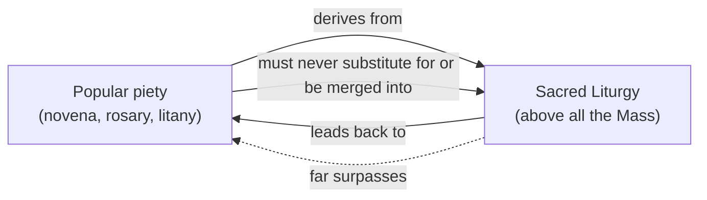

# Novenas and Novena Masses

## Purpose and Scope

This document explains what a **novena** is, where the practice comes from, and what is actually meant when a parish advertises a **"Novena Mass."** It distinguishes the novena — a form of popular piety — from the Mass, which is the Church's supreme act of worship, and it describes how the two may be joined in a single pastoral gathering without being confused. The recurring **Wednesday Novena to Our Mother of Perpetual Help** and the Philippine practice of the **Simbang Gabi** are used as worked examples.

The guiding principle throughout is the Church's own: devotion and liturgy are two legitimate expressions of Christian worship, but they are not equal, and popular devotions "should be so drawn up that they harmonize with the liturgical seasons, accord with the sacred liturgy, are in some way derived from it and lead the people to it" (CCC 1675, quoting [_Sacrosanctum Concilium_](https://www.magisterium.com/docs/f3bd930d-74b4-46ee-86ed-06d79db364a9/ref/13) 13).

---

## 1. What a Novena Is

A **novena** (from the Latin _novem_, "nine") is a devotional exercise of prayer sustained over **nine days** — or nine successive weeks, months, or weeks of a season — for a particular intention, in preparation for a feast, or in honor of Christ, the Blessed Virgin Mary, or a saint.

Its precise theological classification matters:

| Category                  | Is a novena this? | Notes                                                                                          |
| ------------------------- | ----------------- | ---------------------------------------------------------------------------------------------- |
| Divine Revelation/Dogma   | No                | Devotional practice, not a truth divinely revealed and binding on all the faithful.            |
| Sacrament                 | No                | One of the seven sacraments; a novena confers no sacramental grace of its own.                 |
| Sacramental               | Partly            | A novena may include blessed objects, holy water, or the Sign of the Cross (CCC 1667–1679).    |
| Ecclesiastical discipline | Partly            | Some novenas carry indulgences or are regulated by diocesan norms.                             |
| **Popular piety**         | **Yes**           | A devotional exercise of the Christian people, subordinate to and oriented toward the liturgy. |

The _Catholic Encyclopedia_ states the matter plainly: the novena "is permitted and even recommended by ecclesiastical authority, but still has no proper and fully set place in the liturgy of the Church." It is therefore never an obligation under pain of sin, and it never substitutes for the Mass or the sacraments.

The Catechism locates novenas and similar exercises within the broad stream of popular piety:

- **CCC 1674** — "Besides sacramental liturgy and sacramentals, catechesis must take into account the forms of piety and popular devotions among the faithful... the veneration of relics, visits to sanctuaries, pilgrimages, processions, the stations of the cross, religious dances, the rosary, medals, etc."
- **CCC 1675** — "These expressions of piety extend the liturgical life of the Church, but do not replace it."
- **CCC 1676** — "Pastoral discernment is needed to sustain and support popular piety and, if necessary, to purify and correct the religious sense which underlies these devotions."

The _Directory on Popular Piety and the Liturgy_ (Congregation for Divine Worship and the Discipline of the Sacraments, 2002) confirms the same relationship: popular piety "is objectively subordinated to, and directed towards, the Liturgy" (§50), and "the Liturgy and popular piety are two forms of worship which are in a mutual and fruitful relationship with each other," with the Liturgy remaining the primary reference point (§58).

Theological foundations for the three main kinds of novena:

- **Intercessory novenas** rest on the communion of saints: those in glory "contemplate God, praise him and constantly care for those whom they have left on earth... Their intercession is their most exalted service to God's plan. We can and should ask them to intercede for us and for the whole world" (CCC 2683; cf. CCC 956).
- **Novenas of preparation** rest on the liturgical year and its feasts.
- **Novenas for the dead** rest on the Church's ancient practice of suffrage for the faithful departed (2 Maccabees 12:46; CCC 1032).

---

## 2. Biblical and Historical Roots

### 2.1 The biblical model: the nine days of the Upper Room

The New Testament describes the first disciples gathered in prayer between the Ascension and Pentecost: "all these were persevering with one mind in prayer with the women, and Mary the mother of Jesus, and with his brethren" (Acts 1:14), awaiting the promise that they would "be endued with power from on high" (Luke 24:49). That interval of nine days supplies the archetype of every novena. The _Directory on Popular Piety_ says the Pentecost novena "emerged from prayerful reflection on this salvific event" and that it "is already present in the Missal and in the Liturgy of the Hours" (§155).

### 2.2 The number nine

St. Jerome observed that "the number nine in Holy Writ is indicative of suffering and grief" (_In Ezech._ vii). The _Catholic Encyclopedia_ accordingly describes the tone of the novena as one of "hopeful mourning, of yearning, of prayer," in contrast to the festal character of the octave. The number nine, then, is not arbitrary; it carries a scriptural and devotional resonance suited to petition and to mourning.

### 2.3 Historical development

The precise path by which the various novenas arose is not fully documented, but the general lines are these:

- **Roman precedent.** The ancient Romans held an official nine-day religious celebration (recorded in Livy, I.xxxi), and a private nine days' mourning with a feast on the ninth day after a death; they also celebrated the _parentalia novendialia_, a yearly nine-day commemoration of the dead (13–22 February).
- **Patristic caution.** St. Augustine warned Christians against imitating the pagan custom, since "there is no example of it in Holy Writ" (_PL_ XXXIV, 596). Pseudo-Alcuin and, in the twelfth century, John Beleth repeated the caution.
- **Christian reception.** The custom of honoring the third, seventh, and ninth day after death nonetheless took root in Christian mortuary practice, and is already found in the _Constitutiones Apostolicae_ (VIII.xlii). It existed especially in the East, and also among the Franks and Anglo-Saxons.
- **The four kinds.** The _Catholic Encyclopedia_ distinguishes four kinds of novena: **novenas of mourning**, **of preparation**, **of prayer** (petition), and **indulgenced novenas** — a distinction that is not exclusive, since a single novena may combine these purposes.
- **Feast-preparation novenas.** In the medieval and modern periods the novena joined the _triduum_ (three days) and the _septinaria_ (seven days) as a way of preparing for a feast (Directory §189). The _Christmas novena_ (Directory §103) and the _Pentecost novena_ (Directory §155) are the clearest examples.

---

## 3. Kinds of Novenas

| Kind                                         | Purpose                                                    | Examples                                                                                    |
| -------------------------------------------- | ---------------------------------------------------------- | ------------------------------------------------------------------------------------------- |
| **Novena of preparation**                    | Prepares the faithful for a feast or solemnity             | Pentecost Novena (Ascension → Pentecost); Christmas Novena (17–25 December); Simbang Gabi   |
| **Novena of prayer (petition/intercession)** | Asks a grace or a saint's intercession                     | Novena to St. Jude; to St. Rita; to St. Peregrine; the Perpetual Help Wednesday novena      |
| **Novena of mourning (for the dead)**        | Offers suffrages for the faithful departed                 | The novena following a death; the forty-day commemoration; All Souls' observances           |
| **Indulgenced novena**                       | A novena to which an indulgence is attached                | The Divine Mercy Novena (with its plenary conditions); certain indulgenced prayers and sets |
| **Analogous exercises**                      | Related devotional patterns of fixed length                | Triduum (3 days); septinaria (7 days); the Nine First Fridays; the Five First Saturdays     |
| **Recurring ("perpetual") novena**           | A fixed weekday devotion rather than nine consecutive days | The Wednesday Novena to Our Mother of Perpetual Help; the Tuesday Novena to St. Anthony     |

A note on terminology: the "**perpetual**," "**weekly**," or "**everlasting**" novenas — above all the Wednesday novena — are strictly a _recurring weekday devotion_, not nine consecutive days. They borrow the name and the purpose of the novena but are repeated across the year. This is why a parish can speak of a "Novena Mass **every Wednesday**."

---

## 4. The Novena and the Mass: Distinction and Harmony

A **novena** and the Mass must never be confused. The **Mass** is the Church's liturgical celebration of the Eucharist — the memorial of the Lord's Paschal Mystery, the re-presentation of the sacrifice of Calvary, and the source and summit of the Christian life (CCC 1324; [_Sacrosanctum Concilium_](https://www.magisterium.com/docs/f3bd930d-74b4-46ee-86ed-06d79db364a9/ref/10) 10). A **novena** is a devotional exercise of the Christian people. The Council's liturgical constitution states the relation:

> "The popular devotions of the Christian people... should accord with the sacred Liturgy... and in some way derive from it, and lead people to it, since in fact the Liturgy by its very nature is far superior to any of them."

The _Directory on Popular Piety_ draws out the consequence: the question of the relation between popular piety and the Liturgy must "not be posed in terms of contradiction, equality or, indeed, of substitution" (§50), and "while not opposed to each other, neither are they to be regarded as equiparate to each other" (§58).

Pope St. Paul VI identified **two extremes** to be avoided, and the specific abuse that concerns us here (see USCCB, _Popular Devotional Practices_, §2, quoting _Marialis Cultus_ 31):

- On one side, the rejection of devotions "which, in their correct forms, have been recommended by the Magisterium," leaving a vacuum in their place.
- On the other side, "those who, without wholesome liturgical and pastoral criteria, mix practices of piety and liturgical acts in hybrid celebrations." The document names the exact problem: "It sometimes happens that **novenas or similar practices are inserted into the very celebration of the Eucharistic Sacrifice**. This creates the danger that the Lord's Memorial Rite, instead of being the culmination of the meeting of the Christian community, becomes the occasion, as it were, for devotional practices." Paul VI's rule is therefore: "**exercises of piety should be harmonized with the liturgy, not merged into it.**"

So the correct relationship is _harmony and mutual reference_, never fusion. The novena should draw the faithful toward the Mass, and the Mass — celebrated with its own texts and structure intact — should remain the summit, not a stage on which the novena is performed.

---

## 5. What Is a "Novena Mass"?

A **"Novena Mass" is not a distinct rite, a separate sacrament, or a defined liturgical form.** It is the ordinary celebration of the Mass — on a given day — at which an associated novena is also prayed, most often before or after the liturgical celebration.

| Element           | What it actually is                                                                                           |
| ----------------- | ------------------------------------------------------------------------------------------------------------- |
| **The Mass**      | The Church's Eucharistic liturgy for that day, with texts determined by the liturgical calendar and its rules |
| **The novena**    | A devotional exercise: prayers, hymns, a litany, meditation, preaching                                        |
| **"Novena Mass"** | A pastoral name for a Mass celebrated in connection with the novena — the two joined in one gathering         |

Several clarifications follow:

1. **The Mass has its own texts.** Its prayers and readings follow the liturgical calendar and the _General Instruction of the Roman Missal_ (GIRM). The label "novena Mass" does not by itself change the day's celebration.
2. **A novena Mass may be a votive Mass — but not automatically.** When the calendar permits, a Mass in honor of a particular mystery or saint may be celebrated as a **votive Mass** (see the _General Instruction of the Roman Missal_, "Votive Masses and Masses for Various Needs and Occasions," ch. IX) — for example, a Votive Mass of the Blessed Virgin Mary on a Saturday, or of a saint in whose honor the novena is offered. But the devotional name does not itself authorize this; the calendar and its rules do.
3. **The novena is prayed outside the Mass, not inside it.** Whether before Mass or after the Concluding Rites, the novena has its own place. It is not inserted into the Liturgy of the Word or the Liturgy of the Eucharist, so that the Mass "does not appear as one part of a novena service" but remains the Church's full act of worship.
4. **The proper ordering.** Parish practice varies; the norm is that the Mass remains clearly the culminating act of worship:

   - **Novena before Mass** — commonly the Rosary or novena prayers, followed by Mass; or
   - **Novena after Mass** — the Mass concludes with the Concluding Rites and blessing, and the novena follows.

   Where a parish prays the novena immediately after the Prayer After Communion (before the Concluding Rites) — a practice found in some places — the liturgical norms ask that the Mass's own structure not be obscured and that the devotion never appear to be the point of the celebration. The safest and clearest arrangement is the novena before the Mass or after the dismissal.

5. **The graces asked belong to the whole Church.** A novena Mass is a proper Mass; the novena is a prayer of the Church's people attached to it. The Mass's own efficacy is not increased or conditioned by the novena, and a novena never becomes the "reason" the Mass is offered.

---

## 6. The Wednesday Novena to Our Mother of Perpetual Help

The best-known "novena Mass" in the Philippines is the recurring **Wednesday Novena to Our Mother of Perpetual Help**. It illustrates everything above.

### 6.1 The icon

The image of Our Mother of Perpetual Help is a Byzantine-style icon, generally dated to around the thirteenth century. According to the historical account in the _Catholic Encyclopedia_ ("Our Lady of Perpetual Succour"), it was brought to Rome toward the end of the fifteenth century and displayed in the church of **San Matteo**, where it was venerated for nearly three centuries. That church was destroyed in 1812, and the image was hidden and neglected for decades.

### 6.2 Restoration of the devotion

The image was rediscovered between **1863 and 1865**. In **1865**, Pope **Blessed Pius IX** directed that it be publicly venerated once more, at the Redemptorist church of **Sant'Alfonso all'Esquilino** in Rome. The solemn transfer took place in **1866**, and the Vatican Chapter crowned the icon in **1867**. Pius IX also approved a feast, and later a special Mass and Office for the Redemptorists.

### 6.3 The Redemptorists and the spread of the devotion

The Congregation of the Most Holy Redeemer — the **Redemptorists** — was founded in 1732 by **St. Alphonsus Liguori** as a missionary order devoted especially to preaching to the poor. With the icon entrusted to their Roman church, Redemptorist missionaries and publications carried the devotion worldwide; reproductions were sent from Sant'Alfonso to many countries, and the associated confraternity was raised to an **archconfraternity**.

### 6.4 The Wednesday practice

The sources do not establish a precise date, founder, or origin for the specifically **Wednesday** recurrence of the novena. What is certain is that the Redemptorists promoted a recurring weekly novena-service in honor of Our Mother of Perpetual Help, and that the Wednesday practice became the vehicle by which the devotion reached — and remains rooted in — the Philippines and many other countries.

### 6.5 Status

The Church's approval of the devotion is shown by the approval of public veneration, of the feast, of liturgical texts for the Redemptorists, and of the confraternity. This is a **legitimate Marian devotion**; it is not, however, a matter of doctrine, and the many reported favors and healings associated with the icon do not constitute Church teaching. As with every Marian devotion, the honor given to Mary is relative and directed finally to Christ, whom the icon shows her holding.

### 6.6 In Philippine parishes

In the Philippines the Wednesday novena is ordinarily held at a Redemptorist church (or a parish that adopted the devotion) as a **Novena Mass**: the Wednesday Mass is celebrated, and the novena prayers to Our Mother of Perpetual Help are prayed in connection with it. See, for example, the published Mass timetable for [Our Mother of Perpetual Help Church (Redemptorist Church), Iligan City](../churches/our-mother-of-perpetual-help-redemptorist.md), where the Wednesday Masses are marked "Novena Mass."

---

## 7. How to Pray a Novena

1. **Choose the shape.** Nine consecutive days; nine successive weeks (as with the Nine First Fridays); nine successive months; or a recurring weekday (the "perpetual" novena).
2. **Name the intention.** A novena is offered for something definite — a person, a need, a grace asked. In written prayers, **N.** may stand for a name or intention.
3. **Use sound material.** Scripture, the psalms, a litany, a traditional novena prayer, or a meditation on the mystery in question. Avoid texts of doubtful origin or unapproved private revelations.
4. **Pray with the Church.** The _Directory on Popular Piety_ notes that tridua, septinaria, and novenas "are truly preparations for the celebration of the various feast days" especially "when they encourage the faithful to approach the Sacraments of Penance and Holy Eucharist, and to renew their Christian commitment" (§189). The Sacrament of Penance and, where possible, Holy Communion are therefore the fitting companions of a novena — they do not replace it, and it does not replace them.
5. **Ask in faith, without presuming.** The petition is always subject to God's will. A novena is not a formula that compels God, and the "number nine" carries no automatic power. Perseverance, humility, and detachment are the dispositions the Church commends.
6. **Receive the answer as given.** The grace sought may come in another form: patience, conversion, or peace. Where the request concerns the dead, the novena is an act of suffrage, entrusted to God's mercy.

A simple general novena prayer, suitable for any intention:

    O God, You are the author of every good gift
    and the giver of all consolation.
    Through the intercession of N.,
    whom You have crowned with glory,
    look with favor on the intention I now place before You:

    [state the intention]

    Grant what is according to Your holy will,
    and the grace to receive Your answer
    with faith, hope, and charity.
    Through Christ our Lord. Amen.

The traditional **Memorare** (attributed to Fr. Claude Bernard, seventeenth century) is often said at the close of a Marian novena:

    Remember, O most gracious Virgin Mary,
    that never was it known
    that anyone who fled to thy protection,
    implored thy help,
    or sought thy intercession,
    was left unaided.
    Inspired by this confidence,
    I fly unto thee,
    O Virgin of virgins, my Mother.
    To thee do I come,
    before thee I stand,
    sinful and sorrowful.
    O Mother of the Word Incarnate,
    despise not my petitions,
    but in thy mercy hear and answer me. Amen.

---

## 8. Common and Notable Novenas

| Novena                                         | Root / occasion                                 | Typical time                            | Notes                                                                                                                                   |
| ---------------------------------------------- | ----------------------------------------------- | --------------------------------------- | --------------------------------------------------------------------------------------------------------------------------------------- |
| **Pentecost Novena**                           | The nine days of the Upper Room (Acts 1:14)     | Ascension → Pentecost                   | The oldest model; present in the Missal and Liturgy of the Hours (Directory §155)                                                       |
| **Christmas Novena**                           | Preparation for the Nativity                    | 17–25 December, with the "O" antiphons  | Directory §103                                                                                                                          |
| **Simbang Gabi / Misa de Gallo**               | Philippine Christmas novena of nine dawn Masses | 16–24 December                          | A novena expressed as nine successive Masses; an inculturated form                                                                      |
| **Novena to the Holy Spirit**                  | Petition for the gifts of the Spirit            | Any; often before Pentecost             | Frequently prayed before decisions, ordinations, and confirmations                                                                      |
| **Efficacious Novena to the Sacred Heart**     | Nine-day petition                               | Any                                     | Traditionally attributed to St. Margaret Mary and offered by [St. Pio of Pietrelcina](../saints/st-padre-pio.md) for others' intentions |
| **Divine Mercy Novena**                        | Nine days of offering for nine groups of souls  | Good Friday → Divine Mercy Sunday       | Given through St. Faustina; see [Divine Mercy Feast and Novena](divine-mercy-feast-and-novena.md)                                       |
| **Novena to St. Faustina**                     | Intercession of St. Faustina                    | 27 September – 5 October                | See [Novena to St. Faustina](novena-st-faustina.md)                                                                                     |
| **Novena to St. Michael and the Archangels**   | Intercession of the holy archangels             | Any; often before 29 September          | See [Novena to St. Michael and the Archangels](novena-st-michael-archangels.md)                                                         |
| **Novena to Our Mother of Perpetual Help**     | Marian intercession                             | Wednesdays (recurring)                  | See §6 above; the classic Philippine "Novena Mass"                                                                                      |
| **Novena to St. Jude**                         | Patron of hopeless and desperate causes         | Any; often before 28 October            | See [St. Jude Thaddeus](../saints/st-jude-thaddeus.md)                                                                                  |
| **Novena to St. Rita**                         | Patroness of impossible causes                  | Any; often before 22 May                | See [St. Rita of Cascia](../saints/st-rita-cascia.md)                                                                                   |
| **Novena for the dead / forty-day observance** | Suffrages for the faithful departed             | After a death; 3rd, 7th, 30th, 40th day | See [Prayers for the Dead](prayers-for-the-dead.md)                                                                                     |
| **Nine First Fridays**                         | Reparation to the Sacred Heart                  | Nine consecutive first Fridays          | Analogous, not strictly a novena; see [Sacred Heart Devotion](sacred-heart-devotion.md)                                                 |
| **Five First Saturdays**                       | Reparation to the Immaculate Heart              | Five consecutive first Saturdays        | Analogous; see [First Saturdays Devotion](first-saturdays-devotion.md)                                                                  |

---

## 9. Indulgences and Novenas

The _Catholic Encyclopedia_ names the **indulgenced novena** as one of the four kinds of novena. Two points should be kept distinct:

- **An indulgence remits the temporal punishment due to sin already forgiven; it does not forgive guilt.** Guilt is forgiven in the Sacrament of Penance (CCC 1471–1479).
- **An indulgence may be attached to a particular novena or to particular prayers within it.** The conditions are those stated in the grant — ordinarily confession, Holy Communion, and prayer for the Holy Father, with a defined work (CCC 1478; _Enchiridion Indulgentiarum_).

Examples:

- The **Divine Mercy Novena** carries a plenary indulgence under the usual conditions (Apostolic Penitentiary, 29 June 2002), celebrated in connection with Divine Mercy Sunday. See [Divine Mercy Feast and Novena](divine-mercy-feast-and-novena.md).
- Indulgences attached to prayers for the dead may be **applied to the departed** by way of suffrage. See [Purgatory](../eschatology/purgatory.md) and [Prayers for the Dead](prayers-for-the-dead.md).

---

## 10. Latin and Eastern Catholic Perspectives

The Latin Church's vocabulary — **novena**, **triduum**, **septinaria** — is one way of structuring devotional supplication. The Eastern Catholic Churches, and the Orthodox with them, structure supplication liturgically rather than through a nine-day private devotion:

| Latin practice                           | Eastern Catholic analogue                                                                                                              |
| ---------------------------------------- | -------------------------------------------------------------------------------------------------------------------------------------- |
| Novena (nine days of prayer)             | **Moleben** (_molében_) — a supplicatory service of prayer, intercession, and thanksgiving, often to Christ, the Theotokos, or a saint |
| Novena of preparation for a Marian feast | **Paraklesis** — the Great and Small Supplication Canons to the Theotokos, served especially in the Dormition Fast (1–14 August)       |
| Marian devotional prayer                 | **Akathist Hymn** — the great hymn of praise to the Theotokos, sung especially on the Saturdays of Lent                                |
| Novena of mourning for the dead          | The Eastern funeral and memorial services, and the **Panikhida** (memorial service)                                                    |

Two cautions apply. First, the East tends to celebrate supplication as a **proper liturgical service** (the Moleben is part of the Church's divine worship), which reinforces rather than weakens the principle that devotion should be liturgical in character. Second, the Eastern Catholic _sui iuris_ Churches are governed by the **Code of Canons of the Eastern Churches (CCEO)**, not the Latin Code; their law on feast days, fasting, and the Eucharistic fast differs, and novenas among Eastern Catholics should respect those norms. For background, see [Eastern Catholic Churches](../church-history/eastern-catholic-churches.md) and [Greek Orthodox Church](../church-history/greek-orthodox-church.md).

The number nine is not foreign to Eastern practice either: the disciples' nine days of prayer between the Ascension and Pentecost is the same biblical root, and the Pentecost novena belongs to the whole Church.

---

## 11. Pastoral Notes and Cautions

- **Guard against superstition.** A novena is not a mechanism and does not oblige God. The number nine, the repetition, and the printed formula have no power apart from faith, hope, and charity.
- **Keep the Mass distinct.** Follow the Church's rule: devotions are harmonized with the liturgy, never merged into it (Paul VI; CCC 1675; Directory §§50, 58). A "Novena Mass" is a Mass with a novena attached — not a novena with a Mass attached.
- **Nothing is required for salvation.** Novenas and approved private revelations are helps to devotion, not articles of faith (CCC 66–67).
- **Discern the fruits.** Pastoral discernment is needed "to sustain and support popular piety and, if necessary, to purify and correct the religious sense which underlies these devotions" (CCC 1676).
- **Distinguish cultural from devotional.** Customs such as the Filipino forty-day (_Pasiyam_) commemoration may be devotional, cultural, or mixed; they do not carry the authority of the liturgy. See [Filipino Funeral Traditions](../cultural-practices/filipino-funeral-traditions.md) and [Prayers for the Dead](prayers-for-the-dead.md).
- **Never abandon the sacraments for the devotion.** The novena is at its most fruitful when it leads to Penance and the Eucharist (Directory §189).

---

## See Also

- [The Order of the Mass](mass/order-of-the-mass.md) — the Church's supreme act of worship, to which every devotion leads.
- [The Ordinary of the Mass](mass/ordinary-of-the-mass.md) — the common prayers and responses of the Mass.
- [Mass Intentions](mass-intentions.md) — offering the Mass for a particular intention or the faithful departed.
- [Divine Mercy Feast and Novena](divine-mercy-feast-and-novena.md) — the nine-day novena given through St. Faustina.
- [Novena to St. Faustina](novena-st-faustina.md) — a nine-day intercessory novena (27 September – 5 October).
- [Novena to St. Michael and the Holy Archangels](novena-st-michael-archangels.md) — a nine-day angelic novena.
- [Sacred Heart Devotion](sacred-heart-devotion.md) — the Efficacious Novena and the Nine First Fridays.
- [First Saturdays Devotion](first-saturdays-devotion.md) — the Five First Saturdays of reparation.
- [Prayers for the Dead](prayers-for-the-dead.md) — novenas and commemorations for the faithful departed.
- [Purgatory](../eschatology/purgatory.md) — indulgences and suffrage for the dead.
- [Liturgical Calendar](liturgical-calendar.md) — the seasons and feasts that novenas prepare for and derive from.
- [Rosary: How to Pray](rosary/how-to-pray.md) — the Rosary, frequently joined to novenas.
- [Our Mother of Perpetual Help Church (Redemptorist Church), Iligan City](../churches/our-mother-of-perpetual-help-redemptorist.md) — a Philippine parish whose Wednesday Masses are marked "Novena Mass."
- [Eastern Catholic Churches](../church-history/eastern-catholic-churches.md) — the Moleben, Paraklesis, and the Eastern liturgical tradition.

---

## Sources

- **Sacred Scripture** — Acts 1:14; Luke 24:49; 2 Maccabees 12:46 (Douay-Rheims).
- **Catechism of the Catholic Church** — CCC 66–67 (Revelation and private revelation); 956 and 2683 (communion of saints and intercession); 1032 (suffrage for the dead); 1324 (the Eucharist as source and summit); 1471–1479 (indulgences); 1667–1679 (sacramentals); 1674–1676 (popular piety).
- **Congregation for Divine Worship and the Discipline of the Sacraments**, _Directory on Popular Piety and the Liturgy: Principles and Guidelines_ (9 April 2002) — §§ 50, 58 (liturgy and popular piety); 103 (Christmas novena); 155 (Pentecost novena); 189 (tridua, septinaria, Marian novenas).
- **Second Vatican Council**, _Sacrosanctum Concilium_ 13 (on popular devotions) and 10 (the liturgy as summit).
- **Pope St. Paul VI**, _Marialis Cultus_ (2 February 1974) — §31, on harmonizing devotions with the liturgy and not merging them into it.
- **United States Conference of Catholic Bishops**, _Popular Devotional Practices: Basic Questions and Answers_ — §2, on the relationship between popular devotions and the liturgy.
- _**Catholic Encyclopedia**_ — "Novena"; "Our Lady of Perpetual Succour"; "Redemptorists"; "Votive Mass."
- **St. Jerome**, _Commentary on Ezekiel_ — on the number nine.

---

> **Note on authority.** This document distinguishes carefully between **dogma** (e.g., the Eucharistic sacrifice, CCC 1324–1327), **ecclesiastical discipline** (the norms governing how a Mass is celebrated and how devotions relate to it), **popular piety** (novenas themselves), and **private revelation** (the messages attached to some devotions). A "Novena Mass" belongs to the last three categories; only the Mass to which it is attached participates in the first.
