# How to Pray the Holy Rosary

The **Rosary** is a scripture-based prayer that guides the faithful to meditate on the salvific life, death, resurrection, and glory of Jesus Christ.

---

## 1. Visual Guide to the Rosary Beads

A standard Dominican Rosary consists of a crucifix, a short introductory strand of five beads, a centerpiece (often a Marian medal), and a loop of fifty beads divided into five "decades" (groups of ten) by five larger or spaced-out single beads.

```mermaid
graph TD
    Crucifix[1. Crucifix: Sign of the Cross & Apostles' Creed] --> FirstLarge[2. First Large Bead: Our Father]
    FirstLarge --> ThreeSmall[3. Three Small Beads: Hail Mary ×3]
    ThreeSmall --> Space1[4. Space/Chain: Glory Be]
    Space1 --> Center[5. Centerpiece: First Mystery stated & Our Father]

    subgraph The Five Decades Loop
        Center --> Decade1[6. 10 Small Beads: Hail Mary ×10]
        Decade1 --> EndDecade1[7. Space: Glory Be & Fatima Prayer]
        EndDecade1 --> LargeBead1[8. Large Bead: Our Father & Next Mystery]
        LargeBead1 --> Decade2[9. 10 Small Beads: Hail Mary ×10]
        Decade2 --> EndDecade2[10. Space: Glory Be & Fatima Prayer]
        EndDecade2 --> LargeBead2[11. Large Bead: Our Father & Next Mystery]
        LargeBead2 --> Decade3[12. 10 Small Beads: Hail Mary ×10]
        Decade3 --> EndDecade3[13. Space: Glory Be & Fatima Prayer]
        EndDecade3 --> LargeBead3[14. Large Bead: Our Father & Next Mystery]
        LargeBead3 --> Decade4[15. 10 Small Beads: Hail Mary ×10]
        Decade4 --> EndDecade4[16. Space: Glory Be & Fatima Prayer]
        EndDecade4 --> LargeBead4[17. Large Bead: Our Father & Next Mystery]
        LargeBead4 --> Decade5[18. 10 Small Beads: Hail Mary ×10]
        Decade5 --> EndDecade5[19. Space: Glory Be & Fatima Prayer]
    end

    EndDecade5 --> Conclusion[20. Centerpiece: Hail, Holy Queen & Concluding Prayer]
```

---

## 2. Step-by-Step Instructions

1. **Introductory Prayers:**
   - Holding the **Crucifix**, make the **Sign of the Cross** and recite the **Apostles' Creed**.
   - On the **first large bead** above the crucifix, pray the **Our Father** (_Pater Noster_).
   - On the **next three small beads**, pray three **Hail Marys** (_Ave Maria_). These are traditionally offered for an increase in the theological virtues of Faith, Hope, and Charity.
   - On the spacer chain before the centerpiece, pray the **Glory Be** (_Gloria Patri_).
2. **The Decades (Repeated five times, once for each Mystery):**
   - State the **First Mystery** of the day (e.g., "The First Joyful Mystery is the Annunciation").
   - At the centerpiece (or the adjacent large bead), pray the **Our Father**.
   - Moving clockwise (or counter-clockwise) onto the loop, pray one **Hail Mary** on each of the **ten small beads** of the decade, whilst silently meditating on the spiritual fruits of the mystery.
   - At the end of the ten Hail Marys, on the spacer before the next large bead, pray the **Glory Be**.
   - Pray the **Fatima Prayer** ("O My Jesus...").
3. **Subsequent Decades:**
   - State the **Next Mystery**, and pray the **Our Father** on the single large bead.
   - Repeat the ten **Hail Marys**, one **Glory Be**, and one **Fatima Prayer**. Continue this until you have completed all five decades.
4. **Concluding Prayers:**
   - After the fifth decade is complete, return to the **Centerpiece**.
   - Pray the **Hail, Holy Queen** (_Salve Regina_).
   - Pray the **Concluding Rosary Prayer**.
   - Close by making the **Sign of the Cross** while holding the Crucifix.

---

## 3. Prayers of the Rosary

### The Sign of the Cross

> In the name of the Father, and of the Son, and of the Holy Spirit. Amen.
>
> _In Latin:_ In nomine Patris, et Filii, et Spiritus Sancti. Amen.

### The Apostles' Creed

> I believe in God, the Father almighty, Creator of heaven and earth, and in Jesus Christ, His only Son, our Lord, who was conceived by the Holy Spirit, born of the Virgin Mary, suffered under Pontius Pilate, was crucified, died and was buried; He descended into hell; on the third day He rose again from the dead; He ascended into heaven, and is seated at the right hand of God the Father almighty; from there He will judge the living and the dead. I believe in the Holy Spirit, the holy catholic Church, the communion of saints, the forgiveness of sins, the resurrection of the body, and life everlasting. Amen.

### The Our Father (The Lord's Prayer)

> Our Father, who art in heaven, hallowed be Thy name; Thy kingdom come; Thy will be done on earth as it is in heaven. Give us this day our daily bread; and forgive us our trespasses as we forgive those who trespass against us; and lead us not into temptation, but deliver us from evil. Amen.

### The Hail Mary

> Hail Mary, full of grace, the Lord is with thee; blessed art thou among women, and blessed is the fruit of thy womb, Jesus. Holy Mary, Mother of God, pray for us sinners, now and at the hour of our death. Amen.

### The Glory Be (The Doxology)

> Glory be to the Father, and to the Son, and to the Holy Spirit. As it was in the beginning, is now, and ever shall be, world without end. Amen.

### The Fatima Prayer

> O my Jesus, forgive us our sins, save us from the fires of hell; lead all souls to Heaven, especially those in most need of Thy mercy. Amen.

### The Hail, Holy Queen (Salve Regina)

> Hail, holy Queen, Mother of mercy, our life, our sweetness, and our hope. To thee do we cry, poor banished children of Eve. To thee do we send up our sighs, mourning and weeping in this valley of tears. Turn then, most gracious Advocate, thine eyes of mercy toward us, and after this our exile, show unto us the blessed fruit of thy womb, Jesus. O clement, O loving, O sweet Virgin Mary.
>
> **V.** Pray for us, O holy Mother of God.  
> **R.** That we may be made worthy of the promises of Christ.

### Concluding Rosary Prayer

> Let us pray.
>
> O God, whose only-begotten Son, by His life, death, and resurrection, has purchased for us the rewards of eternal life, grant, we beseech Thee, that meditating upon these mysteries of the Most Holy Rosary of the Blessed Virgin Mary, we may imitate what they contain and obtain what they promise, through the same Christ our Lord. Amen.

---

## 4. The Mysteries of the Rosary

Catholic tradition assigns the twenty mysteries of Christ's life to four distinct groups, each corresponding to different days of the week to create an orderly cycle of scripture-based meditation.

### I. The Joyful Mysteries

_Meditated upon on **Mondays and Saturdays** (and historically Sundays of Advent)._

1. **The Annunciation:** The Archangel Gabriel announces to Mary that she will conceive the Son of God (_Luke 1:26-38_).
2. **The Visitation:** Mary visits her cousin Elizabeth, who is pregnant with John the Baptist (_Luke 1:39-56_).
3. **The Nativity:** Jesus Christ, the Savior of the world, is born in a stable in Bethlehem (_Luke 2:1-21_).
4. **The Presentation:** Mary and Joseph present the infant Jesus in the Temple of Jerusalem in accordance with the Law of Moses (_Luke 2:22-38_).
5. **The Finding in the Temple:** After searching for three days, Mary and Joseph find the twelve-year-old Jesus teaching the scholars in the Temple (_Luke 2:41-52_).

### II. The Luminous Mysteries (Mysteries of Light)

_Meditated upon on **Thursdays**._

1. **The Baptism in the Jordan:** Jesus is baptized by John, and the Holy Spirit descends upon Him like a dove as the Father proclaims Him His beloved Son (_Matthew 3:13-17_).
2. **The Wedding at Cana:** At Mary's request, Jesus performs His first public miracle by turning water into wine, revealing His glory (_John 2:1-12_).
3. **The Proclamation of the Kingdom:** Jesus preaches the Gospel, announces the arrival of the Kingdom of God, and invites all to repentance and conversion (_Mark 1:14-15_).
4. **The Transfiguration:** Jesus is transfigured on Mount Tabor in the presence of Peter, James, and John, His face shining like the sun (_Matthew 17:1-8_).
5. **The Institution of the Eucharist:** At the Last Supper, Jesus offers His Body and Blood under the signs of bread and wine, establishing the New Covenant (_Matthew 26:26-29_).

### III. The Sorrowful Mysteries

_Meditated upon on **Tuesdays and Fridays** (and historically Sundays of Lent)._

1. **The Agony in the Garden:** Jesus prays in deep anguish at Gethsemane on the eve of His passion, submitting His will to the Father (_Luke 22:39-46_).
2. **The Scourging at the Pillar:** Pilate orders Jesus to be bound to a pillar and brutally beaten (_John 19:1_).
3. **The Crowning with Thorns:** Roman soldiers weave a crown of thorns and mockingly place it on Jesus' head (_Matthew 27:27-31_).
4. **The Carrying of the Cross:** Jesus carries His heavy wooden cross through the streets of Jerusalem up to Calvary (_John 19:16-17_).
5. **The Crucifixion:** Jesus is nailed to the cross and dies after three hours of agonizing suffering (_Luke 23:33-49_).

### IV. The Glorious Mysteries

_Meditated upon on **Wednesdays and Sundays**._

1. **The Resurrection:** Jesus rises gloriously from the dead on the third day, conquering sin and death (_Matthew 28:1-10_).
2. **The Ascension:** Jesus ascends bodily into Heaven forty days after His resurrection to take His place at the right hand of the Father (_Acts 1:1-11_).
3. **The Descent of the Holy Spirit:** The Holy Spirit descends as tongues of fire upon Mary and the Apostles gathered in the Upper Room on Pentecost (_Acts 2:1-41_).
4. **The Assumption:** At the end of her earthly life, the Blessed Virgin Mary is taken body and soul into Heaven by God (_Catechism of the Catholic Church #966_).
5. **The Coronation:** Mary is crowned by her Son as Queen of Heaven and Earth, surrounded by all the choirs of angels (_Revelation 12:1_).
