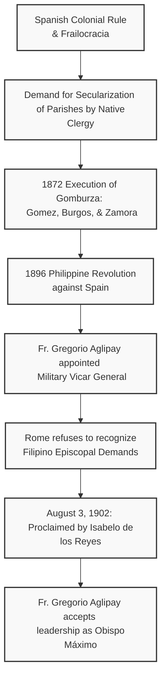

# The Philippine Independent Church (Iglesia Filipina Independiente)

The **Philippine Independent Church**, officially known in Spanish as the **Iglesia Filipina Independiente** (IFI) and colloquially referred to as the **Aglipayan Church**, is an independent Christian denomination with Catholic roots and an Anglican concordat of full communion. It was established in 1902 during the tumultuous aftermath of the Philippine Revolution against Spanish colonial rule and the subsequent Philippine–American War.

Today, the IFI represents one of the most significant nationalist schisms in the history of the Catholic Church, boasting millions of adherents, predominantly in the Philippines and among the Filipino diaspora. It preserves a distinct synthesis of Catholic liturgical style, democratic ecclesiology, social activism, and a nationalist identity.

---

## 1. Historical Origins: Colonialism, Revolution, and Schism

The creation of the Iglesia Filipina Independiente was intrinsically tied to the Filipino struggle for self-determination and the desire for a native-led clergy.

### The Context of Spanish "Friarocracy"

Under Spanish colonial rule (1565–1898), the Catholic Church in the Philippines was dominated by Spanish missionary religious orders—the Dominicans, Franciscans, Augustinians, and Recollects—collectively referred to as the friars. This system, often called "friarocracy" (_frailocracia_), wielded immense political, socioeconomic, and ecclesiastical power. Native Filipino priests (secular clergy) were systematically marginalized and restricted to subordinate roles (such as coadjutors or assistants), with little to no hope of heading parishes or ascending the hierarchy.

### The Secularization Movement and the Gomburza Martyrs

By the mid-19th century, native priests began demanding the "secularization" of parishes (the transfer of parish administration from Spanish friars blockaded in religious orders to native secular priests). This movement was led by pioneering figures like Father Pedro Pelaez and later Father José Burgos.

On February 17, 1872, three Filipino secular priests—**Mariano Gomez, José Burgos, and Jacinto Zamora** (collectively remembered as **Gomburza**)—were executed by garrote on false charges of mutiny in the Cavite Arsenal. Their martyrdom galvanized the nationalist movement, deeply inspiring national hero José Rizal and paving the intellectual road to the Philippine Revolution of 1896 (discussed in the context of global history in [catholic-history.md](catholic-history.md)).



### Father Gregorio Aglipay and the Revolution

When the Philippine Revolution broke out in 1896, **Father Gregorio Aglipay y Labayan** (1860–1940), an ordained Roman Catholic secular priest from Ilocos Norte, found himself drawn into the conflict. In 1898, General Emilio Aguinaldo, leader of the revolutionary government, appointed Aglipay as **Military Vicar General** of the revolutionary forces.

Aglipay utilized his position to organize the Filipino clergy, urging them to assert their rights, occupy vacant parishes, and refuse submissions to Spanish bishops. He sought to secure the Vatican's recognition of the native clergy while remaining loyal to the Holy See. However, the Spanish-dominated ecclesiastical hierarchy in Manila, led by Archbishop Bernardino Nozaleda, viewed Aglipay's actions as rebellion, leading to his formal **excommunication** in May 1899.

### The 1902 Proclamation of Independence

Following Spain’s defeat, the Treaty of Paris (1898) ceded the Philippines to the United States. Despite the political transition and the introduction of the separation of church and state under American rule, the Vatican (via Pope Leo XIII’s apostolic constitution _Quae Mari Sinico_ in late 1902) initially refused to immediately expel the Spanish friars or guarantee the immediate consecration of native bishops.

Frustrated by Rome's perceived obstinacy, **Isabelo de los Reyes** (1864–1938), a prominent labor leader, writer, and nationalist intellectual (famously known as "Don Belong"), took decisive action. On **August 3, 1902**, during a meeting of the _Unión Obrera Democrática_ (Democratic Labor Union) in Manila, de los Reyes proclaimed the establishment of the **Iglesia Filipina Independiente** (IFI).

Initially, Aglipay was reluctant to enter into a schism, hoping that a negotiated settlement with Rome could still be reached. However, after unsuccessful dialogue with American Protestant missionaries and Jesuit emissaries who insisted on submission to the established Roman/American order, Aglipay finalized his decision. He accepted de los Reyes' offer to lead the new church and was consecrated as its first **Obispo Máximo** (Supreme Bishop) on January 18, 1903, by his fellow priests—a localized presbyterial consecration that would later have deep sacramentological implications.

---

## 2. Theological and Doctrinal Evolution

The theological history of the Aglipayan Church is marked by a dramatic shift from early scientific rationalism and Unitarian concepts to orthodox Christian Trinitarianism.

### The Early Era: Scientific Rationalism and Unitarianism (1902–1940)

During its first decades, the IFI's theological texts were heavily drafted by Isabelo de los Reyes, who was deeply influenced by European Protestantism, modernism, and scientific rationalism. These early works, including the _Doctrina Cristiana_ (1903), _Lecturas Predicables_ (1913), and the _Oficio Divino_ (Divine Office, 1906), introduced a theology that diverged significantly from Roman Catholic orthodoxy:

- **Unitarian Tendencies:** They rejected the traditional doctrine of the Holy Trinity in favor of a rationalist Unitarianism, viewing God as a single, indivisible energy and questioning the absolute divinity of Jesus Christ.
- **Scientific Reinterpretation:** Miracles, original sin, and the historical reality of certain biblical narratives were reinterpreted in the light of modern science and reason.
- **Nationalist Spirit:** The early liturgy incorporated nationalistic hymns and canonized local heroes, such as José Rizal and the Gomburza martyrs.

Despite these official rationalist texts, a deep theological divide existed within the early church. While the leadership and official catechisms expressed Unitarianism, the vast majority of the ordinary clergy and laity—who had migrated directly from the Roman Catholic Church—continued practicing their traditional Catholic faith. They maintained belief in the Trinity, prayed the Rosary, worshipped the Infant Jesus (Santo Niño), and venerated the Virgin Mary.

### The Post-War Realignment to Trinitarian Orthodoxy (1940s)

Following the death of Gregorio Aglipay in 1940, the internal ideological split widened, resulting in a litigation era. A faction led by Obispo Máximo Santiago Fonacier wished to retain the Unitarian, nationalistic features, while a faction led by Obispo Máximo Gerardo Bayaca and Isabelo de los Reyes Jr. sought to lead the church back to orthodox Christian roots.

After extensive legal battles over church property and the legal right to the name "Iglesia Filipina Independiente," the Philippine Supreme Court ruled in favor of the Trinitarian faction. Under their leadership, the IFI officially adopted a new **Declaration of Faith** and **Articles of Religion** on **August 4, 1947**, which firmly anchored the church in traditional Christian orthodoxy:

- **Affirmation of the Trinity:** Formally confessed belief in one God in three Consubstantial Persons (Father, Son, and Holy Spirit).
- **Adoption of the Ecumenical Creeds:** Confessed the Apostles' Creed and the Nicene Creed as the primary standards of the Christian faith.
- **Sacraments:** Recognized the Seven Sacraments instituted by Christ, with Holy Baptism and the Holy Eucharist being primary.

### Acquisition of the Historic Episcopate (1948)

Because Gregorio Aglipay and the first generation of IFI bishops were consecrated by other priests (presbyterial consecration) rather than by validly consecrated bishops in apostolic succession, the Catholic Church and other traditional episcopal churches regarded IFI's holy orders as invalid.

To rectify this lack of historical succession, the IFI petitioned the **Protestant Episcopal Church in the United States of America (PECUSA)**, a member of the Anglican Communion, for the transfer of the historic episcopate.

On **April 7, 1948**, at St. Luke’s Pro-Cathedral in Manila, three American Episcopal bishops—**Norman S. Binsted** (Bishop of the Philippines), **Robert F. Wilner** (Suffragan Bishop of the Philippines), and **Harry S. Kennedy** (Bishop of Honolulu)—consecrated three IFI bishops into the historic apostolic succession:

1. **The Most Reverend Isabelo de los Reyes Jr.** (Obispo Máximo IV)
2. **The Right Reverend Gerardo Bayaca**
3. **The Right Reverend Manuel Aguilar**

These three bishops subsequently reconsecrated and reordained the other bishops and priests of the Aglipayan Church, effectively establishing a valid apostolic line from an Anglican and Old Catholic perspective.

```
       [Episcopal Church (PECUSA) Consecrators]
          (Binsted, Wilner, & Kennedy - 1948)
                           │
                           ▼
          [Conferred Apostolic Succession upon]
   Isabelo de los Reyes Jr. | Gerardo Bayaca | Manuel Aguilar
                           │
                           ▼
       [Re-consecrated the entire IFI Episcopate/Clergy]
```

---

## 3. Liturgical and Sacramental Practice

Liturgically, the Aglipayan Church retains an aesthetic and sacramental life that seems almost identical to Roman Catholicism, although heavily influenced by Anglican liturgical patterns.

| Aspect                   | Roman Catholic Church                                                   | Philippine Independent Church (IFI)                                                        |
| :----------------------- | :---------------------------------------------------------------------- | :----------------------------------------------------------------------------------------- |
| **Holy Mass**            | Uses the _Novus Ordo Missae_ (contemporary) or Tridentine Rite (Latin). | Uses the _Misa Filipina_ or local Anglo-Catholic service structures.                       |
| **Liturgical Language**  | Vernacular or Latin.                                                    | Vernacular (Tagalog, Ilokano, Cebuano, etc.) or English; pioneered vernacular use in 1902. |
| **Clerical Celibacy**    | Mandatory for Latin Rite priests (with limited exceptions).             | **Optional**; clergy (including bishops) are permitted to marry.                           |
| **Papal Authority**      | Bishop of Rome has universal, supreme jurisdiction.                     | Rejects papal jurisdiction and infallibility; operates under autocephalous governance.     |
| **Apostolic Succession** | Roman Catholic lineage.                                                 | Conferred via the Anglican (Episcopal) lineage since April 1948.                           |

### The Misa Filipina

The central rite of the IFI is the Holy Eucharist, celebrated through the **Misa Filipina** (Philippine Mass). The structure of the service closely mirrors both the pre-Vatican II Latin Mass and the Eucharistic Liturgy of the Anglican _Book of Common Prayer_. In some modern parishes, it resembles the post-Vatican II Roman Rite (_Novus Ordo_).

The IFI was a pioneer in using **vernacular languages** (such as Tagalog, Ilokano, and Hiligaynon) and English in the liturgy, decades before the Roman Catholic Church adopted this discipline at the Second Vatican Council (outlined in [eastern-catholics.md](eastern-catholics.md)).

### Devotional Life and Nationalism

Aglipayans maintain strong traditional Catholic popular devotions:

- **Marian Devotion:** The IFI has a deep devotion to the Blessed Virgin Mary, especially under the title of _Our Lady of Balintawak_ (clothed in a traditional Filipiniana dress, symbolizing motherly protective care for the Filipino nation).
- **The Saints:** The church venerates Christian saints, but also maintains a calendar that honors national heroes and martyrs (such as Gomburza, Andres Bonifacio, and Emilio Jacinto) as historical icons of social justice.
- **Ecclesiastical Dress:** IFI bishops wear traditional cassocks, miters, and crosiers, while priests wear albs, stoles, and chasubles during Mass, mimicking traditional Catholic aesthetics.

---

## 4. Ecclesial Governance and Structure

The Iglesia Filipina Independiente is an **autocephalous** (self-governing) church, operating under a conciliar and democratic framework that heavily incorporates lay leadership.

- **The Obispo Máximo (Supreme Bishop):** The primate and spiritual head, chief pastor, and chief executive of the church. He is elected to a **non-renewable six-year term** by the General Assembly, representing a cooperative model of leadership (unlike the supreme lifetime authority of the Pope in [popes.md](popes.md)).
- **The Supreme Council of Bishops (SCB):** Composed of all active bishops. It governs matters of doctrine, liturgy, and pastoral care, acting as the corporate episcopate.
- **The National Lay Council (NLC):** A unique governing body representing the lay faithful, which has an active voice in financial, social, and administrative decisions of the church.
- **The General Assembly:** The highest governing body of the IFI, which meets every six years to elect the Obispo Máximo and vote on major constitutional and canonical amendments. It consists of all bishops, representatives of the clergy, and delegates from the laity.

The current incumbent head of the IFI is **His Eminence, The Most Reverend Joel Ocop Porlares** (Obispo Máximo XIV), who was elected on May 9, 2023, and officially installed on June 29, 2023.

---

## 5. Ecumenical Relations and Contemporary Developments

Throughout its history, the IFI has transformed from an isolated nationalist sect into an active participant in global ecumenical structures.

### Concordats of Full Communion

The IFI is in full communion with:

- **The Anglican Communion:** Formalized via the 1961 Concordat of Intercommunion with the Episcopal Church in the USA and subsequently extended to all member churches of the Anglican Communion, including the Episcopal Church in the Philippines.
- **The Union of Utrecht (Old Catholic Churches):** Sharing a common independent Catholic identity that rejects papal supremacy (analogous to the Greek Orthodox position in [greek-orthodox.md](greek-orthodox.md)), the IFI established full communion with the Old Catholic Churches of Europe.
- **The Church of Sweden:** A Lutheran state church that preserves the historic episcopate, establishing mutual recognition and full communion.

The IFI is also an active member of the **World Council of Churches (WCC)** and a founding member of the **National Council of Churches in the Philippines (NCCP)**.

### Rapprochement with the Roman Catholic Church: The 2021 Landmark Agreement

For over a century, relations between the Roman Catholic Church and the Aglipayan Church were historically fraught with mutual condemnation, property litigation, and theological recrimination. However, decades of quiet ecumenical dialogue bore monumental fruit in 2021, on the occasion of the **500th Anniversary of the Arrival of Christianity in the Philippines**.

On **August 3, 2021**, a historic joint statement was signed by the leadership of both churches:

> **"Celebrating the Gift of Holy Baptism: A Joint Statement of Mutual Recognition of Baptism between the Iglesia Filipina Independiente and the Roman Catholic Church in the Philippines"**

The document was co-signed by:

- **Archbishop Romulo G. Valles, D.D.**, representing the Roman Catholic Church as President of the Catholic Bishops' Conference of the Philippines (CBCP).
- **The Most Reverend Rhee M. Timbang**, representing the Iglesia Filipina Independiente as the 13th Obispo Máximo.

```
       [Roman Catholic Church (CBCP)]  <─── Ecumenical Dialogue ───>  [Iglesia Filipina Independiente (IFI)]
                     │                                                                  │
                     ▼                                                                  ▼
        Archbishop Romulo G. Valles                                        Most Rev. Rhee M. Timbang
                     │                                                                  │
                     └───────────────────────────► SIGNED ◄─────────────────────────────┘
                                                    │
                                                    ▼
                                     [Historic August 3, 2021 Accord]
                                     - Mutual Recognition of Baptism
                                     - Mutual Recognition of Christian Ministry
                                     - Shared Statement of Repentance and Healing
```

This landmark agreement achieved several critical outcomes:

1. **Mutual Recognition of Baptism:** Both churches officially recognized the validity of each other's Holy Baptism, noting that both administer the sacrament using the traditional Trinitarian formula (water in the name of the Father, of the Son, and of the Holy Spirit).
2. **Recognition of Spiritual Fruits:** The statement affirmed that both communities share a common baptismal grace and are called to work together in addressing poverty, social injustice, and ecological degradation.
3. **Expression of Mutual Repentance:** The document expressed "mutual forgiveness" and a shared desire to heal the historical wounds of division, moving from a century of conflict toward constructive spiritual collaboration.

This rapprochement stands as one of the modern world's outstanding examples of ecumenical healing, showing that even deep-seated nationalist schisms can find paths of reconciliation and joint witness under the banner of a shared Christian identity.
