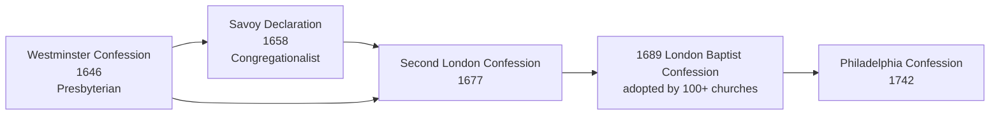

# The 1689 London Baptist Confession of Faith — A Catholic Comparative Study

> **Scope and method.** This document presents the **1689 London Baptist Confession of Faith** (the **Second London Confession**, or **2LCF**) from its own text, and then sets that text beside Catholic doctrine as defined in the Church's primary sources. It is written **for comparison and study only**, in the spirit of [protestantism/README.md](README.md). A Protestant confessional standard is not an ecumenical creed: it binds only the churches that adopt it, and it carries no authority for a Catholic. Nothing here endorses its teaching, and nothing here treats Baptists as enemies rather than separated brethren (_Unitatis Redintegratio_ 22).

The **1689 London Baptist Confession of Faith** is the classic confession of the **Particular Baptists** — the Calvinistic wing of the English Baptist movement. Written in **1677** and formally adopted in **1689**, it is a "**subordinate standard**": a humanly composed summary of doctrine, held beneath the Bible, by which churches of the Reformed Baptist tradition order their teaching and life. It is among the most complete and systematic statements of Calvinistic Baptist theology in existence.

---

## 1. Identity, Names, and Status

| Attribute          | Detail                                                                                                                                                               |
| :----------------- | :------------------------------------------------------------------------------------------------------------------------------------------------------------------- |
| **Full title**     | _A Confession of Faith put forth by the Elders and Brethren of many Congregations of Christians (baptized upon Profession of their Faith) in London and the Country_ |
| **Common names**   | The 1689 London Baptist Confession of Faith; the Second London Confession (2LCF); the "Baptist Confession of Faith"                                                  |
| **First printed**  | **1677** (with an appendix concerning Baptism); reprinted 1688                                                                                                       |
| **Adopted**        | **1689**, by the representatives of "upwards of one hundred baptized churches, in England and Wales (denying Arminianism)"                                           |
| **Authorship**     | The Particular Baptists, building on the **First London Confession** (1644) and, above all, on the **Westminster Confession** (1646)                                 |
| **Status**         | A **subordinate standard** — not Scripture, and not an ecumenical creed; binding only on churches that voluntarily subscribe to it                                   |
| **Widely used by** | Reformed (Particular) Baptist churches, associations, and seminaries worldwide                                                                                       |

The confession's closing statement explains its purpose: the churches met in London "from the third of the seventh month to the eleventh of the same, 1689… to consider of some things that might be for the glory of God, and the good of these congregations," and recommended the confession "for the satisfaction of all other Christians that differ from us in the point of Baptism." Its signatories included **William Kiffin**, **Hanserd Knollys**, and **Benjamin Keach**.

---

## 2. Historical Setting and Textual Genealogy

### 2.1 The English Particular Baptists

The Particular Baptists emerged in the 1630s and 1640s from English Separatism, holding a **Calvinistic** theology (hence "particular" — a particular, limited atonement) and **believers' Baptism by immersion**. Their first confession, the **First London Confession** (1644), was a distinctly Baptist statement. For a fuller account of the Baptist tradition, see [baptists.md](baptists.md).

### 2.2 A Confession "in the Westminster Mould"

The document of 1677 was not composed from scratch. It is a **revision of the Savoy Declaration** (1658), the Congregationalist reworking of the **Westminster Confession of Faith** (1646). The 1689 therefore stands at the end of a chain:

The 1689 reproduces most of the Westminster text verbatim, but reworks it at the decisive points: the **church** (congregational rather than presbyterian polity), the **sacraments** (two ordinances; believers' Baptism), the **civil magistrate** (no power over religion), and the assembly's own **anti-monastic** and **anti-papal** clauses. It adds the chapter "**Of the Gospel, and of the Extent of the Grace Thereof**" and integrates discipline and counsel into its chapter on the Church. **Westminster** has thirty-three chapters; the **1689** has **thirty-two**.

### 2.3 1689 and the Act of Toleration

The confession was adopted in the year of the **Act of Toleration** (1689), which permitted nonconformist worship in England. The 1677 text was republished and endorsed by more than a hundred congregations, which is why a document written in 1677 is universally known as the **1689** confession. In the American colonies the **Philadelphia Baptist Association** (1707) adopted a revised form in **1742**, the **Philadelphia Confession of Faith**, which added articles on the singing of psalms and the laying on of hands.

---

## 3. Structure: The Thirty-Two Chapters

| Group                             | Chapters                                                                                                                                                                                                                                                                                |
| :-------------------------------- | :-------------------------------------------------------------------------------------------------------------------------------------------------------------------------------------------------------------------------------------------------------------------------------------- |
| **Revelation and God**            | 1. Of the Holy Scriptures · 2. Of God and the Holy Trinity                                                                                                                                                                                                                              |
| **God's decree and creation**     | 3. Of God's Decree · 4. Of Creation · 5. Of Divine Providence                                                                                                                                                                                                                           |
| **Sin, the covenant, and Christ** | 6. Of the Fall of Man, of Sin, and of the Punishment Thereof · 7. Of God's Covenant · 8. Of Christ the Mediator                                                                                                                                                                         |
| **Salvation applied**             | 9. Of Free Will · 10. Of Effectual Calling · 11. Of Justification · 12. Of Adoption · 13. Of Sanctification · 14. Of Saving Faith · 15. Of Repentance unto Life and Salvation · 16. Of Good Works · 17. Of the Perseverance of the Saints · 18. Of the Assurance of Grace and Salvation |
| **Law and Gospel**                | 19. Of the Law of God · 20. Of the Gospel, and of the Extent of the Grace Thereof                                                                                                                                                                                                       |
| **Christian living and society**  | 21. Of Christian Liberty and Liberty of Conscience · 22. Of Religious Worship and the Sabbath Day · 23. Of Lawful Oaths and Vows · 24. Of the Civil Magistrate · 25. Of Marriage                                                                                                        |
| **The Church and the ordinances** | 26. Of the Church · 27. Of the Communion of Saints · 28. Of Baptism and the Lord's Supper · 29. Of Baptism · 30. Of the Lord's Supper                                                                                                                                                   |
| **Last things**                   | 31. Of the State of Man after Death, and of the Resurrection of the Dead · 32. Of the Last Judgment                                                                                                                                                                                     |

---

## 4. What the Confession Teaches

### 4.1 Scripture and Authority (Chapter 1)

The confession opens with the **sufficiency of Scripture**:

> "The Holy Scripture is the only sufficient, certain, and infallible rule of all saving knowledge, faith, and obedience." — Chapter 1, Paragraph 1

It lists the **sixty-six books** of the Old and New Testaments and declares that "the books commonly called **Apocrypha**, not being of divine inspiration, are no part of the canon or rule of the Scripture" (Paragraph 3) — the historic Protestant canon against the Catholic **seventy-three**. The authority of Scripture "dependeth not upon the testimony of any man or church, but wholly upon God" (Paragraph 4); nothing may be added, "whether by new revelation of the Spirit, or traditions of men" (Paragraph 6); and Scripture is "the supreme judge, by which all controversies of religion are to be determined, and all decrees of councils, opinions of ancient writers, doctrines of men, and private spirits, are to be examined" (Paragraph 10).

### 4.2 The Trinity, the Decree, and the Extent of the Atonement (Chapters 2–3, 8, 20)

Chapters 2–3 are orthodox in their Trinitarianism and rigorous in their predestinarianism. Chapter 3 teaches that God "hath decreed… freely and unchangeably, all things"; that "some men and angels are predestinated… to eternal life… others being left to act in their sin to their just condemnation"; and that "they who are elected… are redeemed by Christ… neither are any other redeemed by Christ… but the elect only" — an explicit **particular (limited) atonement**. Paragraph 7 counsels that this "high mystery" be handled "with special prudence and care."

### 4.3 Human Nature and Grace (Chapters 6, 9, 10)

Fallen man is "utterly indisposed, disabled, and made opposite to all good, and wholly inclined to all evil" (Chapter 6, Paragraph 4); "a natural man… is not able by his own strength to convert himself" (Chapter 9, Paragraph 3). Salvation therefore rests wholly on **effectual calling** (Chapter 10). The confession also holds that the corruption of nature "doth remain in those that are regenerated; and although it be through Christ pardoned and mortified, yet both itself, and the first motions thereof, are **truly and properly sin**" (Chapter 6, Paragraph 5). It further restricts salvation to those who hear and receive the Gospel: "much less can men that receive not the Christian religion be saved" (Chapter 10, Paragraph 4).

### 4.4 Justification, Assurance, and Perseverance (Chapters 11, 14, 17, 18)

Chapter 11 is the confession's soteriological heart:

> "Those whom God effectually calleth, he also freely justifieth, **not by infusing righteousness into them**, but by pardoning their sins, and by accounting and accepting their persons as righteous; not for anything wrought in them, or done by them, but for Christ's sake alone… by imputing Christ's active obedience… and passive obedience in his death… by faith." — Chapter 11, Paragraph 1

Faith "is the alone instrument of justification" (Paragraph 2), though it "worketh by love." Chapters 17–18 add that the elect "can neither totally nor finally fall from the state of grace," and that a true believer "may in this life be **certainly assured** that he is in the state of grace… an **infallible assurance of faith**" (Chapter 18). Chapter 16 denies that "we cannot by our best works merit pardon of sin or eternal life" — rather, believers "are so far from being able to **supererogate**… that they fall short."

### 4.5 The Law, the Gospel, and Worship (Chapters 19–22)

The **moral law** "doth for ever bind all," and "Christ in the Gospel [doth not] any way dissolve, but much strengthen this obligation" (Chapter 19, Paragraph 5). Chapter 22 sets out the **regulative principle** of worship: God "may not be worshipped according to the imagination and devices of men… nor… under any visible representations" (Paragraph 1); worship is due to God alone, "not to angels, saints, or any other creatures" (Paragraph 2); prayer is not to be made "for the dead" (Paragraph 4). Yet this Baptist confession is not Anabaptist on the Lord's Day: "from the resurrection of Christ [the Sabbath] was changed into the first day of the week, which is called the Lord's day: and is to be continued to the end of the world as the **Christian Sabbath**, the observation of the last day of the week being abolished" (Paragraph 7).

### 4.6 Oaths, the Magistrate, and Marriage (Chapters 23–25)

Against the Anabaptists, the confession holds that "a lawful oath is a part of religious worship" (Chapter 23, Paragraph 1) and that Christians may "lawfully… wage war upon just and necessary occasions" (Chapter 24, Paragraph 2). It rejects "popish monastical vows" as "superstitious and sinful snares" (Chapter 23, Paragraph 5). Marriage it defines as "between one man and one woman" (Chapter 25, Paragraph 1), with Christians bound to marry "in the Lord" (Paragraph 3).

### 4.7 The Church (Chapters 26–27)

The church is described as both **invisible** (the whole number of the elect) and **visible** (particular congregations of professing believers). Its polity is **congregational**: "To each of these churches… he hath given all that power and authority, which is in any way needful for their carrying on that order in worship and discipline" (Paragraph 7). Its officers are "**bishops or elders, and deacons**" (Paragraph 8), chosen "by the common suffrage of the church itself" (Paragraph 9). Assemblies of churches may "meet to consider, and give their advice," but "are **not intrusted with any church-power properly so called**, or with any jurisdiction over the churches themselves" (Paragraph 15). And in its most polemical clause:

> "Neither can the Pope of Rome in any sense be head thereof, but is that **antichrist**, that man of sin, and son of perdition, that exalteth himself in the church against Christ." — Chapter 26, Paragraph 4

### 4.8 Baptism and the Lord's Supper (Chapters 28–30)

The two **ordinances** are "appointed by the Lord Jesus… to be continued in his church to the end of the world" (Chapter 28). **Baptism** is for "those who do actually profess repentance towards God, faith in, and obedience to, our Lord Jesus Christ" — "the only proper subjects of this ordinance" (Chapter 29, Paragraph 2) — administered in water "in the name of the Father, and of the Son, and of the Holy Spirit," with "**immersion**, or dipping of the person in water… necessary" (Paragraphs 3–4). The **Supper** is a memorial: "In this ordinance Christ is not offered up to his Father, nor any real sacrifice made at all… but only a memorial of that one offering up of himself by himself upon the cross, once for all," so that "the **popish sacrifice of the mass**… is most abominable" (Chapter 30, Paragraph 2). It rejects **transubstantiation** as "repugnant not to Scripture alone, but even to common sense and reason," and condemns "the denial of the cup to the people, worshipping the elements… and reserving them for any pretended religious use" (Paragraphs 4, 6). Yet it affirms a real spiritual feeding: "Worthy receivers… do then also inwardly by faith, really and indeed, yet not carnally and corporally, but **spiritually** receive, and feed upon Christ crucified" (Paragraph 7).

### 4.9 The Last Things (Chapters 31–32)

Chapter 31 affirms the **immortality of the soul** and an immediate intermediate state: "their souls, which neither die nor sleep, having an immortal subsistence, immediately return to God who gave them"; the righteous "are received into paradise… with Christ," the wicked "are cast into hell." It adds: "besides these two places, for souls separated from their bodies, the Scripture acknowledgeth **none**" — an explicit denial of **purgatory**. Chapter 32 affirms the **resurrection**, the **last judgment**, "everlasting life" for the righteous, and "everlasting torments" for the wicked. The confession takes no fixed position on the **millennium**.

---

## 5. The Catholic Assessment

### 5.1 What the Church Affirms in Common

Much of the 1689 is Catholic doctrine in Reformation dress. The Catholic reader will recognize, and the Church affirms:

- the **Holy Trinity** — one God in three Persons, "of one substance, power, and eternity" (Chapter 2, Paragraph 3);
- the **two natures of Christ** in one Person, "without conversion, composition, or confusion" (Chapter 8, Paragraph 2) — the dogma of Chalcedon;
- the **inspiration and authority of Sacred Scripture**;
- **creation**, the **fall** of man, the reality of **original sin**, and the **universal need of grace**;
- the **moral law** of the Ten Commandments as permanently binding;
- the **incarnation, atoning death, resurrection, ascension, and intercession** of Christ;
- the **immortality of the soul**, the **resurrection of the body**, the **last judgment**, **heaven**, and the **eternity of hell**;
- the **monogamous, indissoluble** character of marriage, and the legitimacy of **oaths**, **civil government**, and **just war** — points on which this confession agrees with the Catholic Church against the Anabaptists (see [anabaptists.md](anabaptists.md));
- the **intermediate state**, which the confession affirms against "soul sleep" and annihilationism — a notable contrast with Adventism (see [adventism.md](adventism.md)).

### 5.2 Where the Confession Conflicts with Defined Catholic Dogma

| 1689 teaching (chapter)                                                             | Catholic definition and source                                                                                                                                                                                                            |
| :---------------------------------------------------------------------------------- | :---------------------------------------------------------------------------------------------------------------------------------------------------------------------------------------------------------------------------------------- |
| Scripture the "only… rule"; no authority from "any man or church" (1)               | Scripture and Tradition flow from one divine source and are interpreted by the Church; the canon itself rests on the Church's witness. Council of Trent, Session IV; _Dei Verbum_ 9–10; CCC 80–82, 85–87, 95, 100.                        |
| Canon of sixty-six books; Apocrypha excluded (1.2–3)                                | The canon of **seventy-three** books, including the deuterocanonical books. Council of Trent, Session IV; CCC 120; [scripture/bible-history-canon.md](../scripture/bible-history-canon.md).                                               |
| Double predestination; limited atonement (3, 8.5)                                   | God wills the salvation of all; Christ died for all; reprobation is not a positive decree to evil. Council of Trent, Session VI, canons 15–17; 1 Timothy 2:4; CCC 600, 1037.                                                              |
| Total inability; the natural man cannot turn to God (9.3)                           | Prevenient grace enables the will; man can and must cooperate. Council of Trent, Session VI, canons 4–5; CCC 1993–1995, 2001–2002.                                                                                                        |
| Concupiscence "truly and properly sin" in the regenerate (6.5)                      | In the baptized, concupiscence remains but is **not** truly and properly sin. Council of Trent, Session V, canon 5; CCC 1264, 1426.                                                                                                       |
| Justification "not by infusing righteousness into them" but by imputation (11.1)    | Justification is both remission of sins **and** the infusion of sanctifying grace and charity. Council of Trent, Session VI, canons 9–11; CCC 1992, 2017–2020.                                                                            |
| Justifying faith as the sole instrument, and assurance (11.2, 18)                   | Faith works through love; justification can be lost by mortal sin; no one may be absolutely certain of final perseverance without revelation. Council of Trent, Session VI, canons 12, 15–16, 23–24; CCC 1039, 2015, 2090–2091.           |
| No merit; believers cannot "supererogate" (16.4–5)                                  | The justified can merit increase of grace and glory **by grace**; the works of the saints have a real, and the Church disposes of a treasury of merit. Council of Trent, Session VI, canon 32 and chapter 16; CCC 2006–2011, 1471–1479.   |
| Salvation withheld from those who "receive not the Christian religion" (10.4)       | God wills all to be saved; those who through no fault of their own do not know the Gospel may be saved through grace. _Lumen Gentium_ 16; _Gaudium et Spes_ 22; CCC 846–847, 1260.                                                        |
| Two ordinances only (28)                                                            | **Seven** sacraments instituted by Christ. Council of Trent, Session VII, canons 1–2; CCC 1113–1134, 1210.                                                                                                                                |
| Baptism for professing believers only; immersion necessary (29)                     | Baptism is a sacrament conferring grace and an indelible character; **infants** are rightly baptized; immersion is not of the essence. Council of Trent, Session VII, canons on Baptism; CCC 1250–1255, 1284.                             |
| The Supper a memorial; the Mass "most abominable"; transubstantiation rejected (30) | The Mass is the true propitiatory sacrifice, and the bread and wine become Christ's Body and Blood. Council of Trent, Sessions XIII, XXII; CCC 1362–1381.                                                                                 |
| Adoration and reservation of the Blessed Sacrament forbidden (30.4)                 | Christ is truly present and is to be adored, and the Sacrament reserved. CCC 1378–1380; [_Ecclesia de Eucharistia_](https://www.vatican.va/content/john-paul-ii/en/encyclicals/documents/hf_jp-ii_enc_17042003_eccl-de-euch.html) (2003). |
| No visible head of the Church; the Pope is "antichrist" (26.4)                      | The Roman Pontiff is the successor of Peter and the visible head of the Church by divine institution. Vatican I, _Pastor Aeternus_ (1870); _Lumen Gentium_ 18–25; CCC 880–887.                                                            |
| Congregational polity; two offices; assemblies without jurisdiction (26)            | Holy Orders in three degrees, transmitted by **apostolic succession**; the Church is hierarchical. Council of Trent, Session XXIII; CCC 1536–1600; [sacraments/holy-orders.md](../sacraments/holy-orders.md).                             |
| No invocation of saints; no images (22.1–2)                                         | The veneration of images is dogmatically defended; the saints may be invoked. Second Council of Nicaea (787); Council of Trent, Session XXV; CCC 956, 2132, 2683; [sacramentals/sacred-images.md](../sacramentals/sacred-images.md).      |
| No prayer for the dead; no purgatory (22.4, 31.1)                                   | Purgatory is defined, and prayer for the dead is apostolic practice. Council of Trent, Session XXV; 2 Maccabees 12:46; CCC 1030–1032; [eschatology/purgatory.md](../eschatology/purgatory.md).                                            |
| Monastic vows "superstitious and sinful snares" (23.5)                              | The evangelical counsels of poverty, chastity, and obedience are counsels of perfection, and the religious life is a gift of the Church. Council of Trent, Session XXV; CCC 914–933, 1973–1974.                                           |

### 5.3 Matters of Discipline and Theological Opinion

Not every difference is a matter of faith, and the distinctions required by this repository must be applied with care:

- **Discipline, legitimately differing:** the mode of Baptism (immersion), Communion under one or both kinds, the language and form of worship, the length and strictness of the Lord's Day rest, the ecclesiastical calendar, and fasting. The Catholic Church herself receives **immersion** as a valid mode of Baptism and permits Communion under both kinds; the modalities are not dogmas.
- **The "man of sin"** applied to the papacy is a **historical polemic** — the reading of 2 Thessalonians 2 that runs through the Reformation — not a defined doctrine; a Catholic answers it from Scripture and the Church's constitution rather than by returning invective.
- **Theological opinion:** the confession leaves the **millennium** open, and on that point it is neither right nor wrong as Catholic dogma goes; millenarian speculation is governed by CCC 668–677 and is explicitly warned against (CCC 676).
- **What cannot be reduced to discipline:** the canon of Scripture, the relation of Scripture and Tradition, the nature of justification, the number and efficacy of the sacraments, the sacrificial character of the Mass, the Real Presence, the necessity of Baptism for infants, the papacy, the invocation of saints, and purgatory are all matters on which the Church has **definitively spoken**.

---

## 6. Latin and Eastern Catholic Perspectives

The Catholic answer to the 1689 is not merely Latin. The **Eastern Catholic** and **Eastern Orthodox** Churches equally reject the reduction of the sacraments to two, the denial of the Real Presence, the rejection of the invocation of the saints, and the denial of prayer for the dead. They hold with Rome the **seven sacraments**, the **sacrificial Divine Liturgy**, **apostolic succession**, the **veneration of icons** (defended dogmatically at Nicaea II, 787), and the **Theotokos**. The **Lord's Day** is likewise a shared Eastern and Western inheritance — though the East frames its sanctification in the liturgical cycle rather than in the Puritan "Christian Sabbath" of the 1689. On the question of **immersion**, the Christian East baptizes by trine immersion as its normal practice, so the 1689's insistence on immersion is, as a practice, closer to the East than to ordinary Latin custom. See [church-history/eastern-catholic-churches.md](../church-history/eastern-catholic-churches.md).

---

## 7. Convergence, Contrast, and the Confession's Place

The 1689 is a useful test case in **grading** doctrinal difference, because it is neither a bare-bones creed nor a total departure from catholicity:

- It is **orthodox** on the Trinity, the Person of Christ, the inspiration of Scripture, the resurrection, the last judgment, and the eternity of punishment.
- It is **Reformation** on authority, justification, and the sacraments — the historic fault lines with Trent.
- It is **Baptist** on believers' Baptism, congregational polity, and religious liberty.
- It is **Puritan** on the regulative principle and the Christian Sabbath.
- It is **anti-Anabaptist** on oaths, the sword, and the magistrate — and **anti-Arminian** in its own self-description.
- It is **anti-Catholic** in its strongest language (the Mass, the papacy, monastic vows), and it **affirms the immortality of the soul and the intermediate state** against the later Adventist denial.

The Catholic Church therefore receives the confession as the sincere doctrinal standard of separated brethren: to be read carefully, reported fairly, and answered from the Church's own dogmatic and pastoral sources — not caricatured in return.

---

## 8. Present Use and Influence

The 1689 remains the confessional standard of **Reformed Baptist** churches and associations worldwide, and it experienced a notable revival in the late twentieth and early twenty-first centuries. Its influence is visible in:

- its use as a **subordinate standard** in confessional Reformed Baptist churches and seminaries;
- the development of the "**1689 Federalism**" school of covenant theology, which reads Scripture's covenants in the light of the confession's chapters on the covenant and the mediator;
- modern expositions and editions such as Samuel Waldron's _A Modern Exposition of the 1689 Baptist Confession_, James Renihan's _To the Judicious and Impartial Reader_, and Rob Ventura's collection of essays, together with modern-English renderings;
- the **Philadelphia Confession** (1742) and the broader Calvinistic Baptist lineage in which the 1689 stands.

This modern confessional use matters for Catholic readers: it explains why the confession's texts, not merely its history, continue to shape how a significant body of Baptists reads Scripture, worship, and the Church.

---

## 9. Summary Table

| Question                 | 1689 London Baptist Confession                             | Catholic teaching                                                    |
| :----------------------- | :--------------------------------------------------------- | :------------------------------------------------------------------- |
| Rule of faith            | Scripture alone                                            | Scripture and Tradition, interpreted by the Church                   |
| Canon                    | 66 books                                                   | 73 books, with the deuterocanonical books                            |
| Predestination           | Double predestination; limited atonement                   | Universal salvific will; predestination to grace                     |
| Justification            | Imputation of Christ's righteousness; faith alone          | Remission of sin and infusion of grace; faith working through love   |
| Assurance / perseverance | Infallible assurance; cannot finally fall                  | Can lose grace by mortal sin; perseverance cannot be certainly known |
| Sacraments               | Two ordinances                                             | Seven                                                                |
| Baptism                  | Believers only; immersion necessary                        | Sacrament; infants baptized; immersion valid                         |
| Lord's Supper            | Memorial; spiritual feeding; Mass abominable               | Real Presence; propitiatory sacrifice; adoration                     |
| Church                   | Congregational; two offices; no jurisdiction in assemblies | Hierarchical; three degrees; apostolic succession                    |
| Pope                     | Not head; "antichrist"                                     | Successor of Peter, visible head of the Church                       |
| Saints, images, dead     | Not invoked; no images; no prayer for the dead             | Invocation, veneration, and prayer for the dead defined at Trent     |
| Purgatory                | Denied ("Scripture acknowledgeth none")                    | Defined at Trent                                                     |
| State after death        | Immortal souls; immediate intermediate state               | Particular judgment; immortal soul; purgatory                        |
| Last things              | Resurrection; last judgment; eternal punishment            | The same, with the millennium governed by CCC 668–677                |

---

## Sources & Levels of Authority

- **Dogmatic definitions** — Council of Trent: Session IV (Scripture, Tradition, canon), Session V (original sin and concupiscence), Session VI (justification), Session VII (the sacraments and Baptism), Session XIII (the Eucharist), Session XXII (the sacrifice of the Mass), Session XXIII (Holy Orders), Session XXV (purgatory, invocation of saints, images, monastic vows); Second Council of Nicaea (787); Vatican I, _Pastor Aeternus_ (1870).
- **Conciliar and papal teaching** — [_Dei Verbum_](https://www.vatican.va/archive/hist_councils/ii_vatican_council/documents/vat-ii_const_19651118_dei-verbum_en.html); [_Lumen Gentium_](https://www.vatican.va/archive/hist_councils/ii_vatican_council/documents/vat-ii_const_19641121_lumen-gentium_en.html); [_Gaudium et Spes_](https://www.vatican.va/archive/hist_councils/ii_vatican_council/documents/vat-ii_const_19651207_gaudium-et-spes_en.html); [_Unitatis Redintegratio_](https://www.vatican.va/archive/hist_councils/ii_vatican_council/documents/vat-ii_decree_19641121_unitatis-redintegratio_en.html); [_Ut Unum Sint_](https://www.vatican.va/content/john-paul-ii/en/encyclicals/documents/hf_jp-ii_enc_25051995_ut-unum-sint.html) (1995); [_Ecclesia de Eucharistia_](https://www.vatican.va/content/john-paul-ii/en/encyclicals/documents/hf_jp-ii_enc_17042003_eccl-de-euch.html) (2003); _Dominus Iesus_ (2000).
- **Catechism** — CCC 80–100, 120, 600, 668–677, 846–847, 880–887, 914–933, 1113–1134, 1250–1264, 1362–1381, 1426, 1471–1479, 1536–1600, 1992–2011, 2090–2091, 2132, 2683.
- **The confession itself (reported, not endorsed)** — _A Confession of Faith put forth by the Elders and Brethren of many Congregations of Christians… in London and the Country_ (1677; adopted 1689); the Westminster Confession (1646); the Savoy Declaration (1658); the First London Confession (1644); the Philadelphia Confession (1742).
- **Theological opinion** — expositions of the confession (Waldron, Renihan, Ventura) are cited as modern theological literature, not as authority.

---

## See Also

- [protestantism/README.md](README.md) — directory scope and principles
- [protestantism/baptists.md](baptists.md) — the Baptist tradition as a whole
- [protestantism/reformed-churches.md](reformed-churches.md) — the Reformed tradition whose confessions the 1689 reworks
- [protestantism/anabaptists.md](anabaptists.md) — the Anabaptists, whose teaching on oaths and the sword the 1689 rejects
- [protestantism/adventism.md](adventism.md) — a tradition that denies the intermediate state the 1689 affirms
- [protestantism/anglicanism.md](anglicanism.md) — another tradition with a historic confessional standard (the Thirty-Nine Articles)
- [church-history/protestant-reformation.md](../church-history/protestant-reformation.md) — the Reformation in full
- [scripture/bible-history-canon.md](../scripture/bible-history-canon.md) — the canon of the seventy-three books
- [sacraments/baptism.md](../sacraments/baptism.md) — the sacrament of Baptism and the baptism of infants
- [sacraments/eucharist.md](../sacraments/eucharist.md) — the Real Presence and the sacrifice of the Mass
- [sacraments/holy-orders.md](../sacraments/holy-orders.md) — orders and apostolic succession
- [eschatology/purgatory.md](../eschatology/purgatory.md) — purgatory and prayer for the dead
