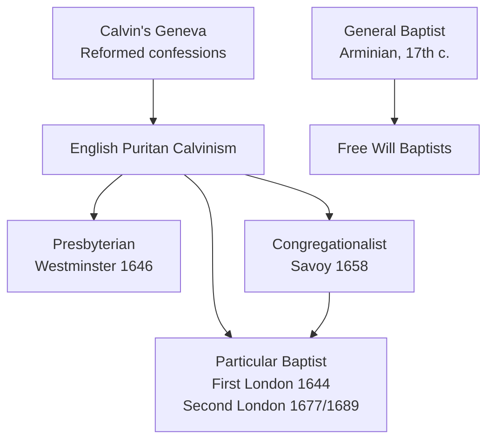

# Calvinism and Baptists — How the Two Categories Differ and Overlap

> **Scope and method.** This note clarifies a common confusion rather than surveying a tradition. It is written **for comparison and study only**, in the spirit of [protestantism/README.md](README.md). It treats Calvinism and the Baptist tradition as categories to be defined and related, not as camps to be defended, and it ends with the Catholic assessment required throughout this directory.

---

## 1. The Category Mistake Behind the Question

The question "what is the difference between Calvinists and Baptists?" assumes that the two are rival groups on the same list. They are not. They name **different things**:

- **Calvinism** is a **theology** — specifically a doctrine of salvation and grace (the "doctrines of grace").
- **Baptist** is an **ecclesiology** — specifically a set of convictions about Baptism, church membership, and church government.

Because the two labels answer different questions, they **overlap**. The largest body in the overlap is the **Reformed (Particular) Baptists**, who are fully Calvinist _and_ fully Baptist. Asking the difference is a little like asking the difference between "French-speaking" and "Canadian": the categories cross rather than compete.

---

## 2. What "Calvinism" Names

**Calvinism** takes its name from **John Calvin (1509–1564)**, the reformer of Geneva, but it is a broader theological stream. Its most famous summary is the **TULIP** mnemonic drawn from the **Canons of Dort** (1619):

- **T**otal depravity — sin has left the will unable to turn to God;
- **U**nconditional election — God's choice is not based on foreseen merit;
- **L**imited (particular) atonement — Christ died for the elect;
- **I**rresistible grace — the elect cannot finally resist saving grace;
- **P**erseverance of the saints — the elect cannot finally fall away.

In the fuller sense, "**Reformed**" also includes **covenant theology**, the **regulative principle of worship**, and a confessional standard — the **Westminster Confession**, the **Three Forms of Unity** (Belgic Confession, Heidelberg Catechism, Canons of Dort), or the **Second Helvetic Confession**.

Two things are commonly assumed about Calvinists but are **not** part of the definition:

- **Infant Baptism.** Most historic Reformed churches are **paedobaptist** (they baptize infants as covenant members), but this is a **consequence** of Reformed covenant theology, not the Calvinism itself. **Reformed Baptists** are Calvinists who reject infant Baptism.
- **Presbyterian polity.** Many Calvinists are **presbyterian** (governed by graded courts of elders), but some are **congregational** (the Savoy Declaration) or **episcopal** (Reformed Anglicans).

See [reformed-churches.md](reformed-churches.md).

---

## 3. What "Baptist" Names

**Baptist** identifies a **church family** defined by a cluster of ecclesiological convictions:

- **Believers' Baptism** — Baptism is for those who personally profess faith, administered by **immersion**;
- **Regenerate church membership** — the local church consists of those who have professed faith;
- **Congregational autonomy** — each local church governs itself under Christ; associations may advise but hold no jurisdiction;
- **Two ordinances** — Baptism and the Lord's Supper;
- **Soul liberty** — faith cannot be coerced, and church and state should be distinct.

Crucially, the label says **nothing about soteriology**. Baptists divide into:

- **Particular Baptists** — Calvinistic (the First London Confession, 1644; the Second London Confession, 1677/1689);
- **General Baptists** — Arminian (a general atonement);
- **Free Will Baptists** — Arminian;
- and mixed bodies (the Southern Baptist Convention contains both streams).

See [baptists.md](baptists.md).

---

## 4. The Four Possible Combinations

| Soteriology | Baptism    | Typical example                                                            |
| :---------- | :--------- | :------------------------------------------------------------------------- |
| Calvinist   | Infant     | Presbyterian and Continental Reformed (Westminster; Three Forms of Unity)  |
| Calvinist   | Believers' | **Reformed / Particular Baptist** (First London 1644; **1689** confession) |
| Arminian    | Believers' | General Baptist; Free Will Baptist                                         |
| Arminian    | Infant     | Much of Methodism; broad Anglicanism                                       |

The **second row** is the key to the question: it is the group that is _both_ Calvinist and Baptist, and it is why the two terms cannot be treated as alternatives.

---

## 5. Where a Calvinist Presbyterian and a Calvinist Baptist Differ

Two people who both affirm TULIP can still belong to different churches, because they differ on the church and the sacraments:

| Question                  | Calvinist Presbyterian                                    | Calvinist (Particular) Baptist                                |
| :------------------------ | :-------------------------------------------------------- | :------------------------------------------------------------ |
| **Baptism**               | Infants baptized as members of the covenant               | Professing believers only, by immersion                       |
| **Church polity**         | Graded courts (session → presbytery → synod)              | Congregational autonomy; associations without jurisdiction    |
| **Covenant theology**     | One covenant of grace including the children of believers | The "1689 Federalism" distinction of covenants                |
| **Confessional standard** | Westminster Confession (33 chapters)                      | Second London Confession (32 chapters) — Westminster reworked |
| **Membership and table**  | Baptized members and their children                       | Professed believers; Baptism normally required for the table  |
| **Historic origin**       | English and Scottish Presbyterianism                      | English Separatism and the Puritan Calvinist stream           |

On these points see [reformed-churches.md](reformed-churches.md) and [1689-london-baptist-confession.md](1689-london-baptist-confession.md).

---

## 6. How the Overlap Arose

The Reformed Baptist position is the product of a specific history. Reformed theology flowed from Geneva into English **Puritanism**, where it branched into Presbyterian, Congregationalist, and eventually Baptist forms. The Particular Baptists took the **Westminster and Savoy** theology and rewrote its teaching on the church and the sacraments.

The **1689 London Baptist Confession** is the classic statement of the resulting position: it is, in substance, **Westminster reworked** for Baptist convictions. See [1689-london-baptist-confession.md](1689-london-baptist-confession.md).

---

## 7. Common Misconceptions

| Claim                                       | Correction                                                                                                                                                         |
| :------------------------------------------ | :----------------------------------------------------------------------------------------------------------------------------------------------------------------- |
| "Calvinist means Presbyterian."             | Presbyterianism is a **polity**; many Calvinists are congregational, and some are Baptist.                                                                         |
| "Baptists are Arminian."                    | The Baptist family includes strong Calvinists (the 1689 tradition) and strong Arminians alike.                                                                     |
| "Calvinists and Baptists are rival groups." | They **overlap**; Reformed Baptists are both.                                                                                                                      |
| "Baptist is a denomination."                | It is a **family** of churches, not one body or one confession.                                                                                                    |
| "Baptists descend from the Anabaptists."    | Largely no: the English Baptists came from Separatism. The 1689 even **rejects** Anabaptist teaching on oaths and the sword. See [anabaptists.md](anabaptists.md). |
| "Calvinism and Lutheranism are the same."   | They share the doctrines of grace but differ historically — notably on the Lord's Supper. See [lutheranism.md](lutheranism.md).                                    |

---

## 8. The Catholic Perspective

From the Catholic standpoint, this is a dispute **within** Protestantism, and the Catholic Church's differences with _both_ camps are deeper than their differences with each other. Calvinists and Baptists alike commonly hold positions the Church has defined otherwise:

- **Scripture alone** against Scripture and Tradition (Council of Trent, Session IV; _Dei Verbum_ 9–10; CCC 80–82, 95);
- the **canon of sixty-six** books against the Catholic **seventy-three** ([scripture/bible-history-canon.md](../scripture/bible-history-canon.md));
- **justification by faith alone**, in its several Reformed and Baptist forms, against the doctrine of Trent, Session VI (CCC 1987–2029);
- the reduction of the **seven sacraments** to two ordinances (Trent, Session VII; CCC 1113–1134, 1210).

Their **own** differences add further divergences:

- **Baptism.** The Calvinist paedobaptist and the Baptist at least agree in denying the Catholic doctrine of baptismal regeneration and the character; the Baptist denial of **infant Baptism** conflicts specifically with Trent, Session VII (CCC 1250–1255).
- **The Eucharist.** Both reject **transubstantiation** and the **sacrifice of the Mass** (Trent, Sessions XIII and XXII; CCC 1362–1381), though the Reformed and Baptist accounts of Christ's presence differ from each other.
- **Ministry and the Church.** Reformed and Baptist polities alike lack the sacrament of **Holy Orders** and **apostolic succession** (Trent, Session XXIII; CCC 1536–1600), and both deny the **Petrine office** (Vatican I, _Pastor Aeternus_; CCC 880–887).

The Church's task is therefore not to choose a side in the Calvinist–Baptist debate but to present the whole faith once delivered, and to seek the unity Christ willed (_Unitatis Redintegratio_ 4; _Ut Unum Sint_ 4). A Catholic reading path is set out in [church-history/catholic-conversion-reading-list.md](../church-history/catholic-conversion-reading-list.md).

---

## 9. Summary Table

| Question                               | Answer                                                                           |
| :------------------------------------- | :------------------------------------------------------------------------------- |
| Do the terms describe the same thing?  | No — Calvinism is a **soteriology**; Baptist is an **ecclesiology**.             |
| Can someone be both?                   | Yes — **Reformed (Particular) Baptists**.                                        |
| Are all Calvinists Baptists?           | No — most historic Reformed churches baptize infants.                            |
| Are all Baptists Calvinists?           | No — General Baptists and Free Will Baptists are Arminian.                       |
| What is the main practical difference? | **Baptism** (infants vs. believers), then **polity** (courts vs. congregations). |

---

## Sources & Levels of Authority

- **Dogmatic definitions** — Council of Trent: Session IV (Scripture and Tradition), Session VI (justification), Session VII (the sacraments and Baptism), Session XIII (the Eucharist), Session XXII (the sacrifice of the Mass), Session XXIII (Holy Orders); Vatican I, _Pastor Aeternus_ (1870).
- **Conciliar and papal teaching** — [_Dei Verbum_](https://www.vatican.va/archive/hist_councils/ii_vatican_council/documents/vat-ii_const_19651118_dei-verbum_en.html); [_Unitatis Redintegratio_](https://www.vatican.va/archive/hist_councils/ii_vatican_council/documents/vat-ii_decree_19641121_unitatis-redintegratio_en.html); [_Ut Unum Sint_](https://www.vatican.va/content/john-paul-ii/en/encyclicals/documents/hf_jp-ii_enc_25051995_ut-unum-sint.html) (1995); _Dominus Iesus_ (2000).
- **Catechism** — CCC 80–95, 120, 880–887, 1113–1134, 1250–1255, 1362–1381, 1536–1600, 1987–2029.
- **Protestant sources (reported, not endorsed)** — the Canons of Dort (1619); the Westminster Confession (1646); the Savoy Declaration (1658); the First London Confession (1644); the Second London Confession (1677/1689).
- **Theological opinion** — the "1689 Federalism" label and modern usage of "Calvinist" / "Reformed" / "Baptist" are cited as descriptive categories, not as authority.

---

## See Also

- [protestantism/README.md](README.md) — directory scope and principles
- [protestantism/reformed-churches.md](reformed-churches.md) — the Reformed and Presbyterian tradition
- [protestantism/baptists.md](baptists.md) — the Baptist tradition as a whole
- [protestantism/1689-london-baptist-confession.md](1689-london-baptist-confession.md) — the classic Calvinistic Baptist confession
- [protestantism/methodism.md](methodism.md) — the Arminian and paedobaptist alternative
- [protestantism/anabaptists.md](anabaptists.md) — the Radical Reformation, from which the Baptists are often wrongly derived
- [protestantism/lutheranism.md](lutheranism.md) — the Lutheran stream, distinct from the Reformed
- [church-history/protestant-reformation.md](../church-history/protestant-reformation.md) — the Reformation in full
- [sacraments/baptism.md](../sacraments/baptism.md) — the sacrament of Baptism and the baptism of infants
- [church-history/catholic-conversion-reading-list.md](../church-history/catholic-conversion-reading-list.md) — a reading path for inquirers
